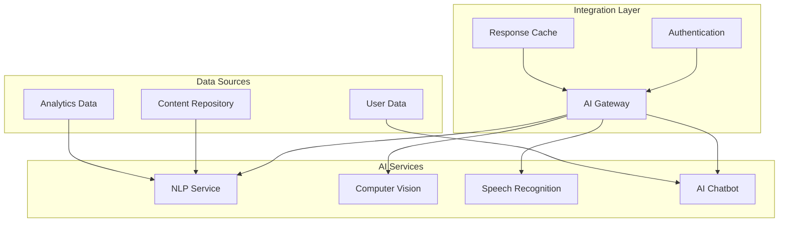
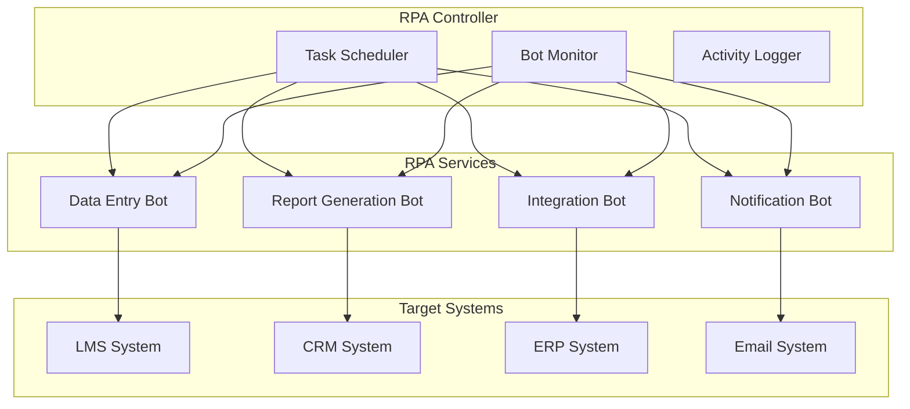
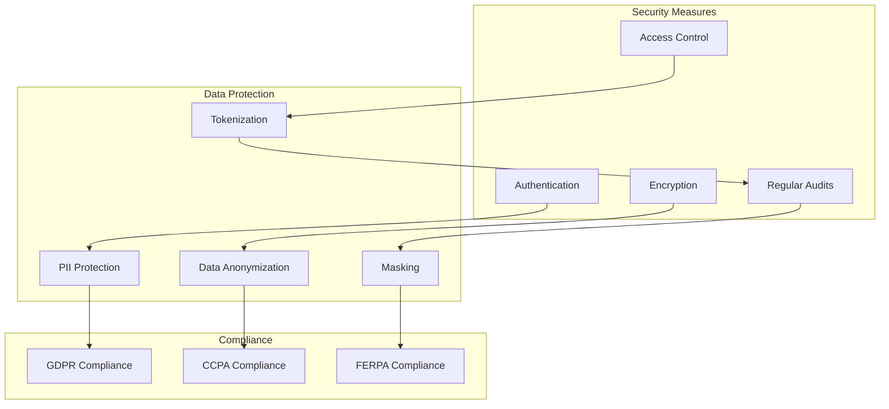
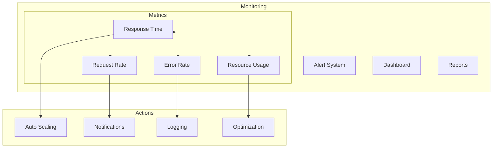

# AI, ML, and RPA Integrations Documentation

[🏠 Home](README.md) > [System Design Documentation](README.md) > AI/ML/RPA Integrations

[← Back to Main Documentation](README.md)

---

## Overview

This document outlines the integration of Artificial Intelligence (AI), Machine Learning (ML), and Robotic Process Automation (RPA) capabilities into the LCT Learning Management System. The focus is on secure, open-source solutions that can be easily integrated while maintaining system security and performance.

## 1. AI Integration Architecture



### AI Use Cases and Solutions

| Use Case | Description | Open Source Solution | Integration Method |
|----------|-------------|----------------------|-------------------|
| Content Recommendation | Personalized course recommendations | TensorFlow Recommenders | REST API |
| Automated Content Tagging | Automatic tagging of learning materials | spaCy | Batch Processing |
| Sentiment Analysis | Analyze student feedback | Hugging Face Transformers | Real-time API |
| Speech-to-Text | Convert lecture audio to text | Mozilla DeepSpeech | Async Processing |
| Chatbot Support | 24/7 student support | Rasa | WebSocket |

## 2. ML Integration Architecture

```mermaid
graph TD
    subgraph ML Pipeline
        DataPrep[Data Preparation]
        Training[Model Training]
        Inference[Model Inference]
        Monitoring[Model Monitoring]
    end

    subgraph ML Models
        Predict[Prediction Models]
        Classify[Classification Models]
        Cluster[Clustering Models]
        Anomaly[Anomaly Detection]
    end

    subgraph Data Flow
        RawData[Raw Data]
        Processed[Processed Data]
        Results[ML Results]
    end

    RawData --> DataPrep
    DataPrep --> Training
    Training --> Inference
    Inference --> Monitoring
    Processed --> ML Models
    ML Models --> Results
```

### ML Use Cases and Solutions

| Use Case | Description | Open Source Solution | Integration Method |
|----------|-------------|----------------------|-------------------|
| Student Performance Prediction | Predict student success | scikit-learn | Batch Processing |
| Content Difficulty Assessment | Auto-assess content difficulty | XGBoost | Real-time API |
| Learning Path Optimization | Optimize learning sequences | TensorFlow | Async Processing |
| Fraud Detection | Detect fraudulent activities | PyOD | Real-time API |
| Adaptive Learning | Personalize learning experience | LightGBM | REST API |

## 3. RPA Integration Architecture



### RPA Use Cases and Solutions

| Use Case | Description | Open Source Solution | Integration Method |
|----------|-------------|----------------------|-------------------|
| Automated Enrollment | Process student enrollments | Robot Framework | Scheduled Tasks |
| Report Generation | Generate periodic reports | OpenRPA | Event Triggered |
| Data Synchronization | Sync data between systems | UiPath Community | Real-time |
| Notification Management | Manage system notifications | TagUI | Scheduled Tasks |
| Document Processing | Process learning materials | Automation Anywhere Community | Event Triggered |

## 4. Security Considerations



### Security Implementation

1. **Data Protection**
   - End-to-end encryption for all AI/ML/RPA communications
   - Secure storage of sensitive data
   - Regular security audits
   - Compliance with data protection regulations

2. **Access Control**
   - Role-based access control (RBAC)
   - Multi-factor authentication
   - API key management
   - IP whitelisting

3. **Monitoring**
   - Real-time activity monitoring
   - Anomaly detection
   - Automated alerts
   - Audit logging

## 5. Integration Guidelines

### Prerequisites
- Python 3.8+ environment
- Docker for containerization
- Kubernetes for orchestration
- Monitoring tools (Prometheus, Grafana)

### Implementation Steps
1. Environment setup
2. Solution selection and validation
3. Security assessment
4. Integration testing
5. Performance optimization
6. Monitoring setup
7. Documentation
8. Training

### Best Practices
- Use containerization for isolation
- Implement proper error handling
- Maintain comprehensive logging
- Regular performance monitoring
- Version control for models
- Regular security updates

## 6. Vendor Selection Criteria

### AI Solutions
1. **TensorFlow**
   - Pros: Extensive community, good documentation
   - Cons: Steep learning curve
   - Use Case: Complex ML models

2. **PyTorch**
   - Pros: Easy to use, good for research
   - Cons: Less production-ready
   - Use Case: Research and prototyping

3. **Hugging Face**
   - Pros: Pre-trained models, easy integration
   - Cons: Limited customization
   - Use Case: NLP tasks

### ML Solutions
1. **scikit-learn**
   - Pros: Simple, well-documented
   - Cons: Limited deep learning
   - Use Case: Traditional ML tasks

2. **XGBoost**
   - Pros: High performance, good accuracy
   - Cons: Memory intensive
   - Use Case: Prediction tasks

3. **LightGBM**
   - Pros: Fast training, good accuracy
   - Cons: Less interpretable
   - Use Case: Large datasets

### RPA Solutions
1. **Robot Framework**
   - Pros: Easy to learn, good documentation
   - Cons: Limited capabilities
   - Use Case: Simple automation

2. **OpenRPA**
   - Pros: Open source, active community
   - Cons: Less mature
   - Use Case: Basic RPA tasks

3. **UiPath Community**
   - Pros: Feature-rich, good support
   - Cons: Limited in community edition
   - Use Case: Complex automation

## 7. Performance Monitoring



### Monitoring Metrics
1. Response time
2. Request rate
3. Error rate
4. Resource utilization
5. Model accuracy
6. Bot success rate
7. System availability
8. Data processing time

## 8. Future Roadmap

1. **Short Term (6 months)**
   - Basic AI/ML integration
   - Simple RPA automation
   - Security implementation
   - Performance monitoring

2. **Medium Term (1 year)**
   - Advanced ML models
   - Complex RPA workflows
   - Enhanced security
   - Automated scaling

3. **Long Term (2 years)**
   - AI-driven personalization
   - Full automation
   - Advanced security
   - Predictive analytics 