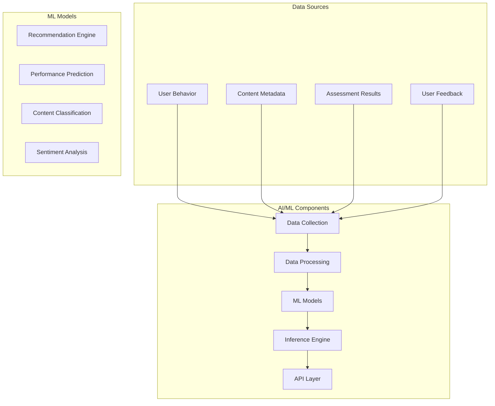
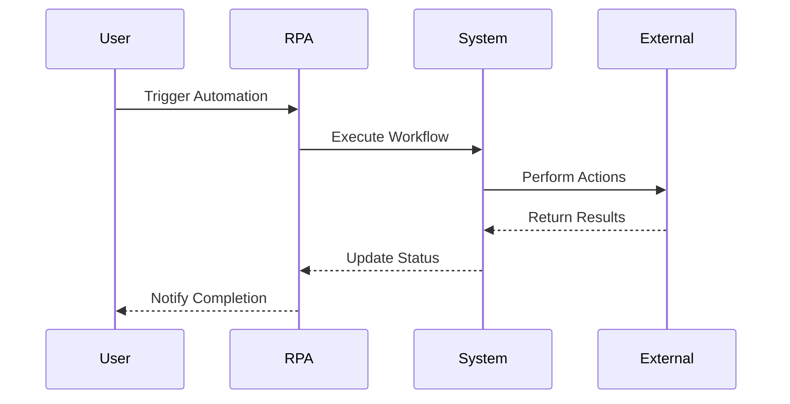

# LCT Learning Management System - AI/ML/RPA Integrations

  

[🏠 Home](../README.md) > [System Design Documentation](README.md) > AI/ML/RPA Integrations

[← Back to Main Documentation](../README.md)

## Company Information
- **Company**: [Lear Cyber Tech](https://www.linkedin.com/company/leartech/)
- **Author**: [Dr. Libin Pallikunnel Kurian](https://www.linkedin.com/in/dr-libin-pallikunnel-kurian-88741530/)
- **GitHub**: [leomultimedia](https://github.com/leomultimedia)
- **Position**: Principal Consultant - ICT & Cyber Security
- **Expertise**: Cloud Digital Leader | Ethical Hacker | OT | IoT | ICS/SCADA | IT Audit | RPA | AI | ML | Analytics

## Company Vision & Mission
- **Vision**: To be a global leader in cybersecurity and technology solutions, empowering organizations with innovative and secure digital transformation.
- **Mission**: To provide cutting-edge cybersecurity solutions and technology services that protect and enhance our clients' digital assets while fostering a culture of continuous learning and innovation.

## Core Values
1. **Integrity**: Upholding the highest standards of ethical conduct and transparency
2. **Customer Focus**: Delivering exceptional value and service to our clients
3. **Innovation**: Driving technological advancement and creative solutions
4. **Teamwork**: Fostering collaboration and mutual respect
5. **Excellence**: Striving for the highest quality in all our endeavors

---

## 1. AI/ML Integration Overview

### 1.1 Purpose
The AI/ML integration in the LCT Learning Management System enhances the learning experience through:
- Personalized learning paths
- Intelligent content recommendations
- Automated assessment and feedback
- Predictive analytics for student success
- Natural language processing for content analysis

### 1.2 Key Components

## 2. Machine Learning Models

### 2.1 Recommendation Engine
- **Purpose**: Personalize learning paths and content recommendations
- **Technologies**: Collaborative filtering, content-based filtering
- **Features**:
  - Course recommendations based on user interests
  - Content suggestions based on learning history
  - Skill gap analysis and targeted learning
  - Adaptive learning paths

### 2.2 Performance Prediction
- **Purpose**: Predict student success and identify at-risk students
- **Technologies**: Time series analysis, regression models
- **Features**:
  - Early warning system for at-risk students
  - Performance trend analysis
  - Success probability prediction
  - Intervention recommendations

### 2.3 Content Classification
- **Purpose**: Automatically categorize and tag learning content
- **Technologies**: NLP, text classification
- **Features**:
  - Automatic content tagging
  - Topic extraction
  - Difficulty level assessment
  - Prerequisite identification

### 2.4 Sentiment Analysis
- **Purpose**: Analyze user feedback and engagement
- **Technologies**: NLP, sentiment analysis
- **Features**:
  - Feedback sentiment analysis
  - Engagement level monitoring
  - Content effectiveness assessment
  - User satisfaction tracking

## 3. RPA Integration

### 3.1 Automation Workflows

### 3.2 Key Automation Areas
1. **Administrative Tasks**
   - User enrollment processing
   - Course scheduling
   - Certificate generation
   - Report generation

2. **Content Management**
   - Content migration
   - Metadata extraction
   - Quality checks
   - Version control

3. **Assessment Processing**
   - Answer sheet evaluation
   - Score calculation
   - Result compilation
   - Feedback generation

4. **Communication**
   - Notification distribution
   - Email campaigns
   - Survey distribution
   - Feedback collection

## 4. Implementation Guidelines

### 4.1 Data Collection
- Implement proper data governance
- Ensure data privacy compliance
- Maintain data quality standards
- Establish data retention policies

### 4.2 Model Development
- Follow ML best practices
- Implement proper testing
- Ensure model explainability
- Maintain version control

### 4.3 Integration
- Use API-first approach
- Implement proper error handling
- Ensure scalability
- Maintain security standards

### 4.4 Monitoring
- Track model performance
- Monitor data quality
- Implement alerting
- Maintain audit logs

## 5. Security Considerations

### 5.1 Data Protection
- Implement encryption
- Ensure proper access control
- Maintain data anonymization
- Follow compliance requirements

### 5.2 Model Security
- Protect model integrity
- Prevent adversarial attacks
- Ensure proper validation
- Maintain audit trails

### 5.3 RPA Security
- Secure credentials
- Implement proper access control
- Monitor automation activities
- Maintain audit logs

## 6. Best Practices

### 6.1 AI/ML Best Practices
- Start with clear objectives
- Use appropriate algorithms
- Ensure data quality
- Monitor model performance
- Maintain documentation

### 6.2 RPA Best Practices
- Document workflows
- Implement error handling
- Maintain version control
- Monitor performance
- Regular maintenance

### 6.3 Integration Best Practices
- Use standard protocols
- Implement proper error handling
- Ensure scalability
- Maintain documentation
- Regular testing

## 7. Future Enhancements

### 7.1 Planned Features
- Advanced personalization
- Real-time analytics
- Enhanced automation
- Improved security
- Better integration

### 7.2 Research Areas
- Advanced ML algorithms
- Better automation
- Enhanced security
- Improved scalability
- Better user experience