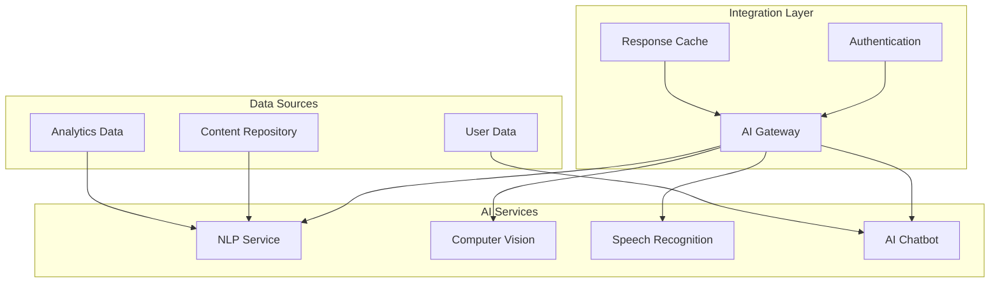

# LCT Learning Management System - AI/ML/RPA Integrations

  

[🏠 Home](../README.md) > [System Design Documentation](README.md) > AI/ML/RPA Integrations

[← Back to Main Documentation](../README.md)

## Company Information
- **Company**: [Lear Cyber Tech](https://www.linkedin.com/company/leartech/)
- **Author**: [Dr. Libin Pallikunnel Kurian](https://www.linkedin.com/in/dr-libin-pallikunnel-kurian-88741530/)
- **GitHub**: [leomultimedia](https://github.com/leomultimedia)
- **Position**: Principal Consultant - ICT & Cyber Security
- **Expertise**: Cloud Digital Leader | Ethical Hacker | OT | IoT | ICS/SCADA | IT Audit | RPA | AI | ML | Analytics

## Company Vision & Mission
- **Vision**: To be a global leader in cybersecurity and technology solutions, empowering organizations with innovative and secure digital transformation.
- **Mission**: To provide cutting-edge cybersecurity solutions and technology services that protect and enhance our clients' digital assets while fostering a culture of continuous learning and innovation.

## Core Values
1. **Integrity**: Upholding the highest standards of ethical conduct and transparency
2. **Customer Focus**: Delivering exceptional value and service to our clients
3. **Innovation**: Driving technological advancement and creative solutions
4. **Teamwork**: Fostering collaboration and mutual respect
5. **Excellence**: Striving for the highest quality in all our endeavors

---

## Overview

This document outlines the integration of Artificial Intelligence (AI), Machine Learning (ML), and Robotic Process Automation (RPA) capabilities into the LCT Learning Management System. The focus is on secure, open-source solutions that can be easily integrated while maintaining system security and performance.

## 1. AI Integration Architecture

### AI Use Cases and Solutions

| Use Case | Description | Open Source Solution | Integration Method |
|