# Business Continuity and Disaster Recovery (BCDR) Plan

[🏠 Home](README.md) > [System Design Documentation](README.md) > BCDR Plan

[← Back to Main Documentation](README.md)

## Related Documentation
- [System Architecture Diagrams](System_Architecture_Diagrams.md)
- [Frontend Architecture](Frontend_Architecture.md)
- [Mobile App Architecture](Mobile_App_Architecture.md)
- [Database Schema](Database_Schema.md)
- [API Specification](API_Specification.md)
- [Security Compliance](Security_Compliance.md)
- [Project Budget](Project_Budget.md)
- [Development Rollout Plan](Development_Rollout_Plan.md)

---

## Overview

This document outlines the Business Continuity and Disaster Recovery strategies for the LCT Learning Management System, including cloud-specific implementations for Azure, GCP, and AWS.

## 1. BCDR Architecture

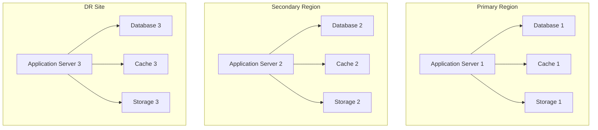

## 2. Cloud-Specific Implementations

### Azure Implementation

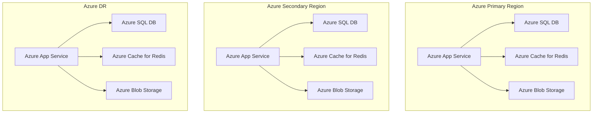

### GCP Implementation

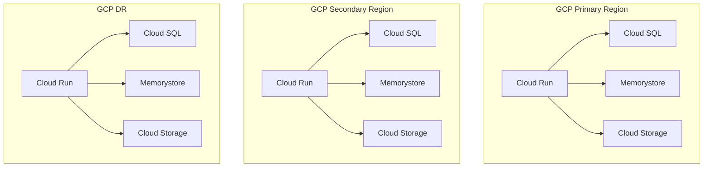

### AWS Implementation

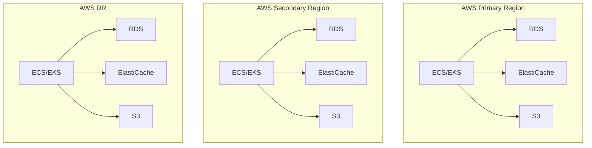

## 3. Recovery Time Objectives (RTO) and Recovery Point Objectives (RPO)

| Component | RTO | RPO | Cloud Implementation |
|-----------|-----|-----|----------------------|
| Application | 2 hours | 15 minutes | Auto-scaling, Multi-region deployment |
| Database | 4 hours | 1 hour | Geo-replication, Point-in-time recovery |
| Cache | 1 hour | 5 minutes | Multi-region replication |
| Storage | 2 hours | 15 minutes | Geo-redundant storage |

## 4. Cloud-Specific BCDR Features

### Azure Features
1. **High Availability**
   - Availability Zones
   - Azure Site Recovery
   - Azure Traffic Manager
   - Azure Front Door

2. **Backup Solutions**
   - Azure Backup
   - Azure Site Recovery
   - Azure Archive Storage

3. **Monitoring**
   - Azure Monitor
   - Application Insights
   - Azure Sentinel

### GCP Features
1. **High Availability**
   - Global Load Balancing
   - Cloud CDN
   - Cloud Armor
   - Cloud DNS

2. **Backup Solutions**
   - Cloud Storage
   - Cloud SQL Backups
   - Cloud Filestore Backups

3. **Monitoring**
   - Cloud Monitoring
   - Cloud Logging
   - Cloud Trace

### AWS Features
1. **High Availability**
   - Route 53
   - CloudFront
   - WAF
   - Global Accelerator

2. **Backup Solutions**
   - AWS Backup
   - S3 Versioning
   - Glacier

3. **Monitoring**
   - CloudWatch
   - X-Ray
   - GuardDuty

## 5. Disaster Recovery Procedures

### 1. Database Recovery
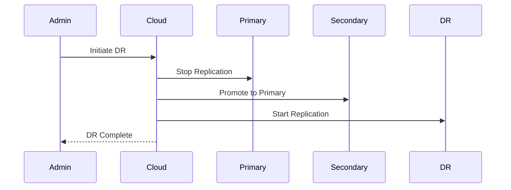

### 2. Application Recovery
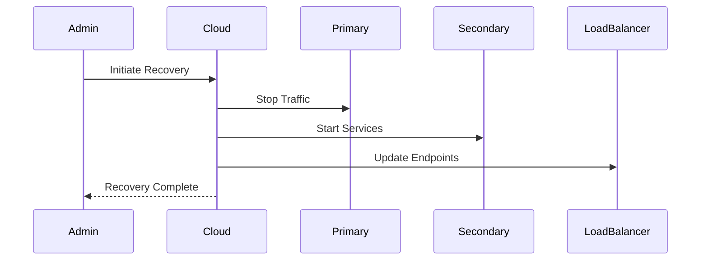

## 6. Testing Procedures

### 1. Regular Testing Schedule
- Monthly: Component-level testing
- Quarterly: Full DR testing
- Annually: Complete BCDR testing

### 2. Test Scenarios
1. **Database Failover**
   - Primary to Secondary
   - Secondary to DR
   - DR to Primary

2. **Application Failover**
   - Region to Region
   - Zone to Zone
   - Service to Service

3. **Storage Recovery**
   - Data restoration
   - Version recovery
   - Geo-replication

## 7. Cloud-Specific Implementation Details

### Azure Implementation
1. **Networking**
   - Virtual Network Peering
   - ExpressRoute
   - Azure Front Door
   - Traffic Manager

2. **Storage**
   - Geo-redundant storage
   - Zone-redundant storage
   - Archive storage

3. **Database**
   - Active Geo-replication
   - Auto-failover groups
   - Point-in-time restore

### GCP Implementation
1. **Networking**
   - VPC Network Peering
   - Cloud Interconnect
   - Cloud CDN
   - Global Load Balancing

2. **Storage**
   - Multi-regional storage
   - Regional storage
   - Coldline storage

3. **Database**
   - Cross-region replication
   - High availability
   - Point-in-time recovery

### AWS Implementation
1. **Networking**
   - VPC Peering
   - Direct Connect
   - CloudFront
   - Route 53

2. **Storage**
   - S3 Cross-region replication
   - EBS snapshots
   - Glacier

3. **Database**
   - Multi-AZ deployment
   - Read replicas
   - Point-in-time recovery

## 8. Cost Considerations

### Azure Cost Optimization
1. **Reserved Instances**
   - 1-year and 3-year terms
   - Hybrid benefit
   - Spot instances

2. **Storage Tiers**
   - Hot, Cool, Archive
   - Lifecycle management
   - Blob tiering

### GCP Cost Optimization
1. **Committed Use**
   - 1-year and 3-year terms
   - Sustained use discounts
   - Preemptible VMs

2. **Storage Classes**
   - Standard, Nearline, Coldline
   - Lifecycle management
   - Object versioning

### AWS Cost Optimization
1. **Reserved Instances**
   - 1-year and 3-year terms
   - Convertible RIs
   - Spot instances

2. **Storage Classes**
   - S3 Standard, IA, Glacier
   - Lifecycle rules
   - Intelligent tiering

## 9. Compliance and Security

### Data Protection
1. **Encryption**
   - At-rest encryption
   - In-transit encryption
   - Key management

2. **Access Control**
   - IAM policies
   - Network security
   - Audit logging

### Compliance Requirements
1. **Standards**
   - ISO 27001
   - SOC 2
   - GDPR
   - HIPAA

2. **Documentation**
   - Security policies
   - Compliance reports
   - Audit trails

## 10. Maintenance and Updates

### Regular Maintenance
1. **Scheduled Tasks**
   - Backup verification
   - Security updates
   - Performance optimization

2. **Monitoring**
   - Health checks
   - Performance metrics
   - Security alerts

### Update Procedures
1. **Application Updates**
   - Blue-green deployment
   - Canary releases
   - Rollback procedures

2. **Infrastructure Updates**
   - Terraform updates
   - Configuration changes
   - Security patches

## 11. Additional Disaster Recovery Scenarios

### 1. Regional Outage Recovery
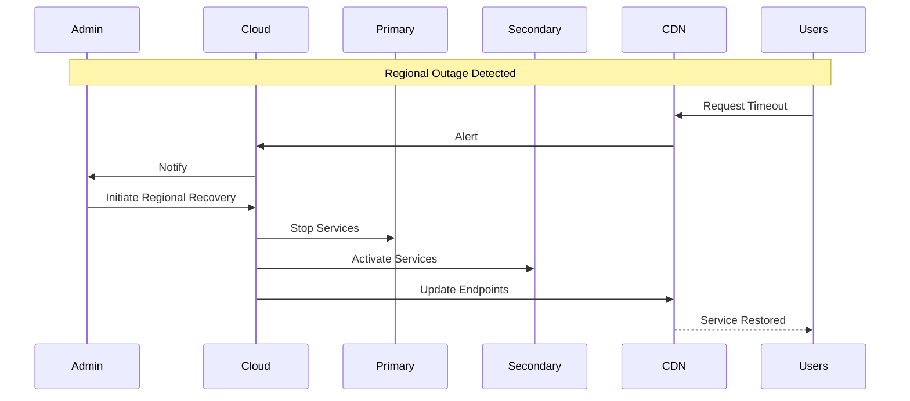

### 2. Data Corruption Recovery
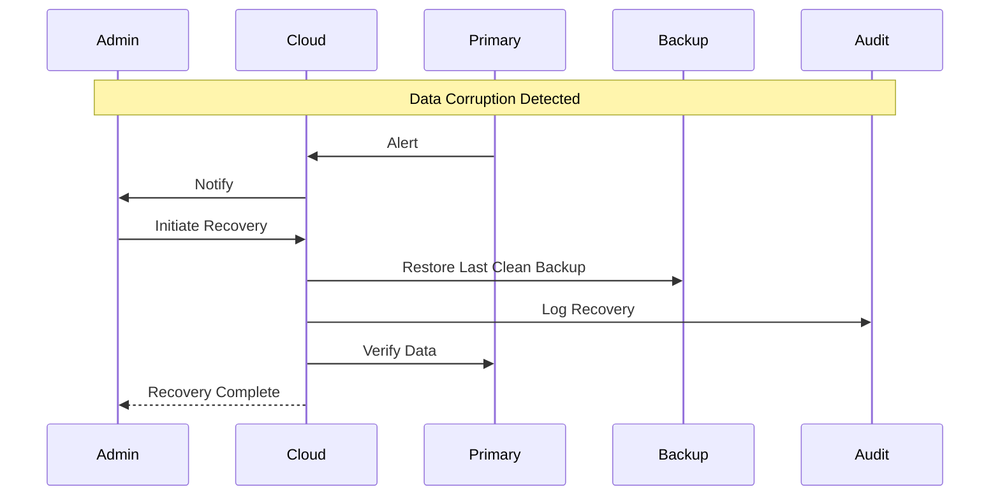

### 3. Security Breach Recovery
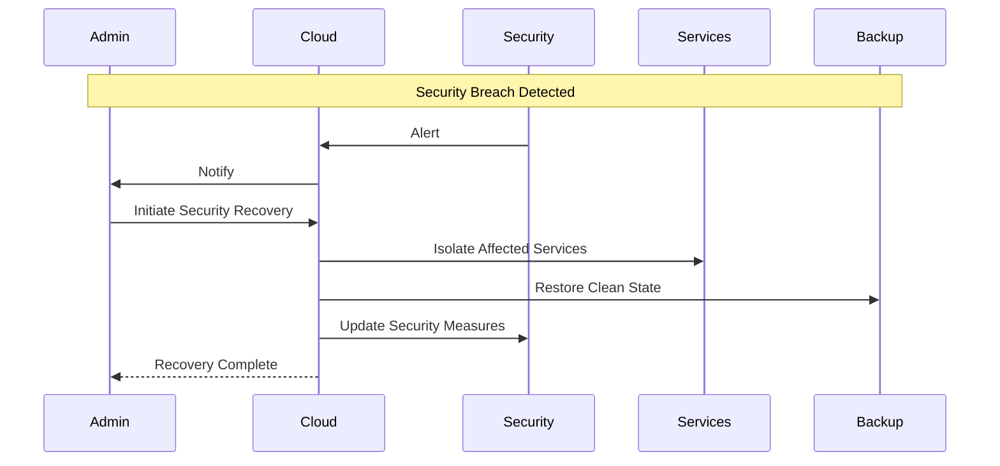

### 4. Network Partition Recovery
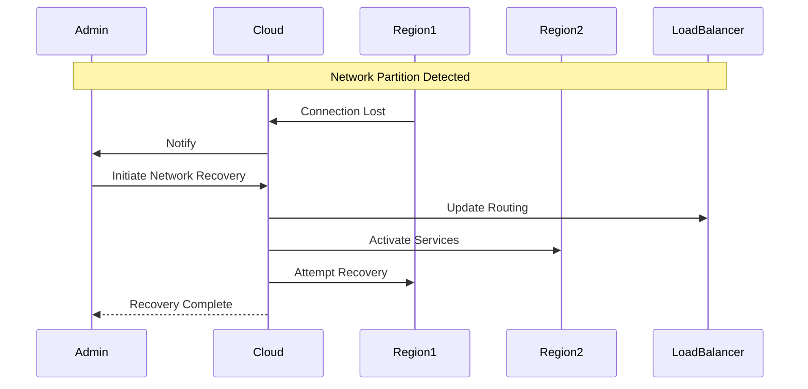

## 12. Detailed Cost Breakdowns

### Azure Cost Breakdown

| Service | Monthly Cost | Annual Cost | Notes |
|---------|-------------|-------------|-------|
| **Compute** | | | |
| App Service (P1v3) | $73.00 | $876.00 | Per instance |
| Azure SQL DB (S3) | $1,000.00 | $12,000.00 | Per database |
| Azure Cache (P1) | $150.00 | $1,800.00 | Per instance |
| **Storage** | | | |
| Blob Storage (LRS) | $0.02/GB | $0.24/GB | Per month |
| Archive Storage | $0.00099/GB | $0.01188/GB | Per month |
| **Networking** | | | |
| Azure Front Door | $0.00 | $0.00 | First 5M requests free |
| Traffic Manager | $0.00 | $0.00 | First 1M queries free |
| **Backup** | | | |
| Azure Backup | $0.20/GB | $2.40/GB | Per month |
| **Monitoring** | | | |
| Azure Monitor | $0.00 | $0.00 | First 5GB free |
| Application Insights | $0.00 | $0.00 | First 5GB free |

### GCP Cost Breakdown

| Service | Monthly Cost | Annual Cost | Notes |
|---------|-------------|-------------|-------|
| **Compute** | | | |
| Cloud Run | $0.40/million requests | $4.80/million requests | Per year |
| Cloud SQL (db-n1-standard-4) | $1,020.00 | $12,240.00 | Per instance |
| Memorystore (M1) | $0.049/hour | $0.588/hour | Per instance |
| **Storage** | | | |
| Cloud Storage (Standard) | $0.02/GB | $0.24/GB | Per month |
| Coldline Storage | $0.004/GB | $0.048/GB | Per month |
| **Networking** | | | |
| Cloud CDN | $0.08/GB | $0.96/GB | Per month |
| Cloud Load Balancing | $0.025/hour | $0.30/hour | Per month |
| **Backup** | | | |
| Cloud SQL Backups | $0.00 | $0.00 | Included in service |
| **Monitoring** | | | |
| Cloud Monitoring | $0.00 | $0.00 | First 150MB free |
| Cloud Logging | $0.00 | $0.00 | First 50GB free |

### AWS Cost Breakdown

| Service | Monthly Cost | Annual Cost | Notes |
|---------|-------------|-------------|-------|
| **Compute** | | | |
| ECS (t3.large) | $69.12 | $829.44 | Per instance |
| RDS (db.m5.large) | $1,000.00 | $12,000.00 | Per instance |
| ElastiCache (cache.m5.large) | $150.00 | $1,800.00 | Per instance |
| **Storage** | | | |
| S3 Standard | $0.023/GB | $0.276/GB | Per month |
| S3 Glacier | $0.004/GB | $0.048/GB | Per month |
| **Networking** | | | |
| CloudFront | $0.085/GB | $1.02/GB | Per month |
| Route 53 | $0.50/hosted zone | $6.00/hosted zone | Per month |
| **Backup** | | | |
| AWS Backup | $0.05/GB | $0.60/GB | Per month |
| **Monitoring** | | | |
| CloudWatch | $0.30/GB | $3.60/GB | Per month |
| X-Ray | $5.00/million traces | $60.00/million traces | Per year |

## 13. Cost Optimization Strategies

### 1. Reserved Capacity Planning
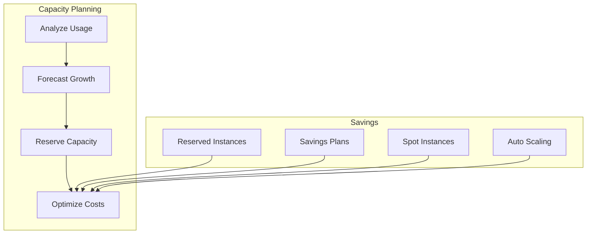

### 2. Storage Lifecycle Management
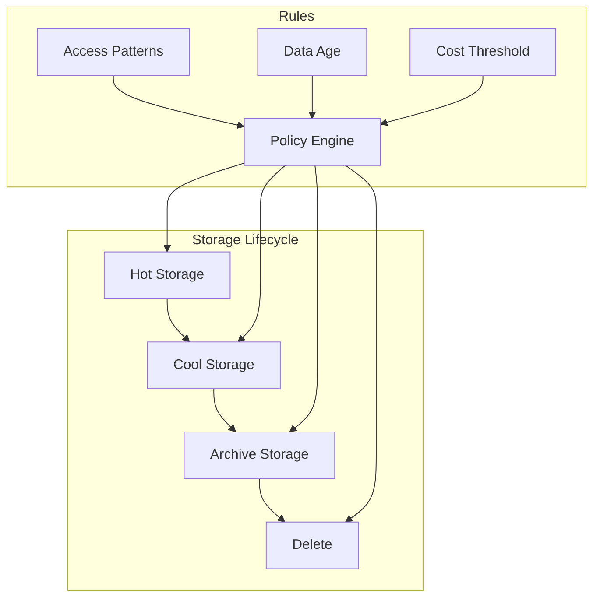

### 3. Cost Monitoring and Alerts
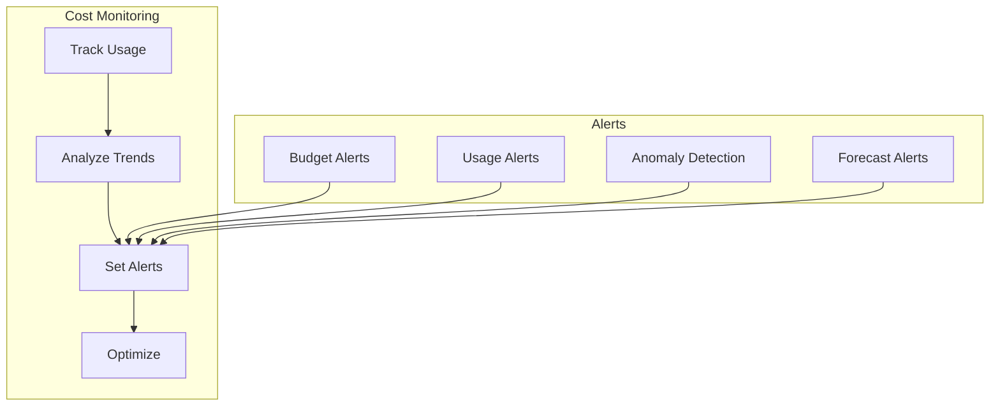

## 14. Workload-Specific Cost Calculations

### 1. Video Content Delivery Workload

#### Azure Implementation
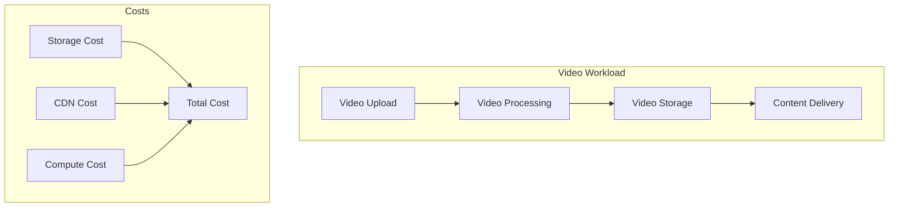

| Component | Monthly Usage | Cost per Unit | Monthly Cost | Annual Cost |
|-----------|--------------|---------------|--------------|-------------|
| **Storage** | | | | |
| Hot Storage (1TB) | 1000 GB | $0.02/GB | $20.00 | $240.00 |
| Cool Storage (5TB) | 5000 GB | $0.01/GB | $50.00 | $600.00 |
| **CDN** | | | | |
| Data Transfer (10TB) | 10000 GB | $0.08/GB | $800.00 | $9,600.00 |
| **Compute** | | | | |
| Media Services (P1) | 1 instance | $1,000.00 | $1,000.00 | $12,000.00 |
| **Total** | | | **$1,870.00** | **$22,440.00** |

### 2. Assessment System Workload

#### GCP Implementation
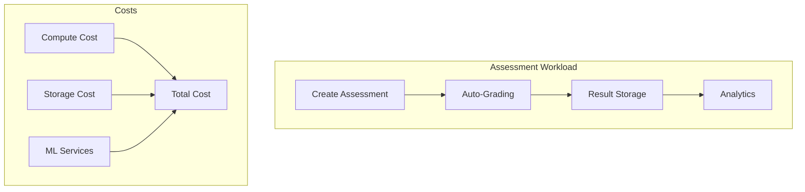

| Component | Monthly Usage | Cost per Unit | Monthly Cost | Annual Cost |
|-----------|--------------|---------------|--------------|-------------|
| **Compute** | | | | |
| Cloud Run (100k requests) | 100,000 | $0.40/million | $40.00 | $480.00 |
| **Storage** | | | | |
| Cloud SQL (S1) | 1 instance | $1,020.00 | $1,020.00 | $12,240.00 |
| **ML Services** | | | | |
| AutoML (100k predictions) | 100,000 | $5.00/million | $500.00 | $6,000.00 |
| **Total** | | | **$1,560.00** | **$18,720.00** |

### 3. User Authentication Workload

#### AWS Implementation
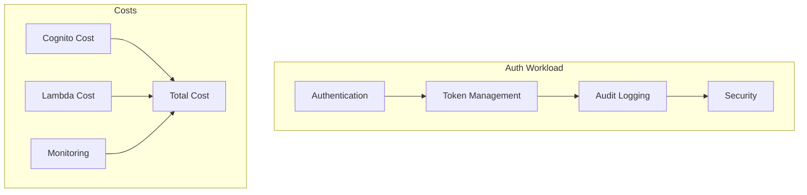

| Component | Monthly Usage | Cost per Unit | Monthly Cost | Annual Cost |
|-----------|--------------|---------------|--------------|-------------|
| **Cognito** | | | | |
| MAUs (50,000) | 50,000 | $0.0055/MAU | $275.00 | $3,300.00 |
| **Lambda** | | | | |
| Requests (1M) | 1,000,000 | $0.20/million | $200.00 | $2,400.00 |
| **Monitoring** | | | | |
| CloudWatch (5GB) | 5 GB | $0.30/GB | $1.50 | $18.00 |
| **Total** | | | **$476.50** | **$5,718.00** |

## 15. Additional Cost Optimization Strategies

### 1. Multi-Cloud Cost Optimization
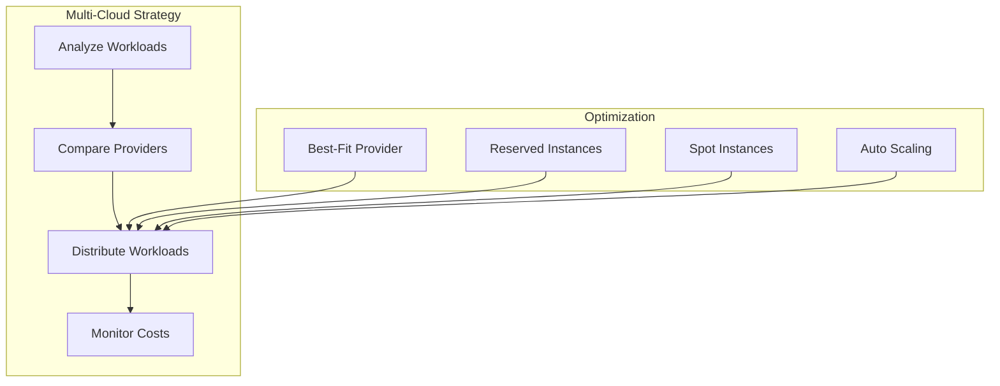

### 2. Workload Scheduling Optimization
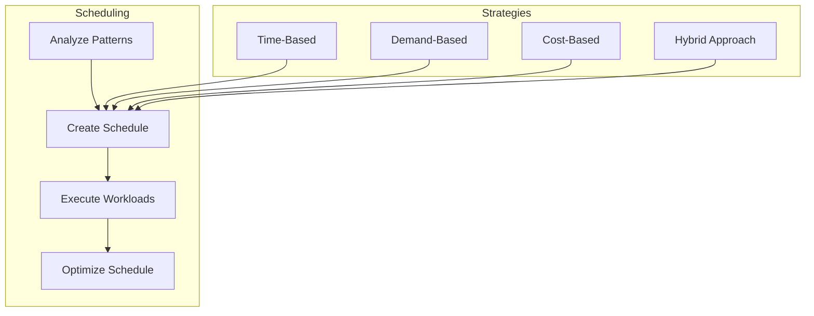

### 3. Resource Right-Sizing
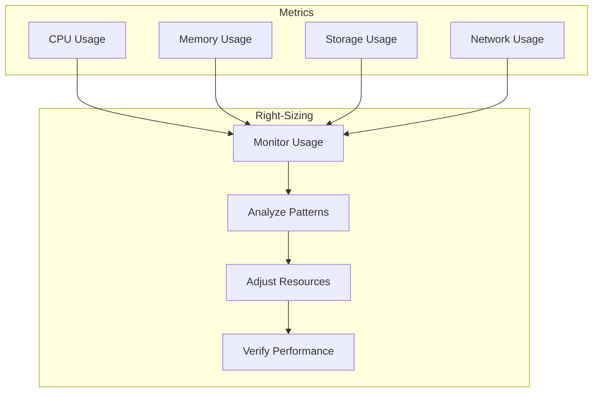

### 4. Cost Allocation and Chargeback
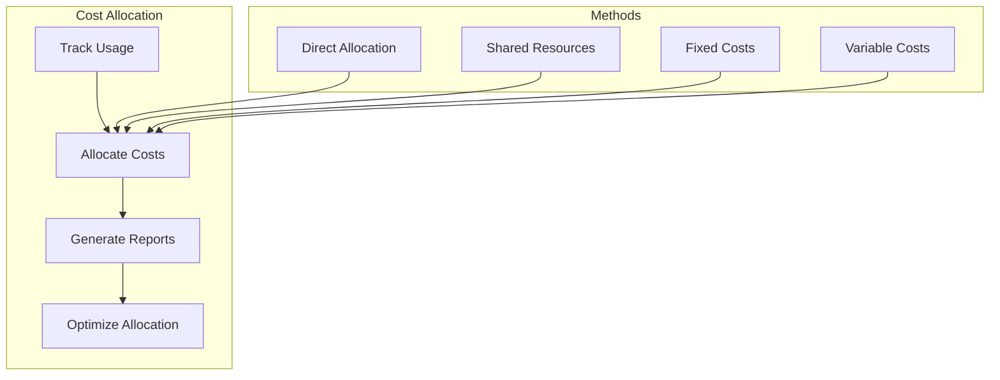

## 16. Cost Optimization Implementation Guide

### 1. Step-by-Step Optimization Process
1. **Initial Assessment**
   - Current resource utilization
   - Cost patterns and trends
   - Performance requirements
   - Business objectives

2. **Resource Optimization**
   - Right-size instances
   - Implement auto-scaling
   - Use spot/preemptible instances
   - Optimize storage classes

3. **Architecture Optimization**
   - Implement caching
   - Use CDN where appropriate
   - Optimize database queries
   - Implement efficient data transfer

4. **Cost Management**
   - Set up budget alerts
   - Implement cost allocation
   - Regular cost reviews
   - Continuous optimization

### 2. Optimization Metrics
| Metric | Target | Measurement | Frequency |
|--------|--------|-------------|-----------|
| Resource Utilization | 70-80% | Cloud monitoring | Daily |
| Cost per User | < $5/month | Cost reports | Monthly |
| Storage Efficiency | > 90% | Storage analysis | Weekly |
| Compute Efficiency | > 85% | Performance metrics | Daily |

### 3. Optimization Tools
| Cloud Provider | Cost Management Tool | Features |
|----------------|----------------------|----------|
| Azure | Cost Management + Billing | Budgets, recommendations, cost analysis |
| GCP | Cloud Billing | Budgets, reports, cost optimization |
| AWS | Cost Explorer | Cost analysis, recommendations, budgets | 