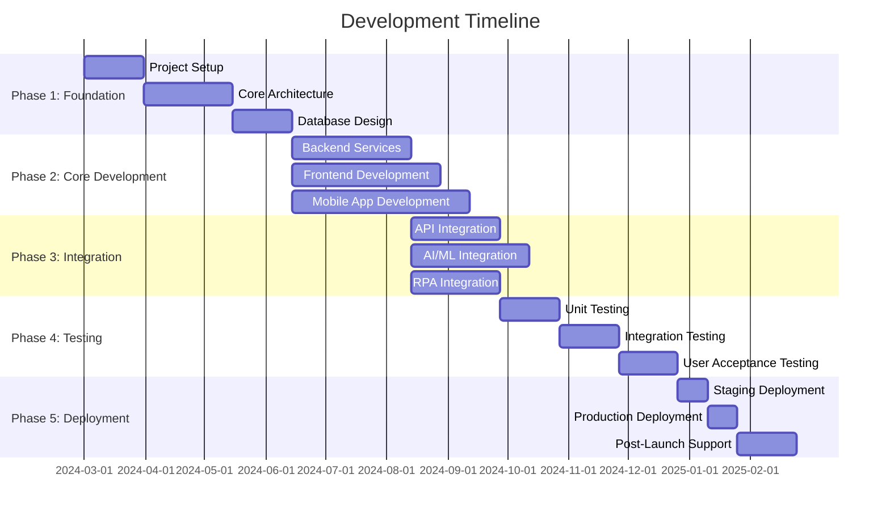
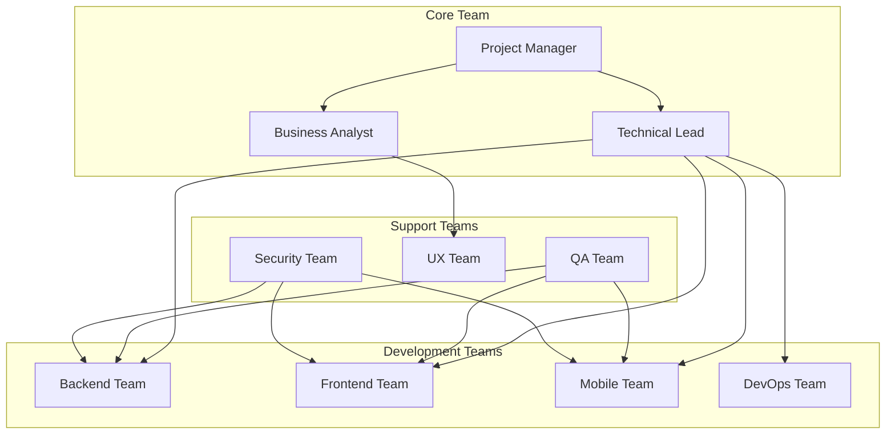
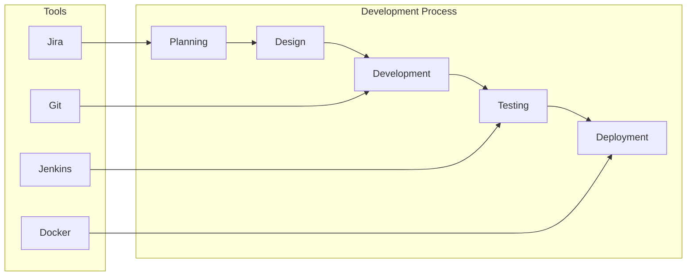
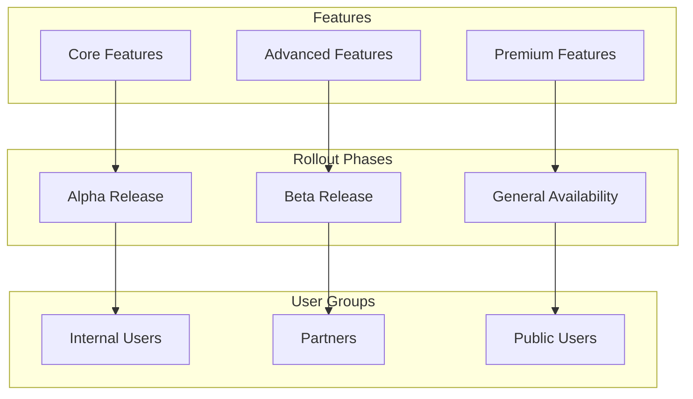
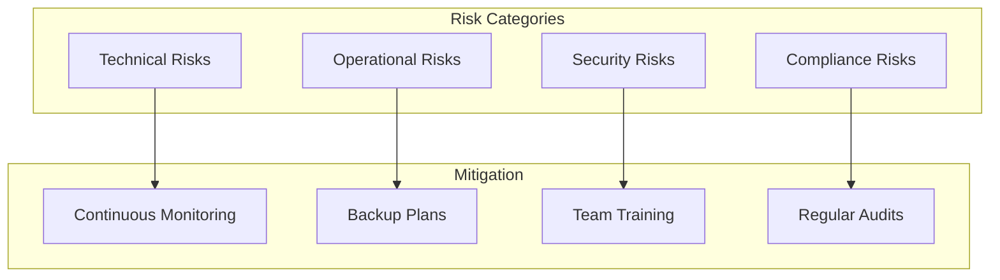
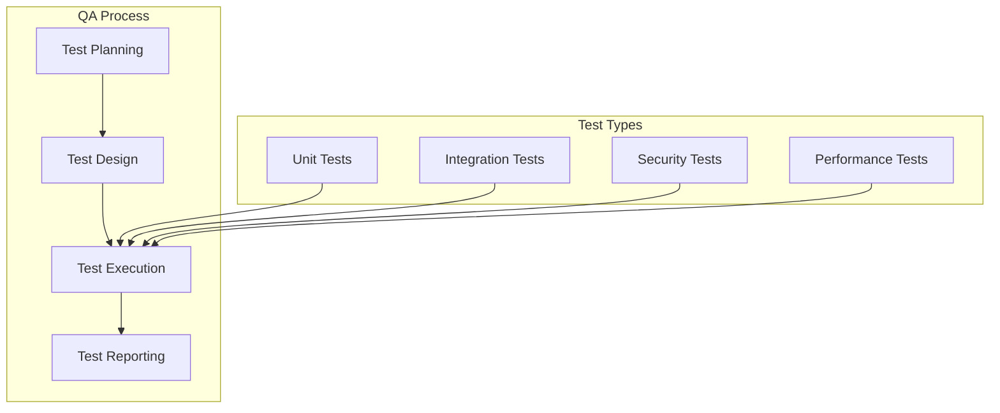
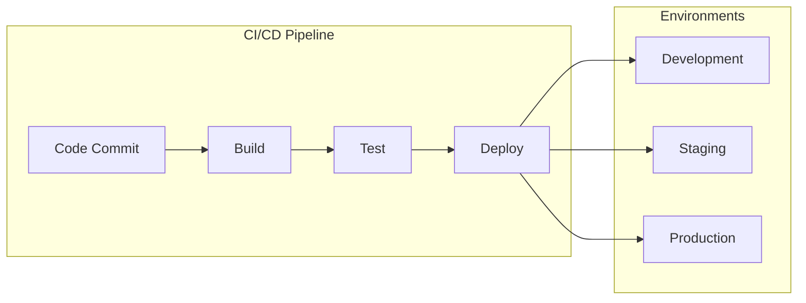
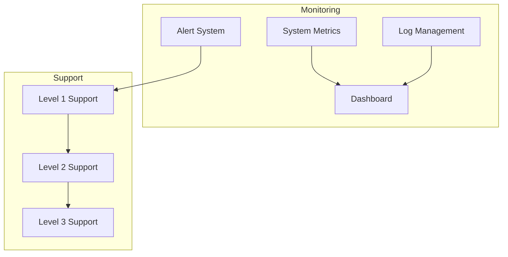

# Development and Rollout Plan

[🏠 Home](README.md) > [System Design Documentation](README.md) > Development and Rollout Plan

[← Back to Main Documentation](README.md)

## Related Documentation
- [System Architecture Diagrams](System_Architecture_Diagrams.md)
- [Frontend Architecture](Frontend_Architecture.md)
- [Mobile App Architecture](Mobile_App_Architecture.md)
- [Database Schema](Database_Schema.md)
- [API Specification](API_Specification.md)
- [Security Compliance](Security_Compliance.md)
- [Project Budget](Project_Budget.md)
- [BCDR Plan](BCDR_Plan.md)

---

## Overview

This document outlines the comprehensive development and rollout plan for the LCT Learning Management System, including timelines, milestones, and key deliverables.

## 1. Development Phases

## 2. Team Structure

## 3. Development Workflow

## 4. Rollout Strategy

## 5. Risk Management

## 6. Quality Assurance Process

## 7. Deployment Pipeline

## 8. Monitoring and Support

## Detailed Implementation Plan

### Phase 1: Foundation (3 months)
1. **Project Setup (1 month)**
   - Environment configuration
   - Development tools setup
   - Documentation standards
   - Team onboarding

2. **Core Architecture (1.5 months)**
   - System design
   - Technology stack selection
   - Architecture patterns
   - Security framework

3. **Database Design (1 month)**
   - Schema design
   - Data modeling
   - Performance optimization
   - Backup strategy

### Phase 2: Core Development (3-4 months)
1. **Backend Services (2 months)**
   - API development
   - Service implementation
   - Database integration
   - Security implementation

2. **Frontend Development (2.5 months)**
   - UI/UX implementation
   - Component development
   - State management
   - Performance optimization

3. **Mobile App Development (3 months)**
   - Native app development
   - Offline capabilities
   - Push notifications
   - Performance optimization

### Phase 3: Integration (2-3 months)
1. **API Integration (1.5 months)**
   - Third-party integrations
   - Payment gateways
   - External services
   - Webhook implementation

2. **AI/ML Integration (2 months)**
   - Model development
   - Training pipeline
   - Inference service
   - Performance monitoring

3. **RPA Integration (1.5 months)**
   - Bot development
   - Workflow automation
   - Integration testing
   - Performance optimization

### Phase 4: Testing (1.5 months)
1. **Unit Testing (1 month)**
   - Component testing
   - Service testing
   - Integration testing
   - Performance testing

2. **User Acceptance Testing (2 weeks)**
   - Feature validation
   - Bug fixing
   - Performance optimization
   - Documentation review

### Phase 5: Deployment (2 months)
1. **Staging Deployment (2 weeks)**
   - Environment setup
   - Deployment testing
   - Performance testing
   - Security testing

2. **Production Deployment (2 weeks)**
   - Gradual rollout
   - Monitoring
   - Support setup
   - Documentation

3. **Post-Launch Support (1 month)**
   - Bug fixing
   - Performance optimization
   - User feedback
   - Documentation updates

## Success Metrics

1. **Technical Metrics**
   - System uptime: 99.9%
   - Response time: < 200ms
   - Error rate: < 0.1%
   - Test coverage: > 80%

2. **Business Metrics**
   - User adoption rate
   - Feature usage
   - Customer satisfaction
   - Support ticket volume

3. **Security Metrics**
   - Vulnerability count
   - Patch deployment time
   - Security incident response time
   - Compliance status

## Risk Management Plan

1. **Technical Risks**
   - Performance issues
   - Integration failures
   - Data loss
   - System downtime

2. **Operational Risks**
   - Resource constraints
   - Timeline delays
   - Budget overruns
   - Team turnover

3. **Security Risks**
   - Data breaches
   - Unauthorized access
   - Compliance violations
   - System vulnerabilities

4. **Mitigation Strategies**
   - Regular backups
   - Continuous monitoring
   - Security audits
   - Team training
   - Contingency planning

## Communication Plan

1. **Internal Communication**
   - Daily standups
   - Weekly team meetings
   - Monthly progress reports
   - Quarterly reviews

2. **External Communication**
   - Stakeholder updates
   - User documentation
   - Release notes
   - Support channels

3. **Documentation**
   - Technical documentation
   - User guides
   - API documentation
   - Training materials 