# LCT Learning Management System - Functional Architecture

  

[🏠 Home](../README.md) > [System Design Documentation](README.md) > Functional Architecture

[← Back to Main Documentation](../README.md)

## Company Information
- **Company**: [Lear Cyber Tech](https://www.linkedin.com/company/leartech/)
- **Author**: [Dr. Libin Pallikunnel Kurian](https://www.linkedin.com/in/dr-libin-pallikunnel-kurian-88741530/)
- **GitHub**: [leomultimedia](https://github.com/leomultimedia)
- **Position**: Principal Consultant - ICT & Cyber Security
- **Expertise**: Cloud Digital Leader | Ethical Hacker | OT | IoT | ICS/SCADA | IT Audit | RPA | AI | ML | Analytics

## Company Vision & Mission
- **Vision**: To be a global leader in cybersecurity and technology solutions, empowering organizations with innovative and secure digital transformation.
- **Mission**: To provide cutting-edge cybersecurity solutions and technology services that protect and enhance our clients' digital assets while fostering a culture of continuous learning and innovation.

## Core Values
1. **Integrity**: Upholding the highest standards of ethical conduct and transparency
2. **Customer Focus**: Delivering exceptional value and service to our clients
3. **Innovation**: Driving technological advancement and creative solutions
4. **Teamwork**: Fostering collaboration and mutual respect
5. **Excellence**: Striving for the highest quality in all our endeavors

---

## 1. System Overview

### 1.1 Functional Architecture Diagram
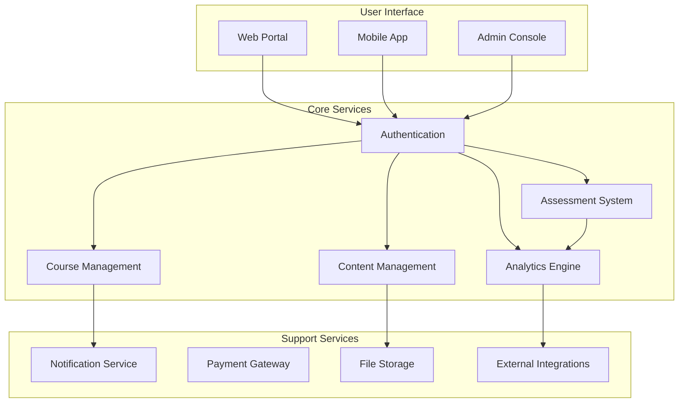
```mermaid
graph TD
    subgraph UserInterface["User Interface"]
        Web[Web Portal]
        Mobile[Mobile App]
        Admin[Admin Console]
    end

    subgraph CoreServices["Core Services"]
        Auth[Authentication]
        Course[Course Management]
        Content[Content Management]
        Assessment[Assessment System]
        Analytics[Analytics Engine]
    end

    subgraph SupportServices["Support Services"]
        Notification[Notification Service]
        Payment[Payment Gateway]
        Storage[File Storage]
        Integration[External Integrations]
    end

    Web --> Auth
    Mobile --> Auth
    Admin --> Auth
    Auth --> Course
    Auth --> Content
    Auth --> Assessment
    Auth --> Analytics
    Course --> Notification
    Content --> Storage
    Assessment --> Analytics
    Analytics --> Integration
```

## 2. User Roles and Permissions

### 2.1 Role Hierarchy
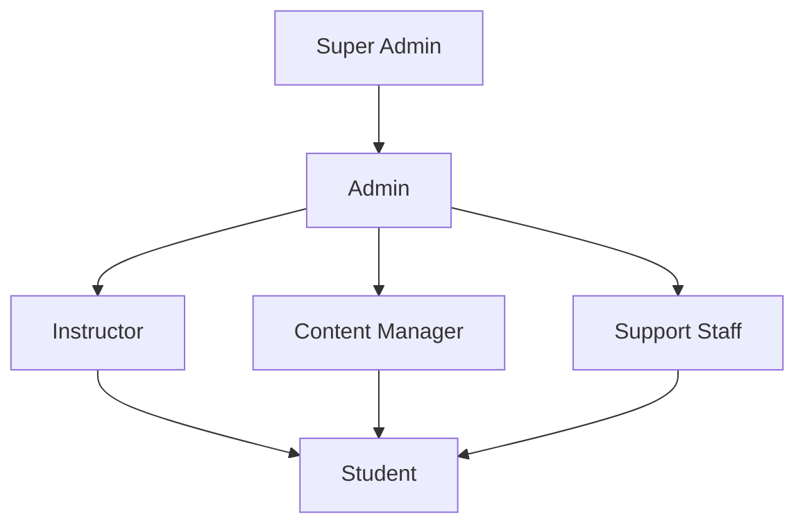
```mermaid
graph TD
    SuperAdmin[Super Admin] --> Admin[Admin]
    Admin --> Instructor[Instructor]
    Admin --> ContentManager[Content Manager]
    Admin --> Support[Support Staff]
    Instructor --> Student[Student]
    ContentManager --> Student
    Support --> Student
```

### 2.2 Permission Matrix
| Role | Course Management | User Management | Content Management | Assessment Management | Analytics Access |
|------|------------------|----------------|-------------------|----------------------|-----------------|
| Super Admin | Full | Full | Full | Full | Full |
| Admin | Full | Full | Full | Full | Full |
| Instructor | Limited | None | Limited | Full | Limited |
| Content Manager | None | None | Full | None | None |
| Support Staff | None | Limited | None | None | Limited |
| Student | None | None | None | Limited | None |

## 3. Core Functional Modules

### 3.1 User Management
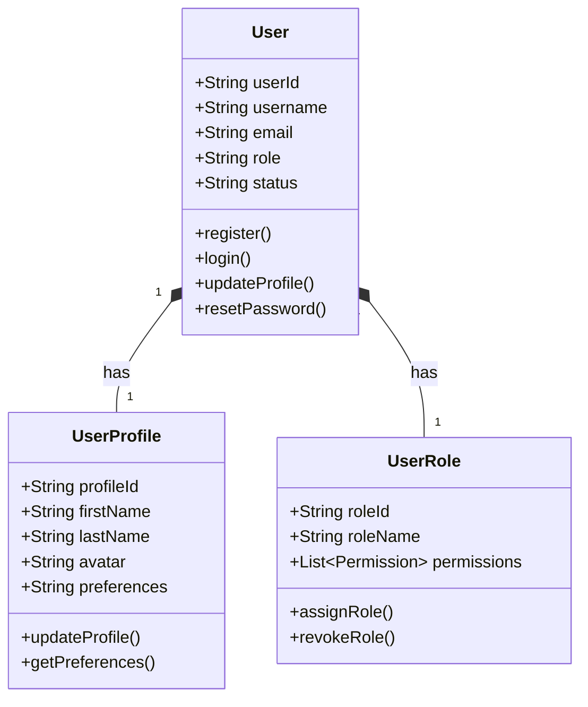
```mermaid
classDiagram
    class User {
        +String userId
        +String username
        +String email
        +String role
        +String status
        +register()
        +login()
        +updateProfile()
        +resetPassword()
    }
    
    class UserProfile {
        +String profileId
        +String firstName
        +String lastName
        +String avatar
        +String preferences
        +updateProfile()
        +getPreferences()
    }
    
    class UserRole {
        +String roleId
        +String roleName
        +List~Permission~ permissions
        +assignRole()
        +revokeRole()
    }
    
    User "1" *-- "1" UserProfile : has
    User "1" *-- "1" UserRole : has
```

### 3.2 Course Management
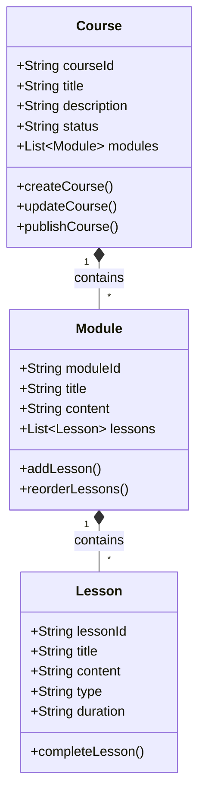
```mermaid
classDiagram
    class Course {
        +String courseId
        +String title
        +String description
        +String status
        +List~Module~ modules
        +createCourse()
        +updateCourse()
        +publishCourse()
    }
    
    class Module {
        +String moduleId
        +String title
        +String content
        +List~Lesson~ lessons
        +addLesson()
        +reorderLessons()
    }
    
    class Lesson {
        +String lessonId
        +String title
        +String content
        +String type
        +String duration
        +completeLesson()
    }
    
    Course "1" *-- "*" Module : contains
    Module "1" *-- "*" Lesson : contains
```

### 3.3 Content Management
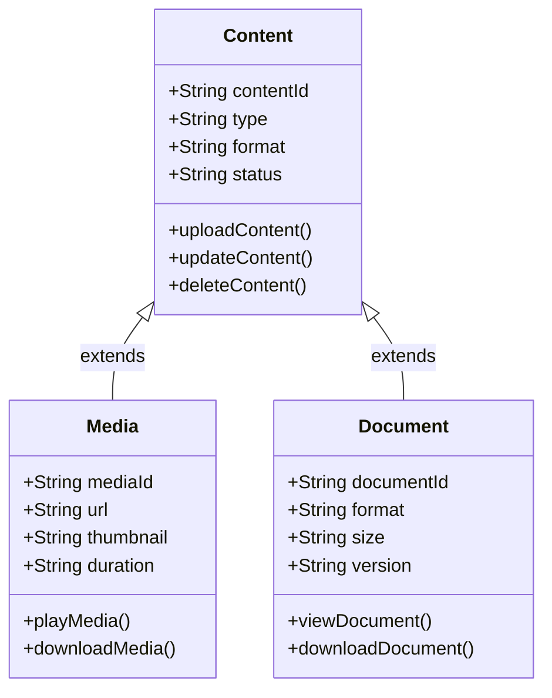
```mermaid
classDiagram
    class Content {
        +String contentId
        +String type
        +String format
        +String status
        +uploadContent()
        +updateContent()
        +deleteContent()
    }
    
    class Media {
        +String mediaId
        +String url
        +String thumbnail
        +String duration
        +playMedia()
        +downloadMedia()
    }
    
    class Document {
        +String documentId
        +String format
        +String size
        +String version
        +viewDocument()
        +downloadDocument()
    }
    
    Content <|-- Media : extends
    Content <|-- Document : extends
```

### 3.4 Assessment System
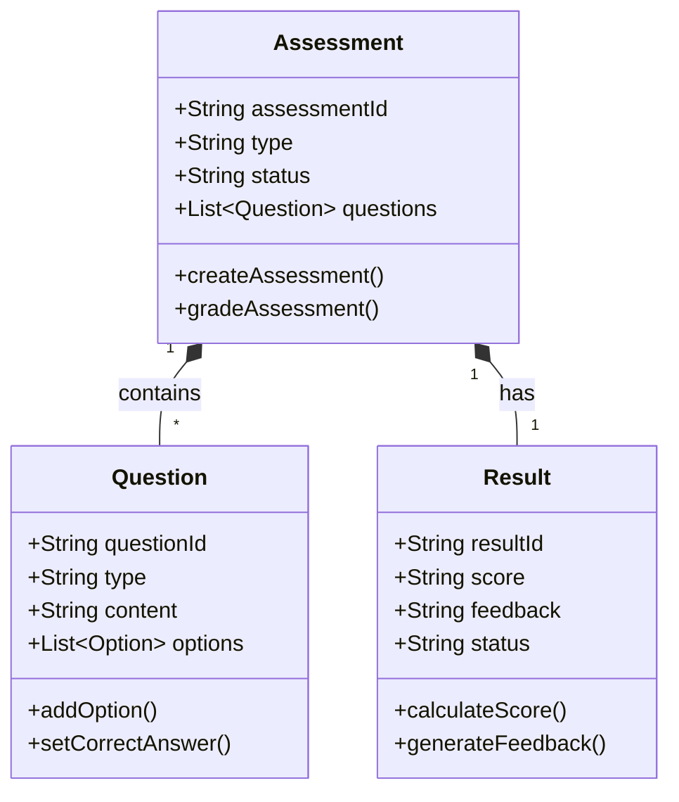
```mermaid
classDiagram
    class Assessment {
        +String assessmentId
        +String type
        +String status
        +List~Question~ questions
        +createAssessment()
        +gradeAssessment()
    }
    
    class Question {
        +String questionId
        +String type
        +String content
        +List~Option~ options
        +addOption()
        +setCorrectAnswer()
    }
    
    class Result {
        +String resultId
        +String score
        +String feedback
        +String status
        +calculateScore()
        +generateFeedback()
    }
    
    Assessment "1" *-- "*" Question : contains
    Assessment "1" *-- "1" Result : has
```

## 4. Use Case Specifications

### 4.1 User Management Use Cases
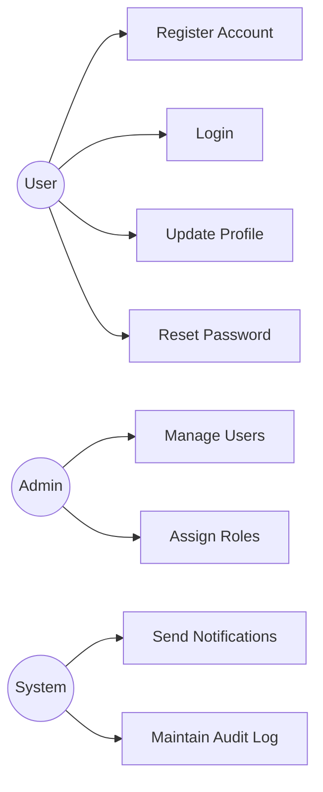
```mermaid
graph LR
    User((User))
    Admin((Admin))
    System((System))

    User --> RA[Register Account]
    User --> L[Login]
    User --> UP[Update Profile]
    User --> RP[Reset Password]
    Admin --> MU[Manage Users]
    Admin --> AR[Assign Roles]
    System --> SN[Send Notifications]
    System --> MA[Maintain Audit Log]
```

### 4.2 Course Management Use Cases
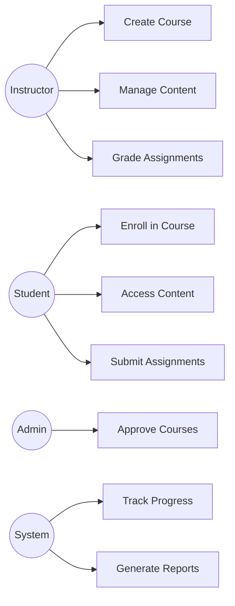
```mermaid
graph LR
    Instructor((Instructor))
    Student((Student))
    Admin((Admin))
    System((System))

    Instructor --> CC[Create Course]
    Instructor --> MC[Manage Content]
    Instructor --> GA[Grade Assignments]
    Student --> EC[Enroll in Course]
    Student --> AC[Access Content]
    Student --> SA[Submit Assignments]
    Admin --> ApC[Approve Courses]
    System --> TP[Track Progress]
    System --> GR[Generate Reports]
```

### 4.3 Content Management Use Cases
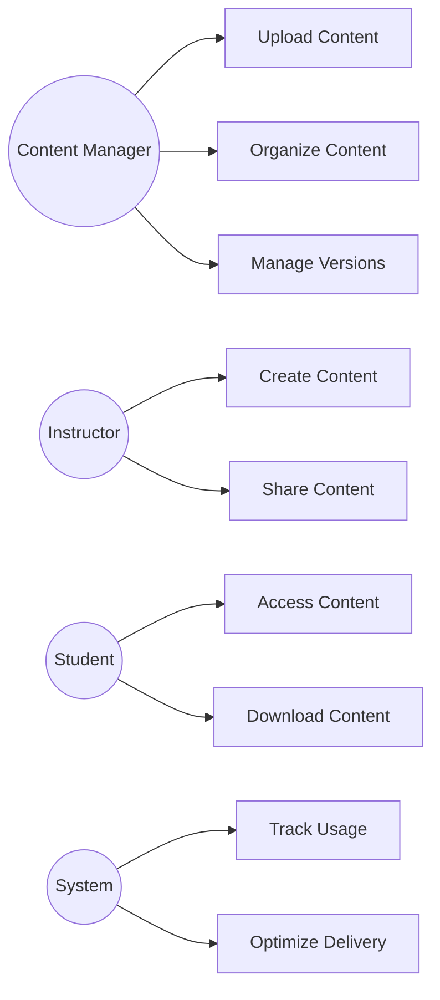
```mermaid
graph LR
    ContentManager((Content Manager))
    Instructor((Instructor))
    Student((Student))
    System((System))

    ContentManager --> UC[Upload Content]
    ContentManager --> OC[Organize Content]
    ContentManager --> MV[Manage Versions]
    Instructor --> CC[Create Content]
    Instructor --> SC[Share Content]
    Student --> AC[Access Content]
    Student --> DC[Download Content]
    System --> TU[Track Usage]
    System --> OD[Optimize Delivery]
```

## 5. Functional Requirements

### 5.1 User Management Requirements
1. **User Registration**
   - Email verification
   - Profile completion
   - Role assignment
   - Welcome notification

2. **Authentication**
   - Multi-factor authentication
   - Session management
   - Password policies
   - Account recovery

3. **Profile Management**
   - Personal information
   - Preferences
   - Notification settings
   - Privacy controls

### 5.2 Course Management Requirements
1. **Course Creation**
   - Course structure
   - Content organization
   - Prerequisites
   - Enrollment rules

2. **Content Delivery**
   - Progress tracking
   - Completion criteria
   - Offline access
   - Mobile optimization

3. **Assessment Management**
   - Question types
   - Grading rules
   - Feedback system
   - Result analytics

### 5.3 Content Management Requirements
1. **Content Creation**
   - Multiple formats
   - Version control
   - Metadata management
   - Quality checks

2. **Content Delivery**
   - Adaptive streaming
   - Download options
   - Offline access
   - Progress tracking

3. **Content Organization**
   - Taxonomy management
   - Search functionality
   - Recommendation engine
   - Access control

## 6. Integration Points

### 6.1 External Systems
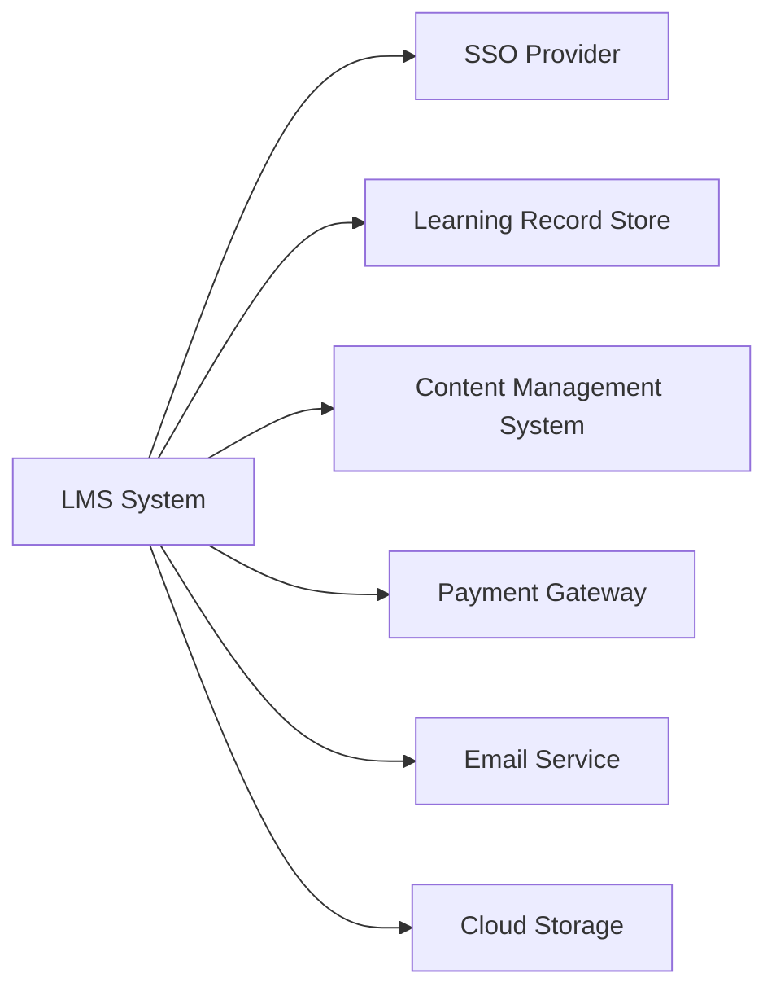
```mermaid
graph LR
    LMS[LMS System] --> SSO[SSO Provider]
    LMS --> LRS[Learning Record Store]
    LMS --> CMS[Content Management System]
    LMS --> Payment[Payment Gateway]
    LMS --> Email[Email Service]
    LMS --> Storage[Cloud Storage]
```

### 6.2 API Endpoints
1. **User Management**
   - `/api/v1/users`
   - `/api/v1/auth`
   - `/api/v1/profiles`

2. **Course Management**
   - `/api/v1/courses`
   - `/api/v1/modules`
   - `/api/v1/lessons`

3. **Content Management**
   - `/api/v1/content`
   - `/api/v1/media`
   - `/api/v1/documents`

4. **Assessment System**
   - `/api/v1/assessments`
   - `/api/v1/questions`
   - `/api/v1/results`

## 7. Security Requirements

### 7.1 Authentication
- OAuth 2.0 / OpenID Connect
- JWT tokens
- Session management
- Rate limiting

### 7.2 Authorization
- Role-based access control
- Permission management
- Resource-level access
- Audit logging

### 7.3 Data Protection
- Encryption at rest
- Encryption in transit
- Data masking
- Secure storage

## 8. Performance Requirements

### 8.1 Response Times
- Page load: < 2 seconds
- API response: < 500ms
- Search results: < 1 second
- File upload: < 5 seconds

### 8.2 Scalability
- Horizontal scaling
- Load balancing
- Caching strategy
- Database optimization

### 8.3 Availability
- 99.9% uptime
- Disaster recovery
- Backup strategy
- Monitoring system 

## 9. Detailed System Diagrams

### 9.1 Core Module Class Diagrams

#### 9.1.1 Learning Path Management
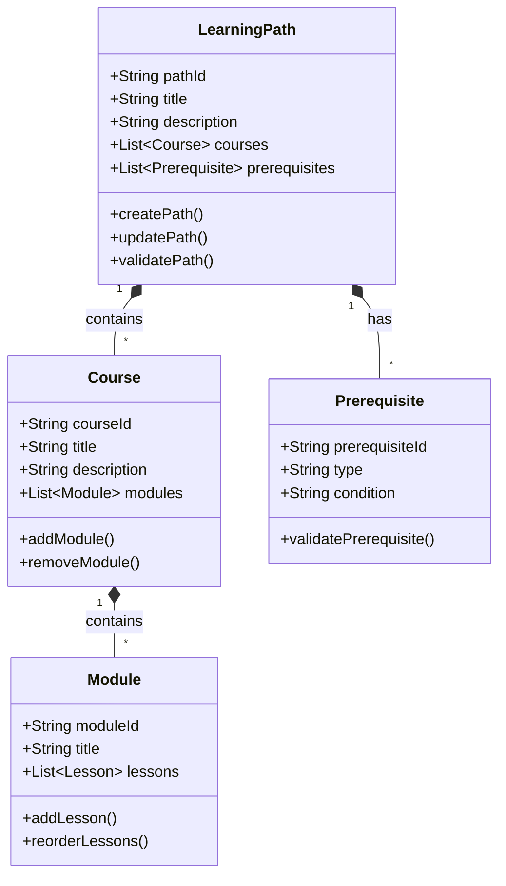
```mermaid
classDiagram
    class LearningPath {
        +String pathId
        +String title
        +String description
        +List~Course~ courses
        +List~Prerequisite~ prerequisites
        +createPath()
        +updatePath()
        +validatePath()
    }
    
    class Course {
        +String courseId
        +String title
        +String description
        +List~Module~ modules
        +addModule()
        +removeModule()
    }
    
    class Module {
        +String moduleId
        +String title
        +List~Lesson~ lessons
        +addLesson()
        +reorderLessons()
    }
    
    class Prerequisite {
        +String prerequisiteId
        +String type
        +String condition
        +validatePrerequisite()
    }
    
    LearningPath "1" *-- "*" Course : contains
    Course "1" *-- "*" Module : contains
    LearningPath "1" *-- "*" Prerequisite : has
```

#### 9.1.2 Analytics and Reporting
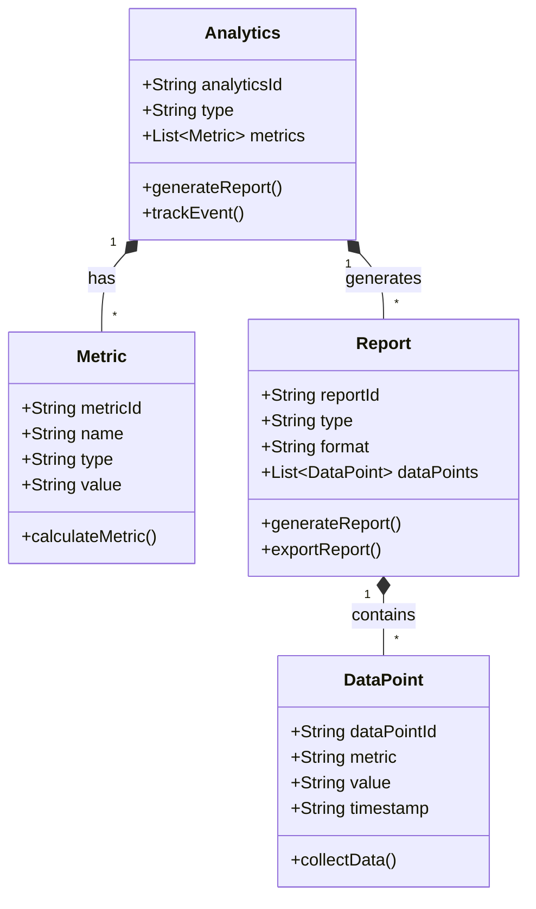
```mermaid
classDiagram
    class Analytics {
        +String analyticsId
        +String type
        +List~Metric~ metrics
        +generateReport()
        +trackEvent()
    }
    
    class Metric {
        +String metricId
        +String name
        +String type
        +String value
        +calculateMetric()
    }
    
    class Report {
        +String reportId
        +String type
        +String format
        +List~DataPoint~ dataPoints
        +generateReport()
        +exportReport()
    }
    
    class DataPoint {
        +String dataPointId
        +String metric
        +String value
        +String timestamp
        +collectData()
    }
    
    Analytics "1" *-- "*" Metric : has
    Analytics "1" *-- "*" Report : generates
    Report "1" *-- "*" DataPoint : contains
```

### 9.2 Extended Use Case Diagrams

#### 9.2.1 Learning Path Management Use Cases
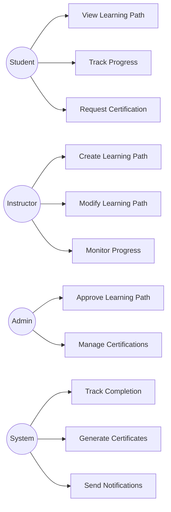
```mermaid
graph LR
    Student((Student))
    Instructor((Instructor))
    Admin((Admin))
    System((System))

    Student --> VLP[View Learning Path]
    Student --> TP[Track Progress]
    Student --> RC[Request Certification]
    Instructor --> CLP[Create Learning Path]
    Instructor --> MLP[Modify Learning Path]
    Instructor --> MP[Monitor Progress]
    Admin --> ALP[Approve Learning Path]
    Admin --> MC[Manage Certifications]
    System --> TC[Track Completion]
    System --> GC[Generate Certificates]
    System --> SN[Send Notifications]
```

#### 9.2.2 Analytics and Reporting Use Cases
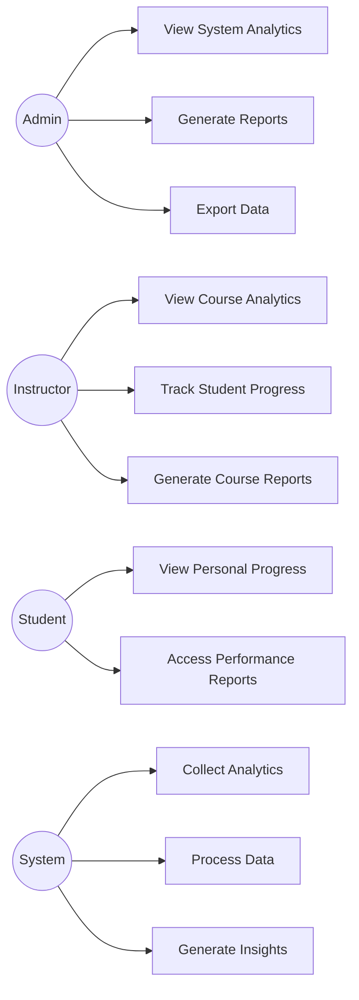
```mermaid
graph LR
    Admin((Admin))
    Instructor((Instructor))
    Student((Student))
    System((System))

    Admin --> VSA[View System Analytics]
    Admin --> GR[Generate Reports]
    Admin --> ED[Export Data]
    Instructor --> VCA[View Course Analytics]
    Instructor --> TSP[Track Student Progress]
    Instructor --> GCR[Generate Course Reports]
    Student --> VPP[View Personal Progress]
    Student --> APR[Access Performance Reports]
    System --> CA[Collect Analytics]
    System --> PD[Process Data]
    System --> GI[Generate Insights]
```

### 9.3 Component Architecture Diagrams

#### 9.3.1 Core System Components
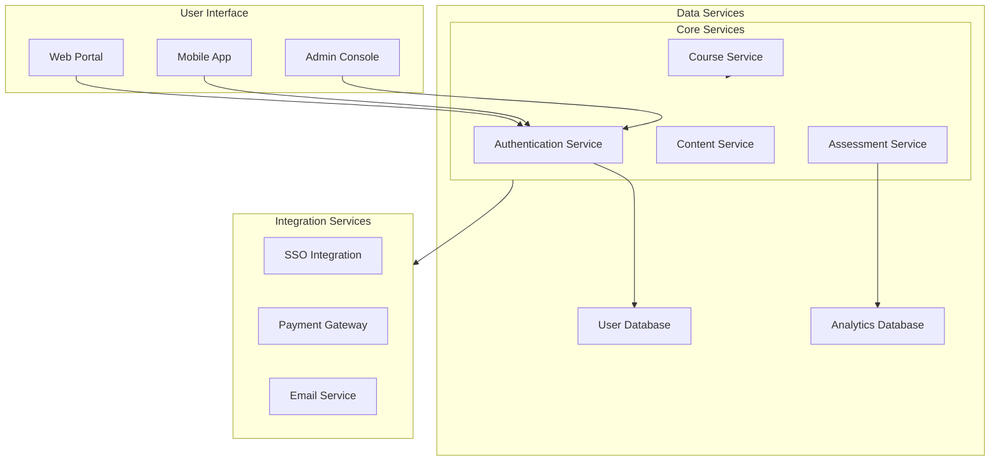
```mermaid
graph TB
    subgraph UI[User Interface]
        WP[Web Portal]
        MA[Mobile App]
        AC[Admin Console]
    end

    subgraph CS[Core Services]
        AS[Authentication Service]
        COS[Course Service]
        CNS[Content Service]
        ASS[Assessment Service]
    end

    subgraph DS[Data Services]
        UD[User Database]
        CS[Content Storage]
        AD[Analytics Database]
    end

    subgraph IS[Integration Services]
        SSO[SSO Integration]
        PG[Payment Gateway]
        ES[Email Service]
    end

    WP --> AS
    MA --> AS
    AC --> AS
    AS --> UD
    COS --> CS
    ASS --> AD
    CS --> IS
```

#### 9.3.2 Microservices Architecture
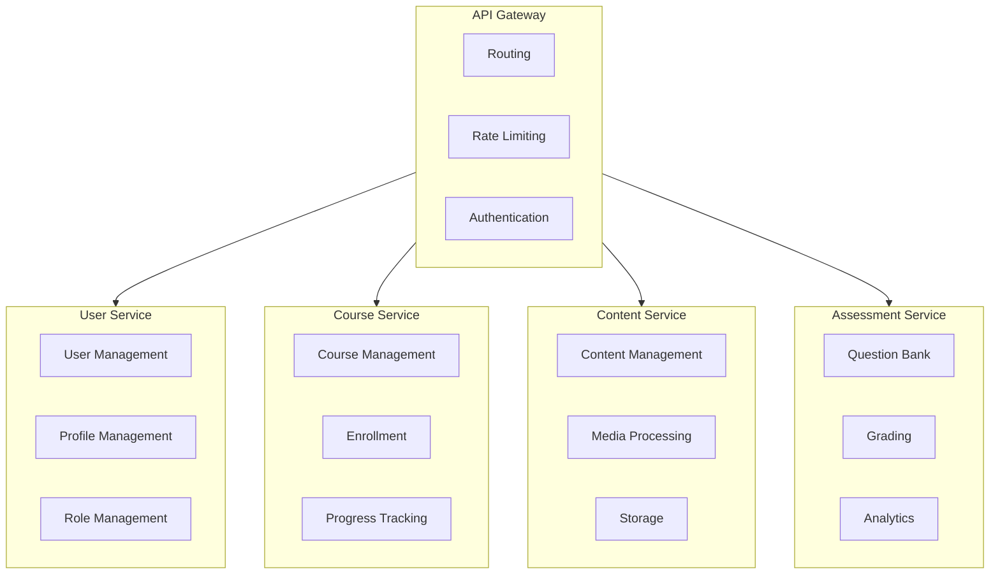
```mermaid
graph TB
    subgraph AG[API Gateway]
        RT[Routing]
        RL[Rate Limiting]
        AU[Authentication]
    end

    subgraph US[User Service]
        UM[User Management]
        PM[Profile Management]
        RM[Role Management]
    end

    subgraph CS[Course Service]
        CM[Course Management]
        EN[Enrollment]
        PT[Progress Tracking]
    end

    subgraph CNS[Content Service]
        CTM[Content Management]
        MP[Media Processing]
        ST[Storage]
    end

    subgraph AS[Assessment Service]
        QB[Question Bank]
        GR[Grading]
        AN[Analytics]
    end

    AG --> US
    AG --> CS
    AG --> CNS
    AG --> AS
```

### 9.4 Workflow Sequence Diagrams

#### 9.4.1 Course Enrollment Workflow
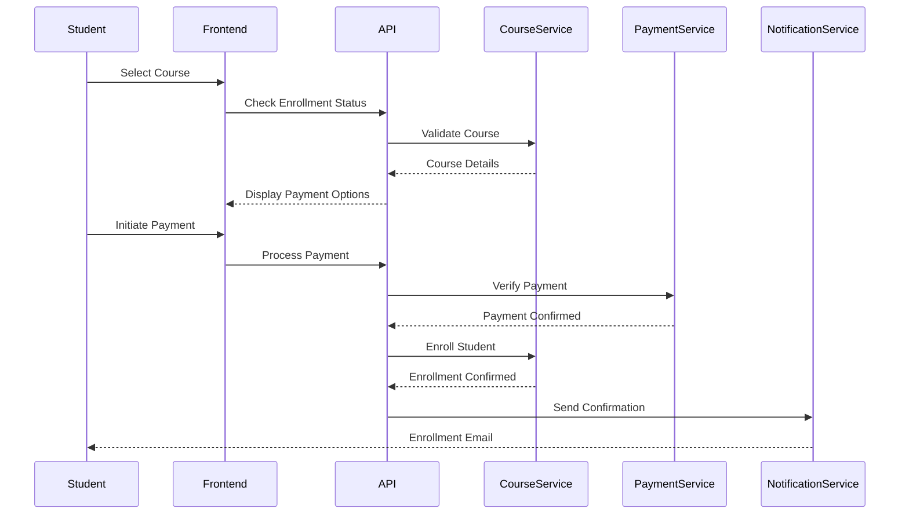
```mermaid
sequenceDiagram
    participant Student
    participant Frontend
    participant API
    participant CourseService
    participant PaymentService
    participant NotificationService
    
    Student->>Frontend: Select Course
    Frontend->>API: Check Enrollment Status
    API->>CourseService: Validate Course
    CourseService-->>API: Course Details
    API-->>Frontend: Display Payment Options
    Student->>Frontend: Initiate Payment
    Frontend->>API: Process Payment
    API->>PaymentService: Verify Payment
    PaymentService-->>API: Payment Confirmed
    API->>CourseService: Enroll Student
    CourseService-->>API: Enrollment Confirmed
    API->>NotificationService: Send Confirmation
    NotificationService-->>Student: Enrollment Email
```

#### 9.4.2 Content Delivery Workflow
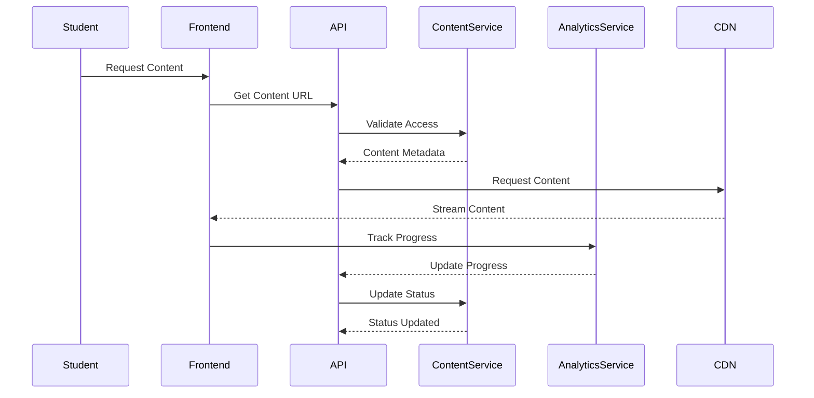
```mermaid
sequenceDiagram
    participant Student
    participant Frontend
    participant API
    participant ContentService
    participant AnalyticsService
    participant CDN
    
    Student->>Frontend: Request Content
    Frontend->>API: Get Content URL
    API->>ContentService: Validate Access
    ContentService-->>API: Content Metadata
    API->>CDN: Request Content
    CDN-->>Frontend: Stream Content
    Frontend->>AnalyticsService: Track Progress
    AnalyticsService-->>API: Update Progress
    API->>ContentService: Update Status
    ContentService-->>API: Status Updated
```

#### 9.4.3 Assessment Workflow
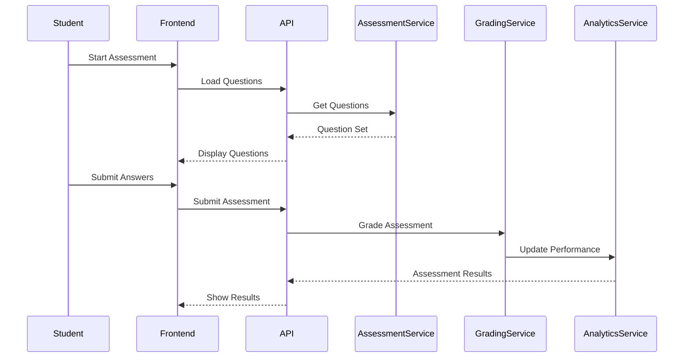
```mermaid
sequenceDiagram
    participant Student
    participant Frontend
    participant API
    participant AssessmentService
    participant GradingService
    participant AnalyticsService
    
    Student->>Frontend: Start Assessment
    Frontend->>API: Load Questions
    API->>AssessmentService: Get Questions
    AssessmentService-->>API: Question Set
    API-->>Frontend: Display Questions
    Student->>Frontend: Submit Answers
    Frontend->>API: Submit Assessment
    API->>GradingService: Grade Assessment
    GradingService->>AnalyticsService: Update Performance
    AnalyticsService-->>API: Assessment Results
    API-->>Frontend: Show Results
```

#### 9.4.4 Learning Path Completion Workflow
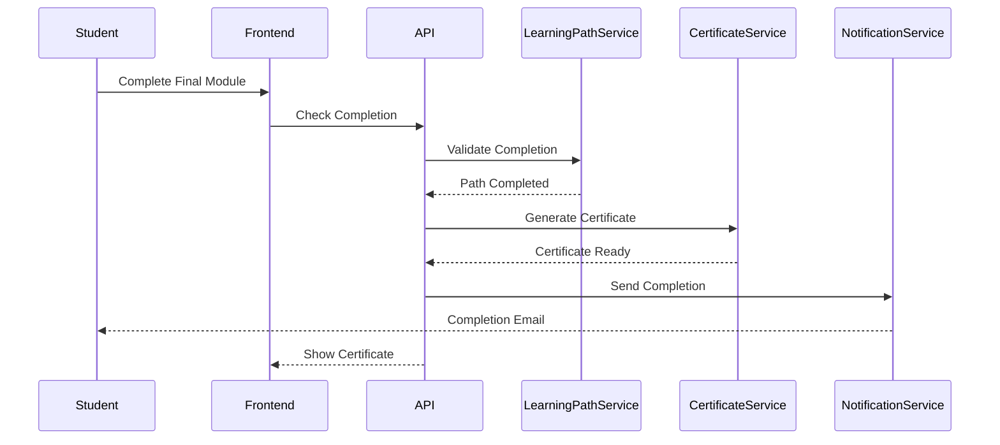
```mermaid
sequenceDiagram
    participant Student
    participant Frontend
    participant API
    participant LearningPathService
    participant CertificateService
    participant NotificationService
    
    Student->>Frontend: Complete Final Module
    Frontend->>API: Check Completion
    API->>LearningPathService: Validate Completion
    LearningPathService-->>API: Path Completed
    API->>CertificateService: Generate Certificate
    CertificateService-->>API: Certificate Ready
    API->>NotificationService: Send Completion
    NotificationService-->>Student: Completion Email
    API-->>Frontend: Show Certificate
``` 