# LCT Learning Management System - Project Budget

[🏠 Home](README.md) > [System Design Documentation](README.md) > Project Budget

[← Back to Main Documentation](README.md)

## Related Documentation
- [System Architecture Diagrams](System_Architecture_Diagrams.md)
- [Frontend Architecture](Frontend_Architecture.md)
- [Mobile App Architecture](Mobile_App_Architecture.md)
- [Database Schema](Database_Schema.md)
- [API Specification](API_Specification.md)
- [Security Compliance](Security_Compliance.md)
- [BCDR Plan](BCDR_Plan.md)
- [Development Rollout Plan](Development_Rollout_Plan.md)

---

## Overview

This document outlines the comprehensive budget for the LCT Learning Management System project, including development, infrastructure, and operational costs.

## 1. Development Costs

### 1.1 Frontend Development
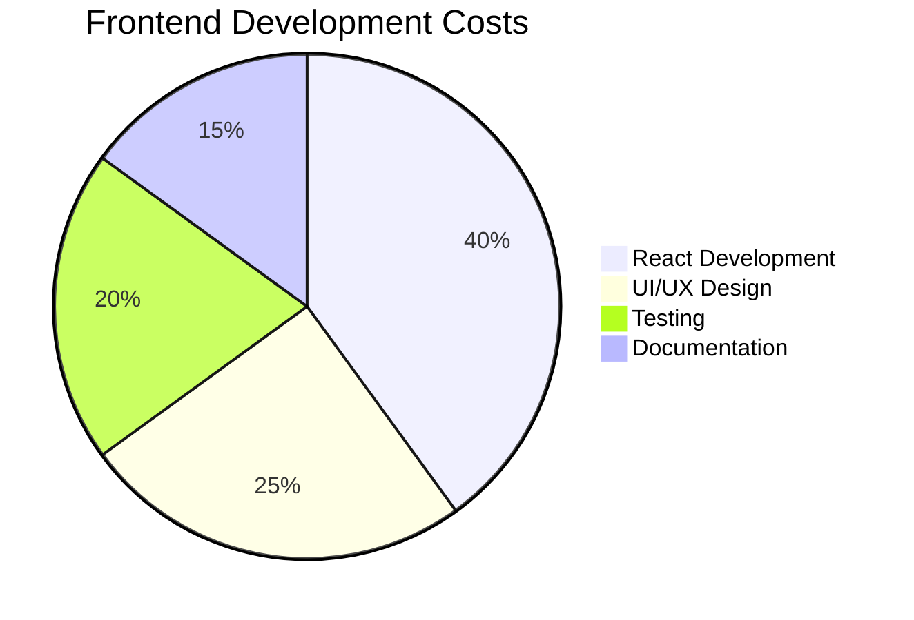
```mermaid
pie title Frontend Development Costs
    "React Development" : 40
    "UI/UX Design" : 25
    "Testing" : 20
    "Documentation" : 15
```

| Component | Hours | Rate ($/hr) | Total Cost |
|-----------|-------|------------|------------|
| **Core Development** | | | |
| React Development | 800 | $75 | $60,000 |
| UI/UX Design | 500 | $85 | $42,500 |
| Testing | 400 | $70 | $28,000 |
| Documentation | 300 | $65 | $19,500 |
| **Total Frontend** | | | **$150,000** |

### 1.2 Backend Development
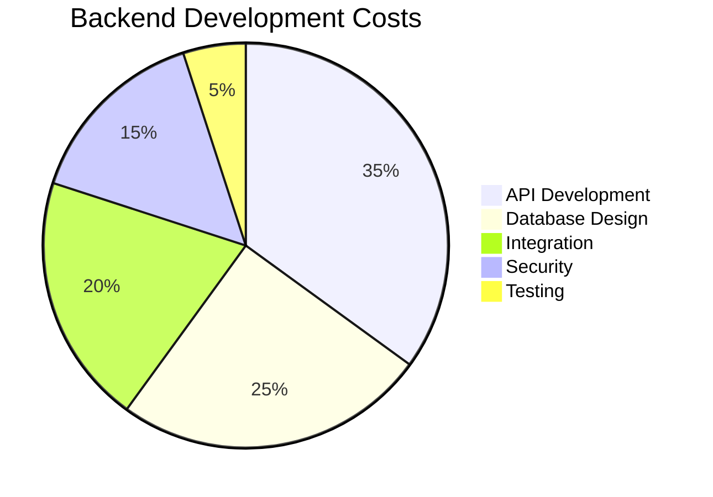
```mermaid
pie title Backend Development Costs
    "API Development" : 35
    "Database Design" : 25
    "Integration" : 20
    "Security" : 15
    "Testing" : 5
```

| Component | Hours | Rate ($/hr) | Total Cost |
|-----------|-------|------------|------------|
| **Core Development** | | | |
| API Development | 1000 | $80 | $80,000 |
| Database Design | 700 | $85 | $59,500 |
| Integration | 600 | $75 | $45,000 |
| Security | 500 | $90 | $45,000 |
| Testing | 300 | $70 | $21,000 |
| **Total Backend** | | | **$250,500** |

### 1.3 Mobile App Development
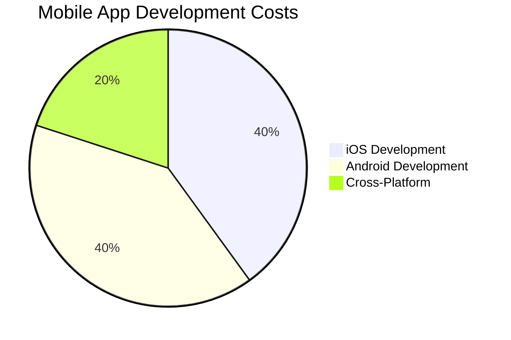
```mermaid
pie title Mobile App Development Costs
    "iOS Development" : 40
    "Android Development" : 40
    "Cross-Platform" : 20
```

| Component | Hours | Rate ($/hr) | Total Cost |
|-----------|-------|------------|------------|
| **Core Development** | | | |
| iOS Development | 600 | $85 | $51,000 |
| Android Development | 600 | $85 | $51,000 |
| Cross-Platform | 300 | $80 | $24,000 |
| Testing | 400 | $70 | $28,000 |
| **Total Mobile** | | | **$154,000** |

## 2. Infrastructure Costs

### 2.1 Cloud Infrastructure (Annual)
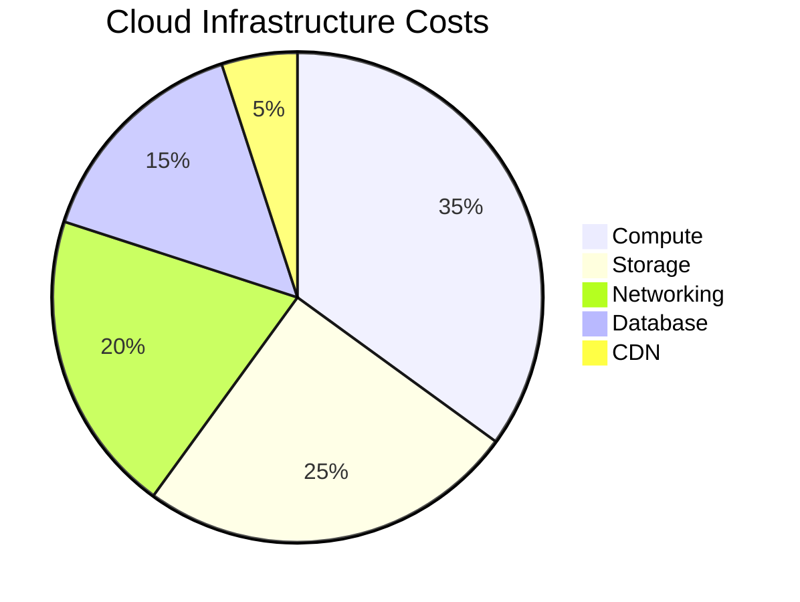
```mermaid
pie title Cloud Infrastructure Costs
    "Compute" : 35
    "Storage" : 25
    "Networking" : 20
    "Database" : 15
    "CDN" : 5
```

| Component | Monthly Cost | Annual Cost | Notes |
|-----------|-------------|-------------|-------|
| **Compute** | | | |
| App Services | $2,000 | $24,000 | Auto-scaling enabled |
| Kubernetes | $1,500 | $18,000 | Managed service |
| **Storage** | | | |
| Blob Storage | $500 | $6,000 | Hot/Cool tiers |
| Database | $1,000 | $12,000 | Managed instance |
| **Networking** | | | |
| Load Balancer | $300 | $3,600 | Global distribution |
| CDN | $200 | $2,400 | Content delivery |
| **Total Annual** | | **$66,000** | |

### 2.2 Development Infrastructure
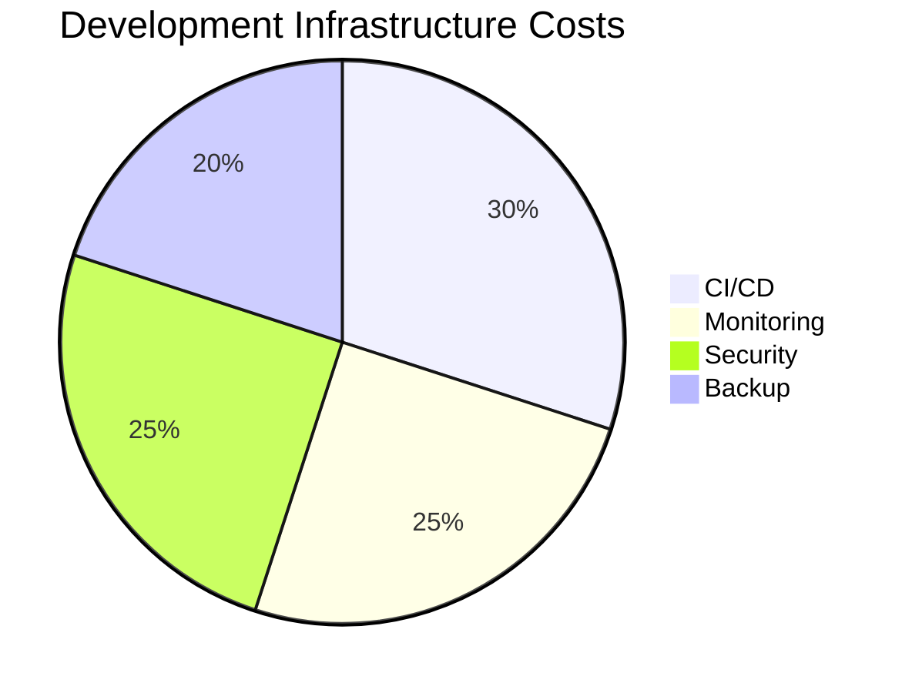
```mermaid
pie title Development Infrastructure Costs
    "CI/CD" : 30
    "Monitoring" : 25
    "Security" : 25
    "Backup" : 20
```

| Component | Monthly Cost | Annual Cost | Notes |
|-----------|-------------|-------------|-------|
| **CI/CD** | | | |
| GitHub Enterprise | $500 | $6,000 | Team license |
| Azure DevOps | $300 | $3,600 | Build pipelines |
| **Monitoring** | | | |
| Application Insights | $200 | $2,400 | Performance monitoring |
| Log Analytics | $150 | $1,800 | Log management |
| **Security** | | | |
| Security Center | $400 | $4,800 | Threat protection |
| WAF | $250 | $3,000 | Web application firewall |
| **Backup** | | | |
| Azure Backup | $100 | $1,200 | Data protection |
| **Total Annual** | | **$22,800** | |

## 3. Operational Costs

### 3.1 Support and Maintenance
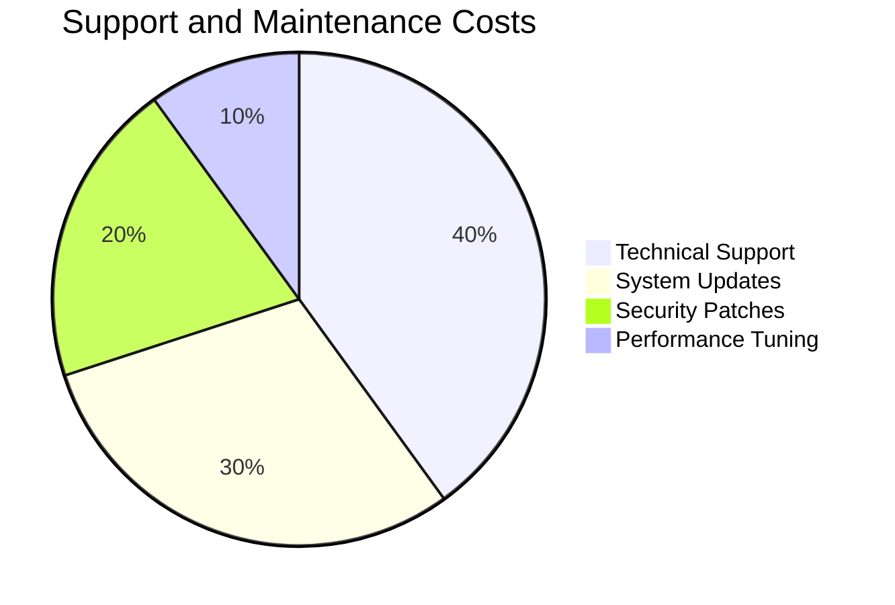
```mermaid
pie title Support and Maintenance Costs
    "Technical Support" : 40
    "System Updates" : 30
    "Security Patches" : 20
    "Performance Tuning" : 10
```

| Component | Monthly Cost | Annual Cost | Notes |
|-----------|-------------|-------------|-------|
| **Technical Support** | | | |
| Level 1 Support | $2,000 | $24,000 | 24/7 availability |
| Level 2 Support | $3,000 | $36,000 | Technical expertise |
| **System Maintenance** | | | |
| Updates & Patches | $1,500 | $18,000 | Regular maintenance |
| Performance Tuning | $1,000 | $12,000 | Optimization |
| **Total Annual** | | **$90,000** | |

### 3.2 Training and Documentation
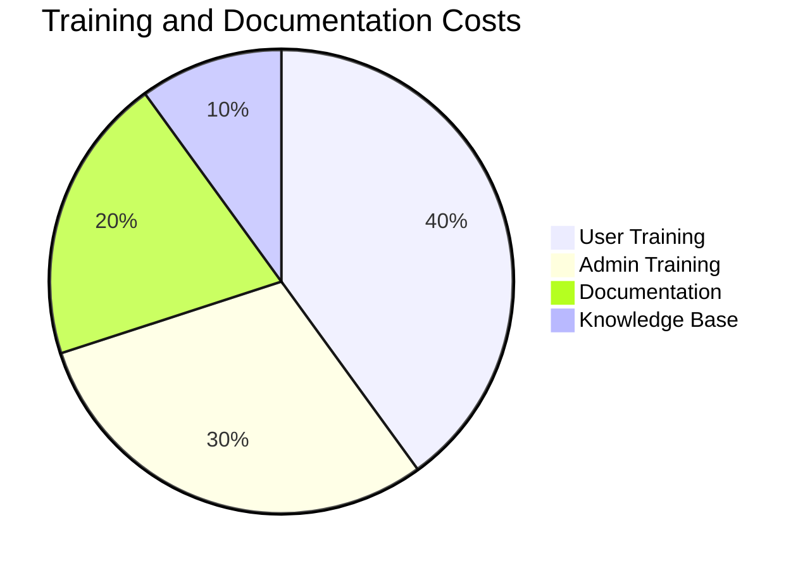
```mermaid
pie title Training and Documentation Costs
    "User Training" : 40
    "Admin Training" : 30
    "Documentation" : 20
    "Knowledge Base" : 10
```

| Component | Cost | Notes |
|-----------|------|-------|
| **Training** | | |
| User Training | $15,000 | Initial training sessions |
| Admin Training | $10,000 | System administration |
| **Documentation** | | |
| User Manuals | $5,000 | Comprehensive guides |
| Knowledge Base | $3,000 | Online resources |
| **Total** | **$33,000** | One-time cost |

## 4. Total Project Budget

### 4.1 Development Phase (6 months)
| Category | Cost |
|----------|------|
| Frontend Development | $150,000 |
| Backend Development | $250,500 |
| Mobile App Development | $154,000 |
| **Subtotal** | **$554,500** |

### 4.2 Infrastructure Setup (3 months)
| Category | Cost |
|----------|------|
| Cloud Infrastructure | $66,000 |
| Development Infrastructure | $22,800 |
| **Subtotal** | **$88,800** |

### 4.3 Operational Phase (First Year)
| Category | Cost |
|----------|------|
| Support and Maintenance | $90,000 |
| Training and Documentation | $33,000 |
| **Subtotal** | **$123,000** |

### 4.4 Total Budget Summary
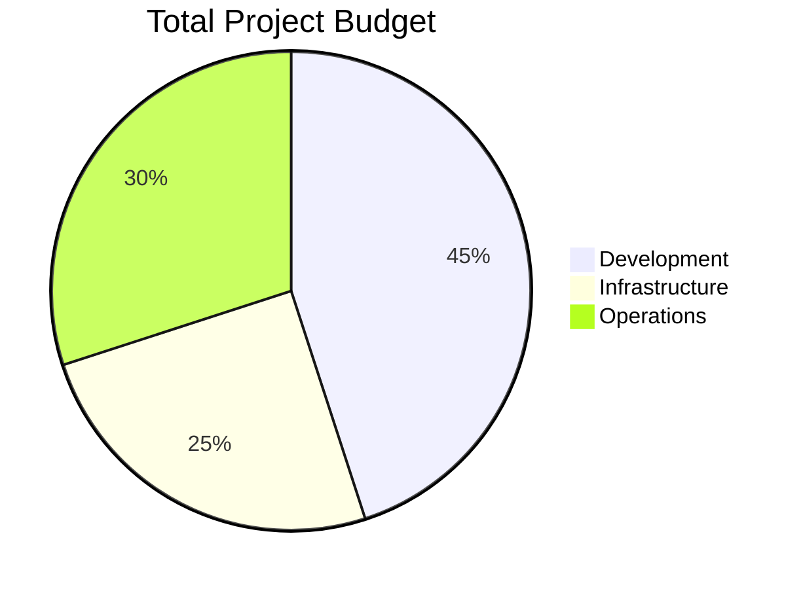
```mermaid
pie title Total Project Budget
    "Development" : 45
    "Infrastructure" : 25
    "Operations" : 30
```

| Phase | Duration | Cost | Percentage |
|-------|----------|------|------------|
| Development | 6 months | $554,500 | 45% |
| Infrastructure | 3 months | $88,800 | 25% |
| Operations | 12 months | $123,000 | 30% |
| **Total** | | **$766,300** | **100%** |

## 5. Cost Optimization Strategies

### 5.1 Development Cost Optimization
- Use of open-source frameworks and libraries
- Implementation of reusable components
- Automated testing to reduce manual effort
- Agile development methodology

### 5.2 Infrastructure Cost Optimization
- Reserved instance pricing
- Auto-scaling based on demand
- Storage lifecycle management
- CDN optimization

### 5.3 Operational Cost Optimization
- Automated monitoring and alerting
- Self-service documentation
- Knowledge base for common issues
- Regular performance optimization

## 6. Budget Allocation Timeline

### 6.1 Development Phase (Months 1-6)
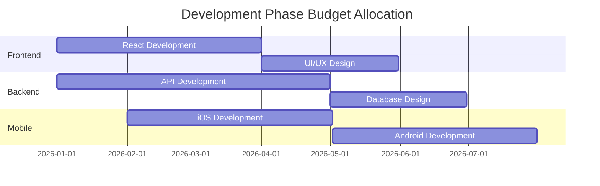
```mermaid
gantt
    title Development Phase Budget Allocation
    dateFormat  MM-DD
    section Frontend
    React Development    :a1, 01-01, 90d
    UI/UX Design        :a2, after a1, 60d
    section Backend
    API Development     :b1, 01-01, 120d
    Database Design     :b2, after b1, 60d
    section Mobile
    iOS Development     :c1, 02-01, 90d
    Android Development :c2, after c1, 90d
```

### 6.2 Infrastructure Phase (Months 4-6)
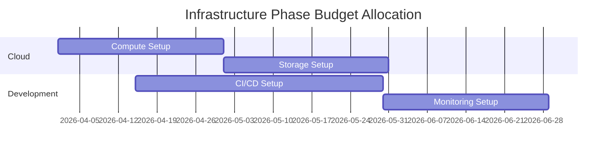
```mermaid
gantt
    title Infrastructure Phase Budget Allocation
    dateFormat  MM-DD
    section Cloud
    Compute Setup      :a1, 04-01, 30d
    Storage Setup      :a2, after a1, 30d
    section Development
    CI/CD Setup        :b1, 04-15, 45d
    Monitoring Setup   :b2, after b1, 30d
```

### 6.3 Operational Phase (Months 7-18)
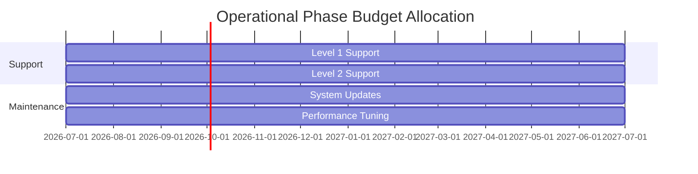
```mermaid
gantt
    title Operational Phase Budget Allocation
    dateFormat  MM-DD
    section Support
    Level 1 Support    :a1, 07-01, 365d
    Level 2 Support    :a2, 07-01, 365d
    section Maintenance
    System Updates     :b1, 07-01, 365d
    Performance Tuning :b2, 07-01, 365d
```

## 7. Detailed Component Cost Breakdowns

### 7.1 Frontend Component Costs
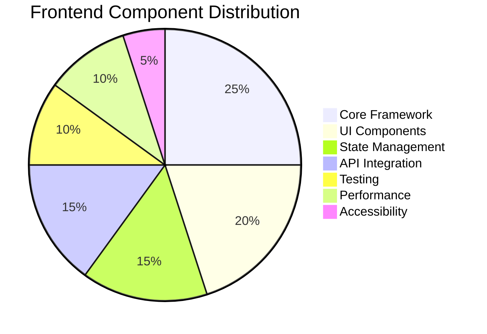
```mermaid
pie title Frontend Component Distribution
    "Core Framework" : 25
    "UI Components" : 20
    "State Management" : 15
    "API Integration" : 15
    "Testing" : 10
    "Performance" : 10
    "Accessibility" : 5
```

| Component | Hours | Rate ($/hr) | Total Cost | Details |
|-----------|-------|------------|------------|---------|
| **Core Framework** | | | | |
| React Setup | 100 | $75 | $7,500 | Base framework setup |
| Routing | 80 | $75 | $6,000 | Navigation implementation |
| **UI Components** | | | | |
| Design System | 120 | $85 | $10,200 | Component library |
| Custom Components | 200 | $85 | $17,000 | Application-specific components |
| **State Management** | | | | |
| Redux Setup | 60 | $75 | $4,500 | State management |
| API Integration | 100 | $75 | $7,500 | Backend integration |
| **Testing** | | | | |
| Unit Tests | 120 | $70 | $8,400 | Component testing |
| Integration Tests | 100 | $70 | $7,000 | Feature testing |
| **Performance** | | | | |
| Optimization | 80 | $75 | $6,000 | Performance tuning |
| **Accessibility** | | | | |
| WCAG Compliance | 40 | $75 | $3,000 | Accessibility features |

### 7.2 Backend Component Costs
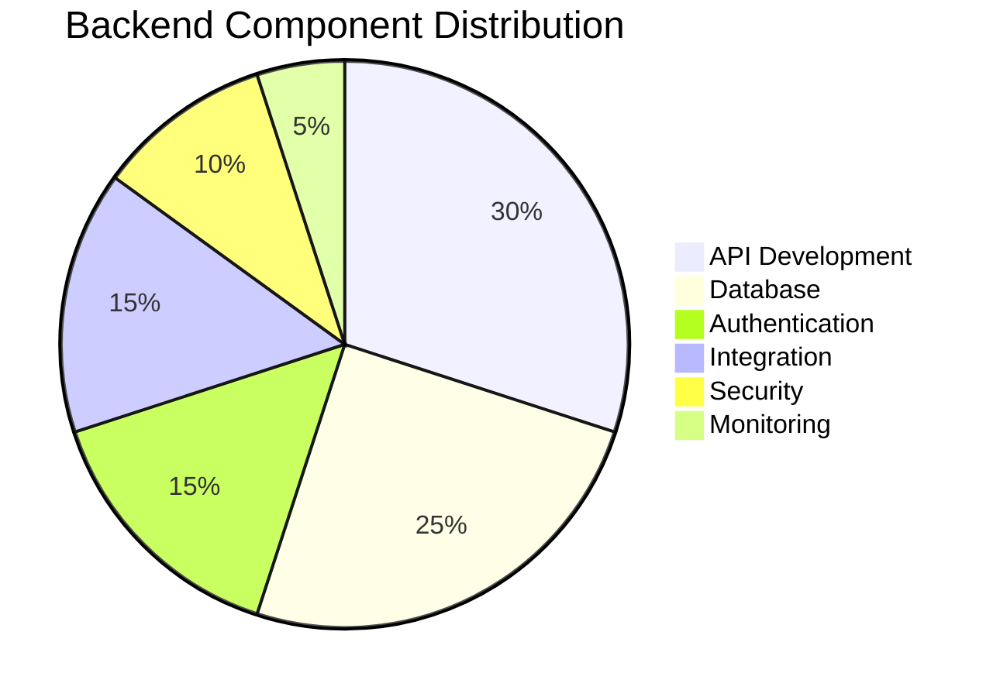
```mermaid
pie title Backend Component Distribution
    "API Development" : 30
    "Database" : 25
    "Authentication" : 15
    "Integration" : 15
    "Security" : 10
    "Monitoring" : 5
```

| Component | Hours | Rate ($/hr) | Total Cost | Details |
|-----------|-------|------------|------------|---------|
| **API Development** | | | | |
| REST API | 300 | $80 | $24,000 | Core API endpoints |
| GraphQL | 200 | $80 | $16,000 | Query optimization |
| **Database** | | | | |
| Schema Design | 200 | $85 | $17,000 | Database structure |
| Query Optimization | 150 | $85 | $12,750 | Performance tuning |
| **Authentication** | | | | |
| Auth System | 150 | $90 | $13,500 | Security implementation |
| **Integration** | | | | |
| Third-party APIs | 200 | $75 | $15,000 | External services |
| **Security** | | | | |
| Security Measures | 100 | $90 | $9,000 | Protection implementation |
| **Monitoring** | | | | |
| Logging System | 50 | $80 | $4,000 | Monitoring setup |

### 7.3 Mobile App Component Costs
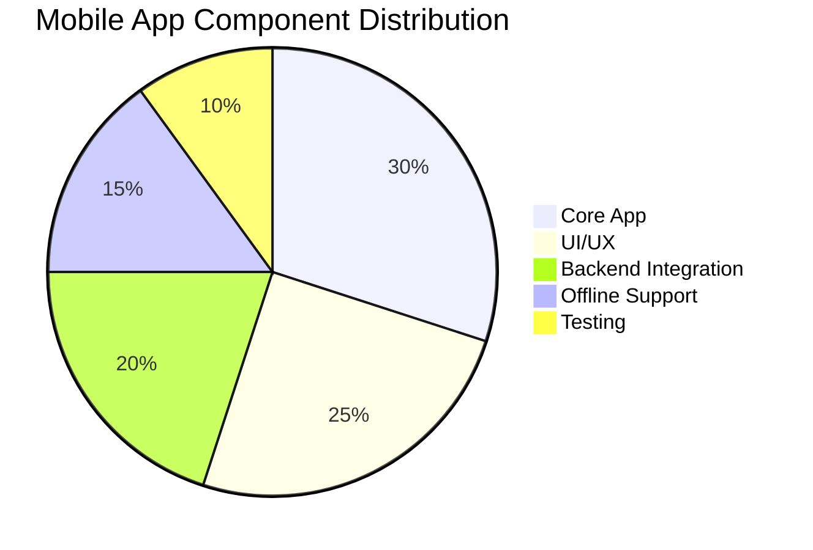
```mermaid
pie title Mobile App Component Distribution
    "Core App" : 30
    "UI/UX" : 25
    "Backend Integration" : 20
    "Offline Support" : 15
    "Testing" : 10
```

| Component | Hours | Rate ($/hr) | Total Cost | Details |
|-----------|-------|------------|------------|---------|
| **Core App** | | | | |
| iOS Base | 200 | $85 | $17,000 | Core iOS functionality |
| Android Base | 200 | $85 | $17,000 | Core Android functionality |
| **UI/UX** | | | | |
| Design System | 150 | $85 | $12,750 | Mobile UI components |
| **Backend Integration** | | | | |
| API Integration | 150 | $80 | $12,000 | Backend connectivity |
| **Offline Support** | | | | |
| Local Storage | 100 | $80 | $8,000 | Offline capabilities |
| **Testing** | | | | |
| Device Testing | 100 | $70 | $7,000 | Cross-device testing |

## 8. Additional Cost Optimization Strategies

### 8.1 Development Phase Optimization
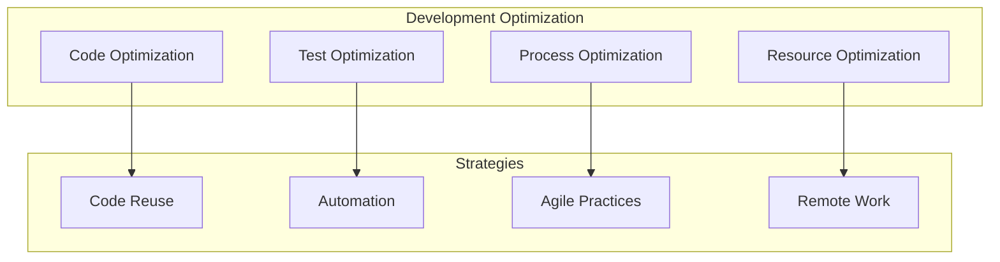
```mermaid
graph TD
    subgraph Development Optimization
        Code[Code Optimization]
        Test[Test Optimization]
        Process[Process Optimization]
        Resource[Resource Optimization]
    end

    subgraph Strategies
        Reuse[Code Reuse]
        Auto[Automation]
        Agile[Agile Practices]
        Remote[Remote Work]
    end

    Code --> Reuse
    Test --> Auto
    Process --> Agile
    Resource --> Remote
```

1. **Code Optimization**
   - Implement reusable component libraries
   - Use code generation tools
   - Adopt microservices architecture
   - Implement caching strategies

2. **Test Optimization**
   - Automated testing pipelines
   - Test-driven development
   - Continuous integration
   - Performance testing automation

3. **Process Optimization**
   - Agile methodology implementation
   - Sprint planning optimization
   - Code review automation
   - Documentation automation

4. **Resource Optimization**
   - Remote work implementation
   - Cross-functional teams
   - Knowledge sharing platforms
   - Automated onboarding

### 8.2 Infrastructure Optimization
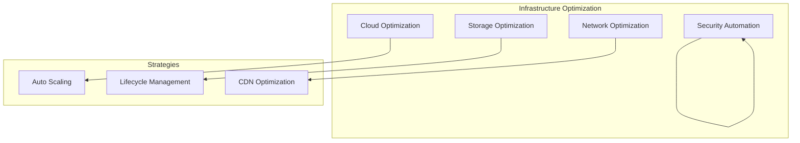
```mermaid
graph TD
    subgraph Infrastructure Optimization
        Cloud[Cloud Optimization]
        Storage[Storage Optimization]
        Network[Network Optimization]
        Security[Security Optimization]
    end

    subgraph Strategies
        AutoScale[Auto Scaling]
        Lifecycle[Lifecycle Management]
        CDN[CDN Optimization]
        Security[Security Automation]
    end

    Cloud --> AutoScale
    Storage --> Lifecycle
    Network --> CDN
    Security --> Security
```

1. **Cloud Resource Optimization**
   - Implement auto-scaling
   - Use spot instances
   - Optimize instance types
   - Implement serverless where possible

2. **Storage Optimization**
   - Implement lifecycle policies
   - Use appropriate storage tiers
   - Implement data compression
   - Optimize backup strategies

3. **Network Optimization**
   - Implement CDN
   - Optimize routing
   - Use edge locations
   - Implement caching

4. **Security Optimization**
   - Automated security updates
   - Implement WAF
   - Use managed security services
   - Automated compliance checks

## 9. Detailed Timeline Projections

### 9.1 Development Phase Timeline
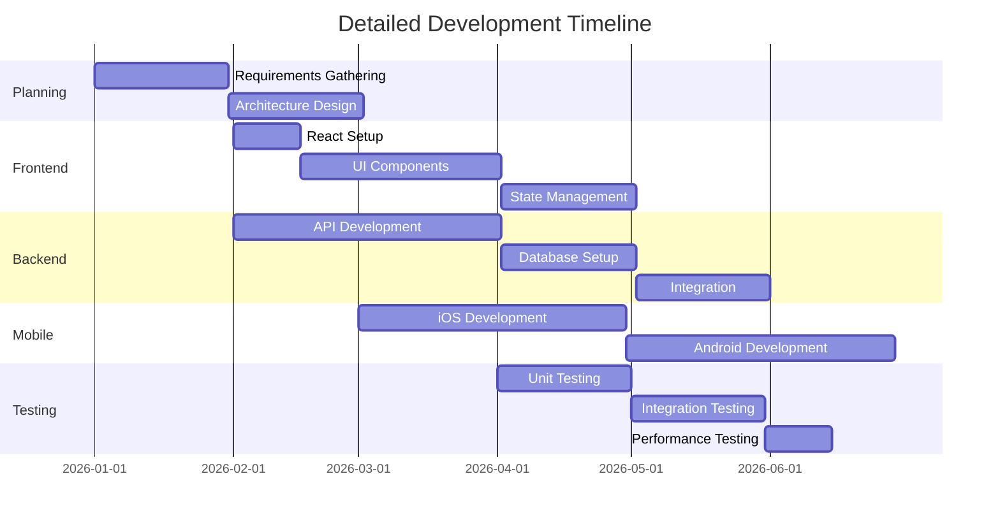
```mermaid
gantt
    title Detailed Development Timeline
    dateFormat  MM-DD
    section Planning
    Requirements Gathering    :a1, 01-01, 30d
    Architecture Design      :a2, after a1, 30d
    section Frontend
    React Setup             :b1, 02-01, 15d
    UI Components           :b2, after b1, 45d
    State Management        :b3, after b2, 30d
    section Backend
    API Development         :c1, 02-01, 60d
    Database Setup          :c2, after c1, 30d
    Integration             :c3, after c2, 30d
    section Mobile
    iOS Development         :d1, 03-01, 60d
    Android Development     :d2, after d1, 60d
    section Testing
    Unit Testing            :e1, 04-01, 30d
    Integration Testing     :e2, after e1, 30d
    Performance Testing     :e3, after e2, 15d
```

### 9.2 Infrastructure Phase Timeline
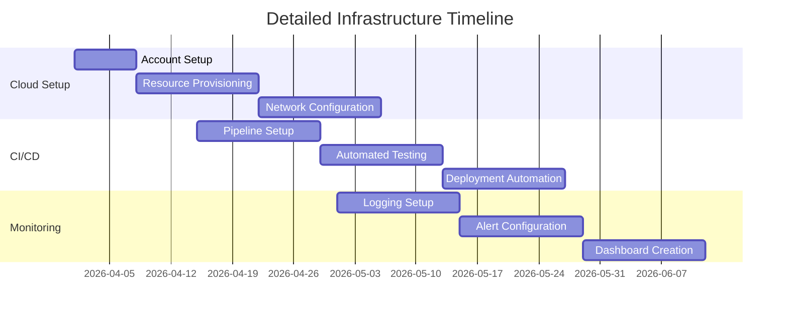
```mermaid
gantt
    title Detailed Infrastructure Timeline
    dateFormat  MM-DD
    section Cloud Setup
    Account Setup           :a1, 04-01, 7d
    Resource Provisioning   :a2, after a1, 14d
    Network Configuration   :a3, after a2, 14d
    section CI/CD
    Pipeline Setup         :b1, 04-15, 14d
    Automated Testing      :b2, after b1, 14d
    Deployment Automation  :b3, after b2, 14d
    section Monitoring
    Logging Setup          :c1, 05-01, 14d
    Alert Configuration    :c2, after c1, 14d
    Dashboard Creation     :c3, after c2, 14d
```

### 9.3 Operational Phase Timeline
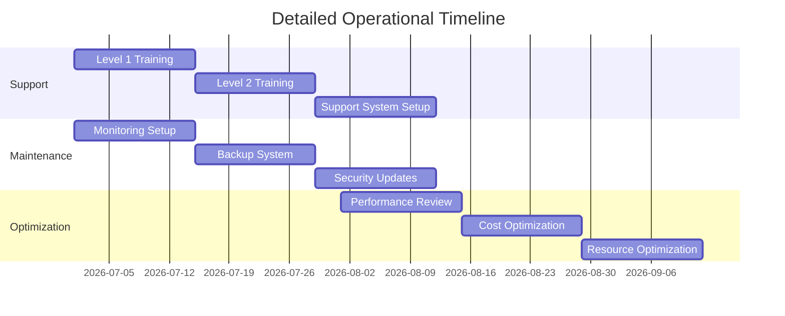
```mermaid
gantt
    title Detailed Operational Timeline
    dateFormat  MM-DD
    section Support
    Level 1 Training       :a1, 07-01, 14d
    Level 2 Training       :a2, after a1, 14d
    Support System Setup   :a3, after a2, 14d
    section Maintenance
    Monitoring Setup       :b1, 07-01, 14d
    Backup System         :b2, after b1, 14d
    Security Updates      :b3, after b2, 14d
    section Optimization
    Performance Review    :c1, 08-01, 14d
    Cost Optimization     :c2, after c1, 14d
    Resource Optimization :c3, after c2, 14d
```

## 10. Risk-Based Cost Adjustments

### 10.1 Risk Factors and Cost Impact
| Risk Factor | Probability | Impact | Cost Adjustment |
|-------------|------------|--------|-----------------|
| Technical Complexity | Medium | High | +15% |
| Integration Challenges | High | Medium | +10% |
| Security Requirements | Medium | High | +20% |
| Performance Requirements | High | High | +15% |
| Regulatory Compliance | Medium | Medium | +10% |

### 10.2 Contingency Planning
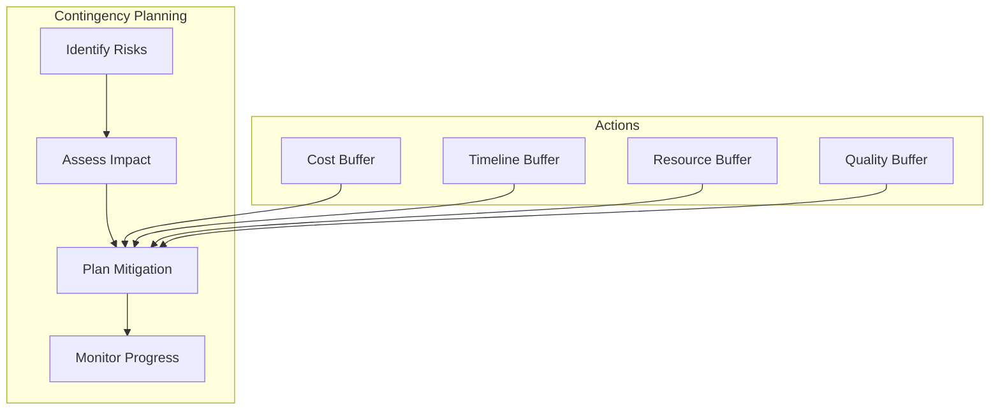
```mermaid
graph TD
    subgraph Contingency Planning
        Identify[Identify Risks]
        Assess[Assess Impact]
        Plan[Plan Mitigation]
        Monitor[Monitor Progress]
    end

    subgraph Actions
        Buffer[Cost Buffer]
        Timeline[Timeline Buffer]
        Resource[Resource Buffer]
        Quality[Quality Buffer]
    end

    Identify --> Assess
    Assess --> Plan
    Plan --> Monitor
    Buffer --> Plan
    Timeline --> Plan
    Resource --> Plan
    Quality --> Plan
```

## 11. Extended Risk Analysis and Mitigation

### 11.1 Technical Risks
```mermaid
graph TD
    subgraph Technical Risks
        Tech[Technical Complexity]
        Integ[Integration Issues]
        Perf[Performance]
        Sec[Security]
        Scal[Scalability]
    end

    subgraph Mitigation
        Arch[Architecture Review]
        Test[Comprehensive Testing]
        Mon[Performance Monitoring]
        Audit[Security Audits]
        Load[Load Testing]
    end

    Tech --> Arch
    Integ --> Test
    Perf --> Mon
    Sec --> Audit
    Scal --> Load
```

| Risk Category | Specific Risk | Probability | Impact | Mitigation Strategy | Cost Impact |
|--------------|---------------|------------|--------|---------------------|-------------|
| **Technical Complexity** | | | | | |
| Complex Integration | High | High | API-first approach, Contract testing | +10% |
| Performance Issues | Medium | High | Performance testing, Caching strategy | +15% |
| Scalability Challenges | Medium | High | Microservices architecture, Auto-scaling | +12% |
| **Security** | | | | | |
| Data Breach | Low | Critical | Encryption, Access control, Regular audits | +20% |
| API Security | Medium | High | API Gateway, Rate limiting, Authentication | +15% |
| Compliance Issues | Medium | High | Regular compliance checks, Documentation | +18% |
| **Integration** | | | | | |
| Third-party Service Failures | Medium | High | Fallback mechanisms, Circuit breakers | +12% |
| Data Migration Issues | High | Medium | Incremental migration, Validation | +10% |
| API Versioning | Medium | Medium | Version control, Documentation | +8% |

### 11.2 Operational Risks
```mermaid
graph TD
    subgraph Operational Risks
        Support[Support Issues]
        Training[Training Gaps]
        Maintenance[Maintenance]
        Updates[System Updates]
    end

    subgraph Mitigation
        Doc[Documentation]
        Train[Training Program]
        Monitor[Monitoring]
        Process[Process Automation]
    end

    Support --> Doc
    Training --> Train
    Maintenance --> Monitor
    Updates --> Process
```

| Risk Category | Specific Risk | Probability | Impact | Mitigation Strategy | Cost Impact |
|--------------|---------------|------------|--------|---------------------|-------------|
| **Support** | | | | | |
| Response Time | High | Medium | Automated monitoring, Escalation process | +8% |
| Knowledge Transfer | Medium | High | Documentation, Training program | +10% |
| **Maintenance** | | | | | |
| System Downtime | Medium | High | Redundancy, Backup systems | +15% |
| Update Issues | Medium | Medium | Staged rollout, Rollback plan | +10% |
| **Training** | | | | | |
| User Adoption | High | Medium | User training, Documentation | +12% |
| Admin Training | Medium | High | Admin training program | +15% |

## 12. Detailed Timeline Dependencies

### 12.1 Development Dependencies
```mermaid
graph TD
    subgraph Planning
        Req[Requirements]
        Arch[Architecture]
        Design[Design]
    end

    subgraph Development
        Front[Frontend]
        Back[Backend]
        Mobile[Mobile]
    end

    subgraph Testing
        Unit[Unit Tests]
        Int[Integration]
        Perf[Performance]
    end

    Req --> Arch
    Arch --> Design
    Design --> Front
    Design --> Back
    Design --> Mobile
    Front --> Unit
    Back --> Unit
    Mobile --> Unit
    Unit --> Int
    Int --> Perf
```

### 12.2 Infrastructure Dependencies
```mermaid
graph TD
    subgraph Cloud Setup
        Account[Account Setup]
        Network[Network Config]
        Security[Security Setup]
    end

    subgraph Services
        Compute[Compute]
        Storage[Storage]
        Database[Database]
    end

    subgraph Monitoring
        Log[Logging]
        Alert[Alerts]
        Dash[Dashboard]
    end

    Account --> Network
    Network --> Security
    Security --> Compute
    Security --> Storage
    Security --> Database
    Compute --> Log
    Storage --> Log
    Database --> Log
    Log --> Alert
    Alert --> Dash
```

### 12.3 Operational Dependencies
```mermaid
graph TD
    subgraph Support
        Train1[Level 1 Training]
        Train2[Level 2 Training]
        System[Support System]
    end

    subgraph Maintenance
        Monitor[Monitoring]
        Backup[Backup]
        Update[Updates]
    end

    subgraph Optimization
        Review[Performance Review]
        Cost[Cost Optimization]
        Resource[Resource Optimization]
    end

    Train1 --> System
    Train2 --> System
    System --> Monitor
    Monitor --> Backup
    Backup --> Update
    Update --> Review
    Review --> Cost
    Cost --> Resource
```

## 13. Critical Path Analysis

### 13.1 Development Critical Path
```mermaid
gantt
    title Development Critical Path
    dateFormat  MM-DD
    section Critical Path
    Requirements Gathering    :crit, a1, 01-01, 30d
    Architecture Design      :crit, a2, after a1, 30d
    API Development         :crit, b1, 02-01, 60d
    Database Setup          :crit, b2, after b1, 30d
    Integration Testing     :crit, c1, 04-01, 30d
    Performance Testing     :crit, c2, after c1, 15d
    section Non-Critical
    UI Development          :a3, 02-01, 45d
    Mobile Development      :a4, 03-01, 60d
    Documentation          :a5, 04-01, 30d
```

### 13.2 Infrastructure Critical Path
```mermaid
gantt
    title Infrastructure Critical Path
    dateFormat  MM-DD
    section Critical Path
    Account Setup           :crit, a1, 04-01, 7d
    Network Configuration   :crit, a2, after a1, 14d
    Security Setup         :crit, a3, after a2, 14d
    CI/CD Setup            :crit, b1, 04-15, 14d
    Monitoring Setup       :crit, c1, 05-01, 14d
    section Non-Critical
    Documentation          :a4, 04-01, 30d
    Training              :a5, 05-01, 14d
```

### 13.3 Operational Critical Path
```mermaid
gantt
    title Operational Critical Path
    dateFormat  MM-DD
    section Critical Path
    Level 1 Training       :crit, a1, 07-01, 14d
    Support System Setup   :crit, a2, after a1, 14d
    Monitoring Setup       :crit, b1, 07-01, 14d
    Backup System         :crit, b2, after b1, 14d
    Performance Review    :crit, c1, 08-01, 14d
    section Non-Critical
    Documentation         :a3, 07-01, 30d
    Training             :a4, 07-15, 14d
```

## 14. Risk Mitigation Budget Allocation

### 14.1 Technical Risk Mitigation Budget
| Mitigation Area | Initial Budget | Contingency | Total |
|-----------------|----------------|-------------|-------|
| Performance Testing | $15,000 | $7,500 | $22,500 |
| Security Audits | $20,000 | $10,000 | $30,000 |
| Integration Testing | $18,000 | $9,000 | $27,000 |
| Scalability Testing | $12,000 | $6,000 | $18,000 |
| **Total** | **$65,000** | **$32,500** | **$97,500** |

### 14.2 Operational Risk Mitigation Budget
| Mitigation Area | Initial Budget | Contingency | Total |
|-----------------|----------------|-------------|-------|
| Support Training | $25,000 | $12,500 | $37,500 |
| System Monitoring | $20,000 | $10,000 | $30,000 |
| Backup Systems | $15,000 | $7,500 | $22,500 |
| Documentation | $10,000 | $5,000 | $15,000 |
| **Total** | **$70,000** | **$35,000** | **$105,000** |

### 14.3 Total Risk Mitigation Budget
```mermaid
pie title Risk Mitigation Budget Distribution
    "Technical Risks" : 45
    "Operational Risks" : 35
    "Contingency" : 20
```

| Category | Budget | Percentage |
|----------|--------|------------|
| Technical Risk Mitigation | $97,500 | 45% |
| Operational Risk Mitigation | $105,000 | 35% |
| Contingency | $67,500 | 20% |
| **Total** | **$270,000** | **100%** | 