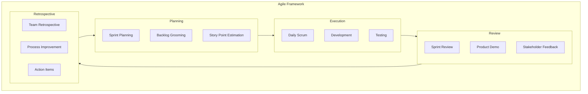
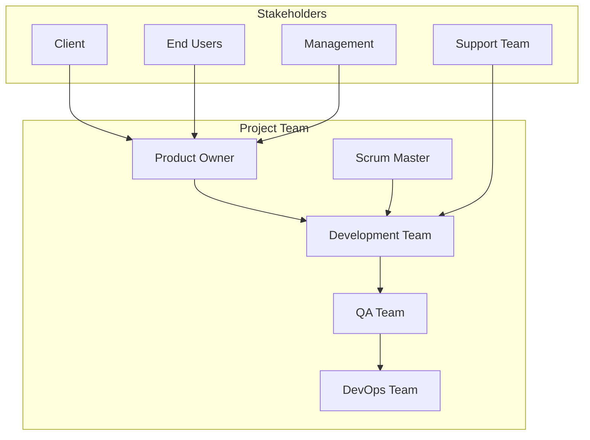
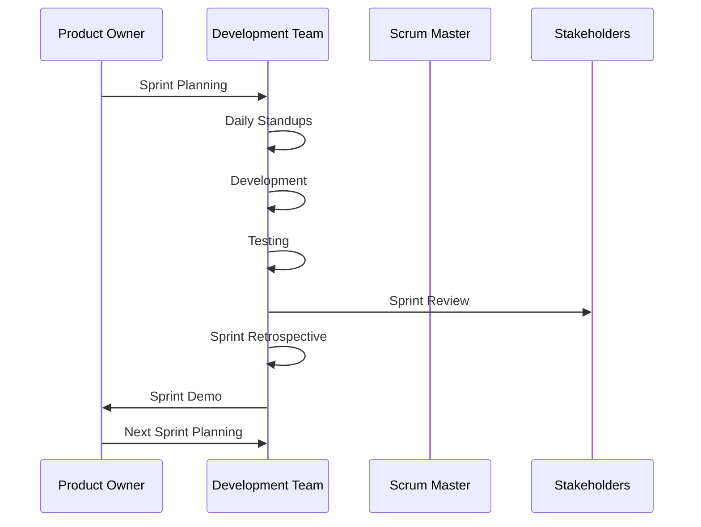
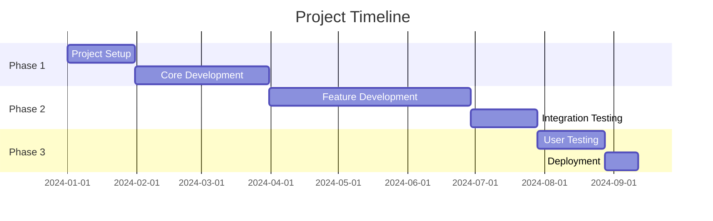
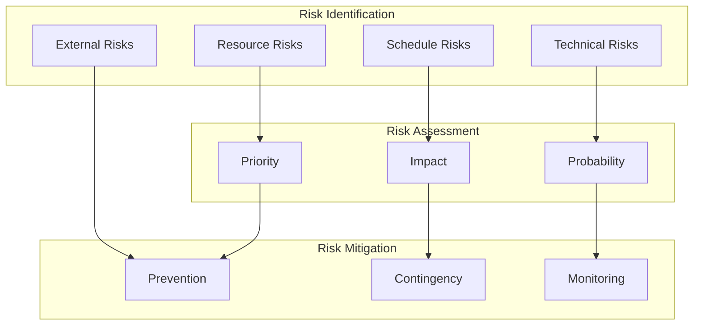
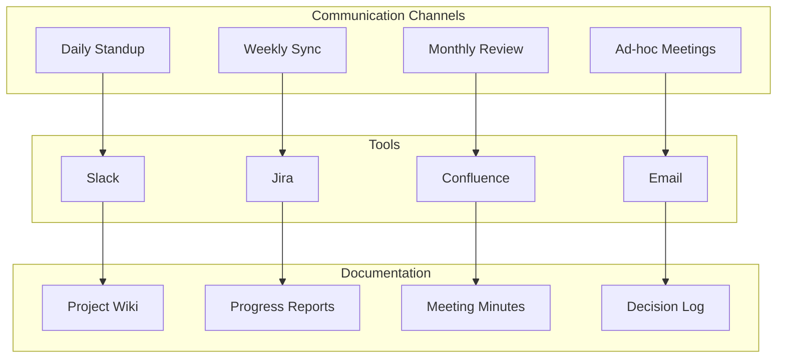
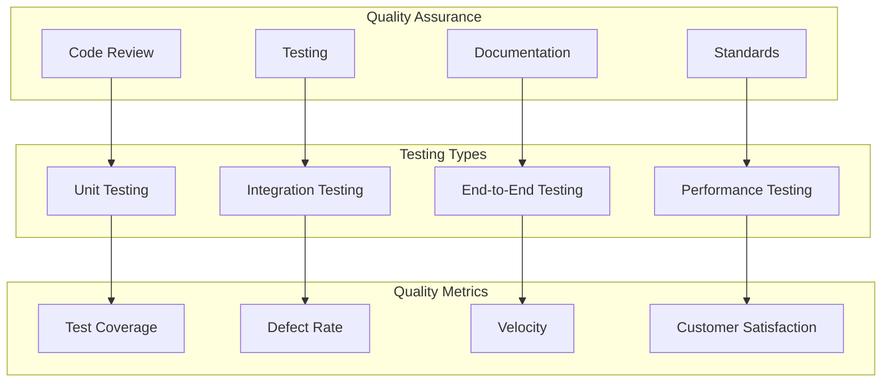
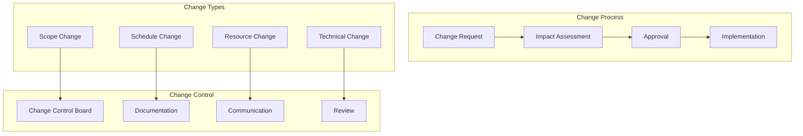

# Project Management Plan Documentation

[🏠 Home](README.md) > [System Design Documentation](README.md) > Project Management Plan

[← Back to Main Documentation](README.md)

---

## Overview

This document outlines the project management approach for the LCT Learning Management System, following Agile methodology with Scrum framework. It covers all aspects of project planning, execution, monitoring, and control.

## 1. Agile Framework Overview

## 2. Project Organization Structure

## 3. Sprint Lifecycle

## 4. Project Timeline and Milestones

## 5. Risk Management

## 6. Communication Plan

## 7. Quality Management

## 8. Resource Management

### Team Structure
1. **Core Team**
   - Product Owner (1)
   - Scrum Master (1)
   - Frontend Developers (3)
   - Backend Developers (3)
   - QA Engineers (2)
   - DevOps Engineer (1)
   - UI/UX Designer (1)

2. **Extended Team**
   - Security Specialist
   - Database Administrator
   - Technical Writer
   - Business Analyst

### Resource Allocation Matrix
| Role | Phase 1 | Phase 2 | Phase 3 |
|------|---------|---------|---------|
| Product Owner | 100% | 100% | 100% |
| Scrum Master | 100% | 100% | 100% |
| Frontend Dev | 100% | 100% | 50% |
| Backend Dev | 100% | 100% | 50% |
| QA Engineer | 50% | 100% | 100% |
| DevOps | 50% | 100% | 100% |
| UI/UX | 100% | 50% | 25% |

## 9. Sprint Planning and Execution

### Sprint Duration
- 2-week sprints
- Sprint planning: 4 hours
- Daily standup: 15 minutes
- Sprint review: 2 hours
- Sprint retrospective: 1 hour

### Definition of Done
1. Code completed and reviewed
2. Unit tests written and passing
3. Integration tests passing
4. Documentation updated
5. Code deployed to staging
6. QA verified
7. Product Owner accepted

## 10. Tools and Technologies

### Project Management Tools
- Jira for issue tracking
- Confluence for documentation
- Slack for communication
- GitHub for version control
- Jenkins for CI/CD
- SonarQube for code quality
- Selenium for testing
- Docker for containerization

### Development Tools
- VS Code/IntelliJ IDEA
- Postman for API testing
- Swagger for API documentation
- Figma for design
- Miro for collaboration
- Zoom for meetings

## 11. Change Management

## 12. Performance Metrics

### Key Performance Indicators (KPIs)
1. **Velocity**
   - Story points completed per sprint
   - Sprint burndown rate
   - Release burndown rate

2. **Quality**
   - Defect density
   - Test coverage
   - Code quality metrics

3. **Timeliness**
   - Sprint completion rate
   - Release on-time delivery
   - Milestone achievement

4. **Customer Satisfaction**
   - Feature acceptance rate
   - User feedback scores
   - Support ticket resolution time

## 13. Continuous Improvement

### Improvement Process
1. **Identify Areas**
   - Team retrospectives
   - Performance metrics
   - Stakeholder feedback
   - Process audits

2. **Plan Improvements**
   - Action items
   - Timeline
   - Resources
   - Success criteria

3. **Implement Changes**
   - Process updates
   - Tool improvements
   - Training
   - Documentation

4. **Measure Results**
   - KPI tracking
   - Feedback collection
   - Success evaluation
   - Lessons learned

## 14. Documentation Standards

### Required Documentation
1. **Technical Documentation**
   - Architecture diagrams
   - API documentation
   - Database schema
   - Deployment procedures

2. **Process Documentation**
   - Development guidelines
   - Testing procedures
   - Release process
   - Security protocols

3. **User Documentation**
   - User guides
   - Admin manuals
   - Training materials
   - Release notes

### Documentation Tools
- Markdown for technical docs
- Confluence for process docs
- HelpScout for user docs
- Swagger for API docs
- Draw.io for diagrams
- Mermaid for flowcharts 