# LCT Learning Management System - Reports Documentation

<div align="center">
  
</div>

[🏠 Home](../README.md) > [System Design Documentation](README.md) > Reports Documentation

[← Back to Main Documentation](../README.md)

## Company Information
- **Company**: [Lear Cyber Tech](https://www.linkedin.com/company/leartech/)
- **Author**: [Dr. Libin Pallikunnel Kurian](https://www.linkedin.com/in/dr-libin-pallikunnel-kurian-88741530/)
- **GitHub**: [leomultimedia](https://github.com/leomultimedia)
- **Position**: Principal Consultant - ICT & Cyber Security
- **Expertise**: Cloud Digital Leader | Ethical Hacker | OT | IoT | ICS/SCADA | IT Audit | RPA | AI | ML | Analytics

## Company Vision & Mission
- **Vision**: To be a global leader in cybersecurity and technology solutions, empowering organizations with innovative and secure digital transformation.
- **Mission**: To provide cutting-edge cybersecurity solutions and technology services that protect and enhance our clients' digital assets while fostering a culture of continuous learning and innovation.

## Core Values
1. **Integrity**: Upholding the highest standards of ethical conduct and transparency
2. **Customer Focus**: Delivering exceptional value and service to our clients
3. **Innovation**: Driving technological advancement and creative solutions
4. **Teamwork**: Fostering collaboration and mutual respect
5. **Excellence**: Striving for the highest quality in all our endeavors

---


## Overview

This document outlines the reporting system for the LCT Learning Management System, including business, system, operations, and maintenance reports with their respective wireframes.

## 1. Business Reports

### 1.1 User Engagement Dashboard

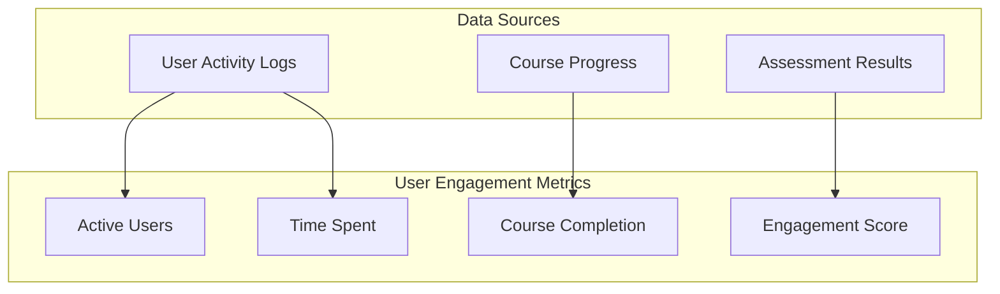

#### Wireframe: User Engagement Dashboard

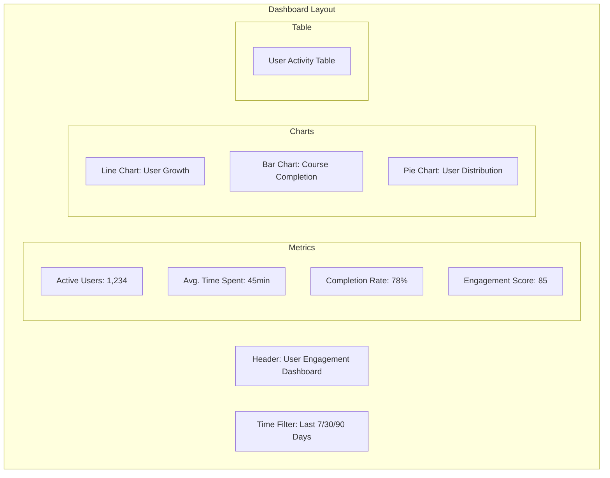

### 1.2 Revenue Analytics

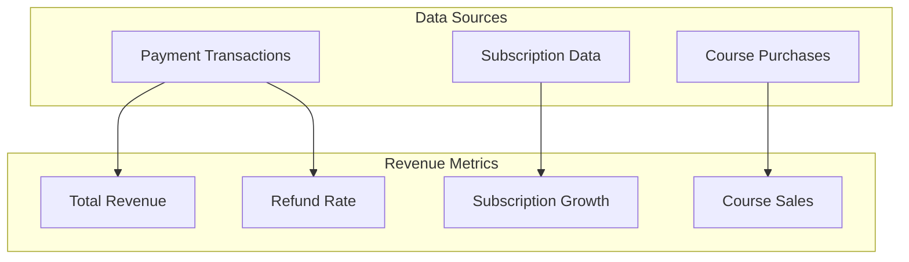

#### Wireframe: Revenue Analytics Dashboard

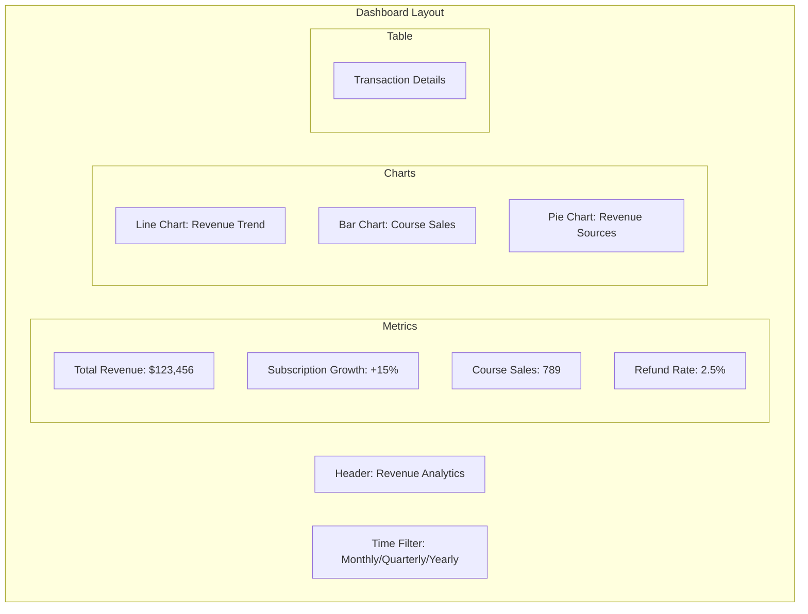

## 2. System Reports

### 2.1 System Health Dashboard

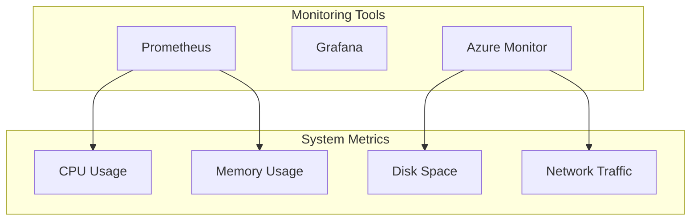

#### Wireframe: System Health Dashboard

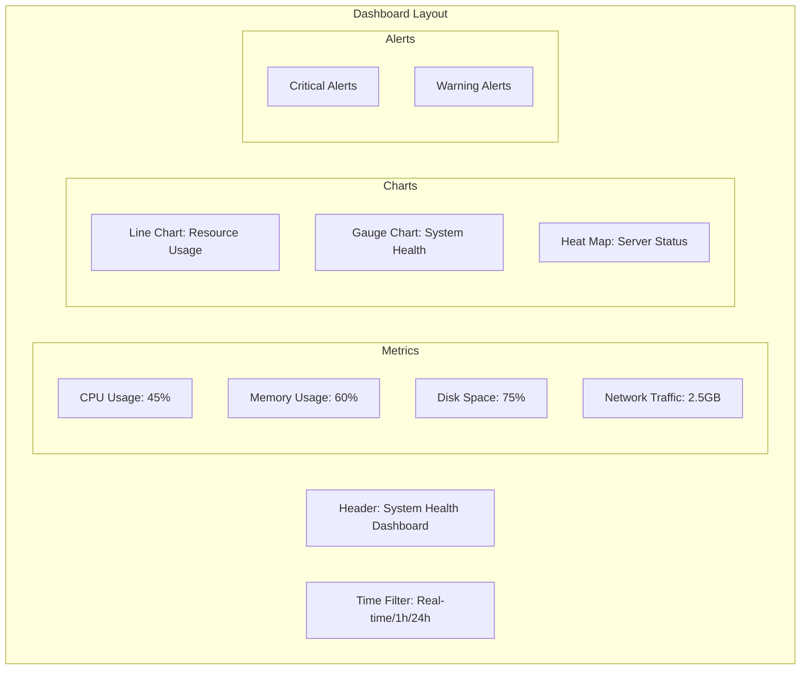

### 2.2 Performance Metrics

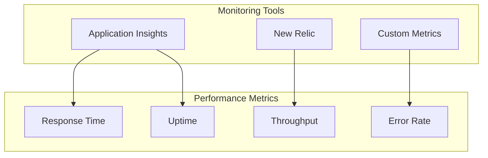

#### Wireframe: Performance Dashboard

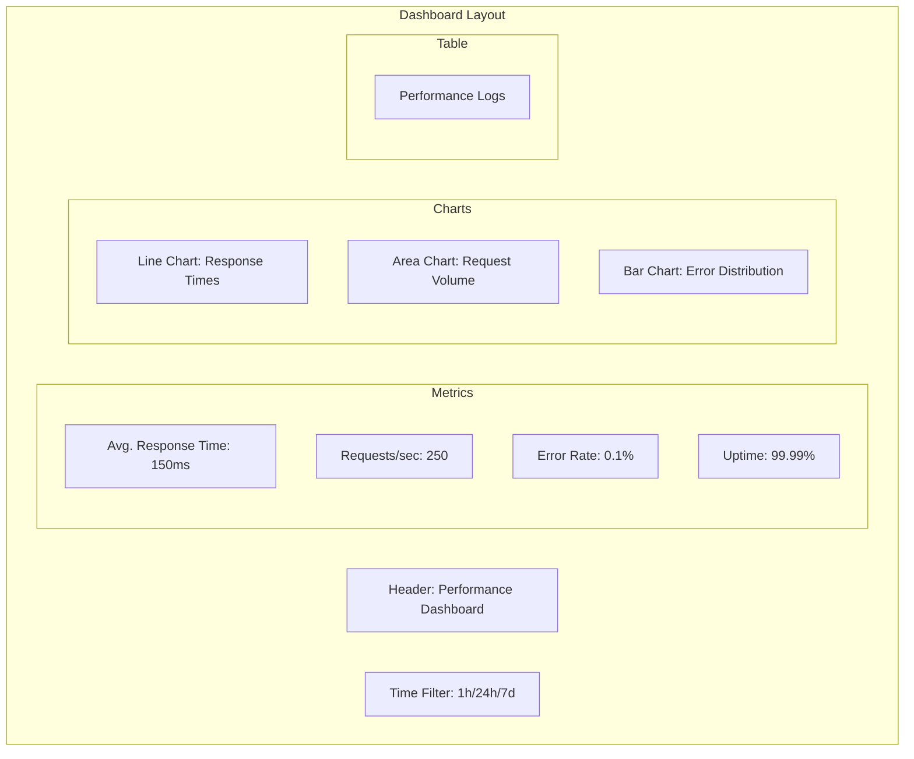

## 3. Operations Reports

### 3.1 User Support Dashboard

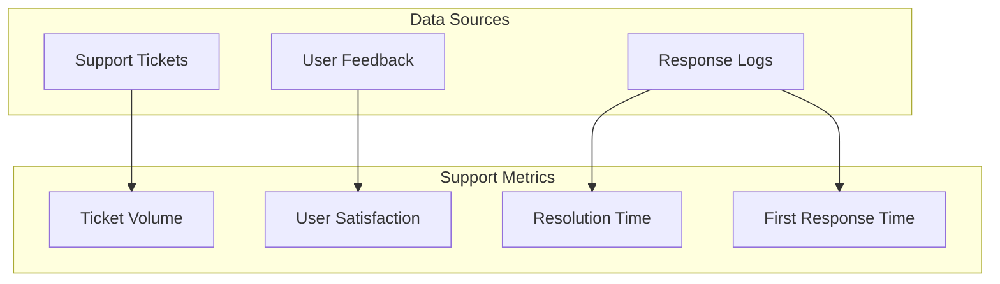

#### Wireframe: Support Dashboard

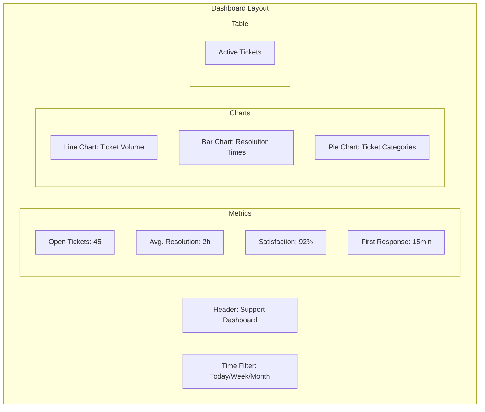

### 3.2 Content Management Dashboard

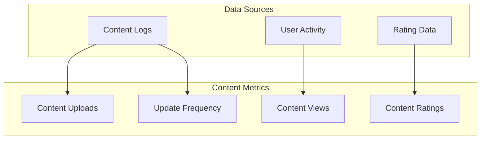

#### Wireframe: Content Management Dashboard

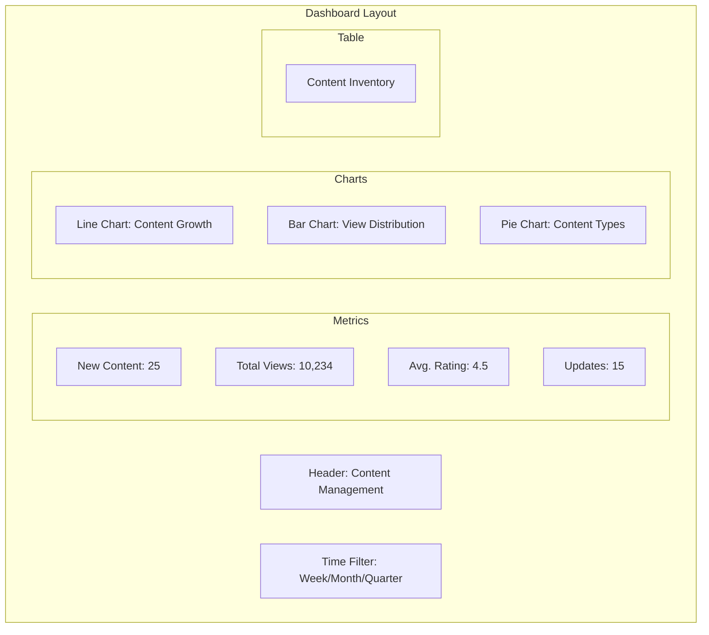

## 4. Maintenance Reports

### 4.1 System Maintenance Dashboard

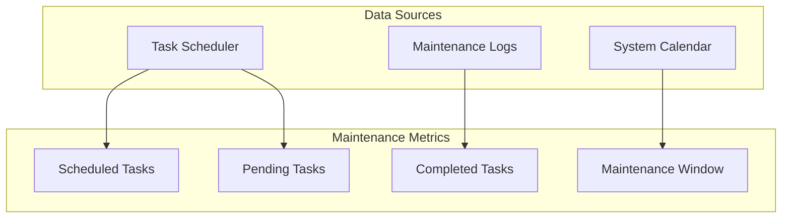

#### Wireframe: Maintenance Dashboard

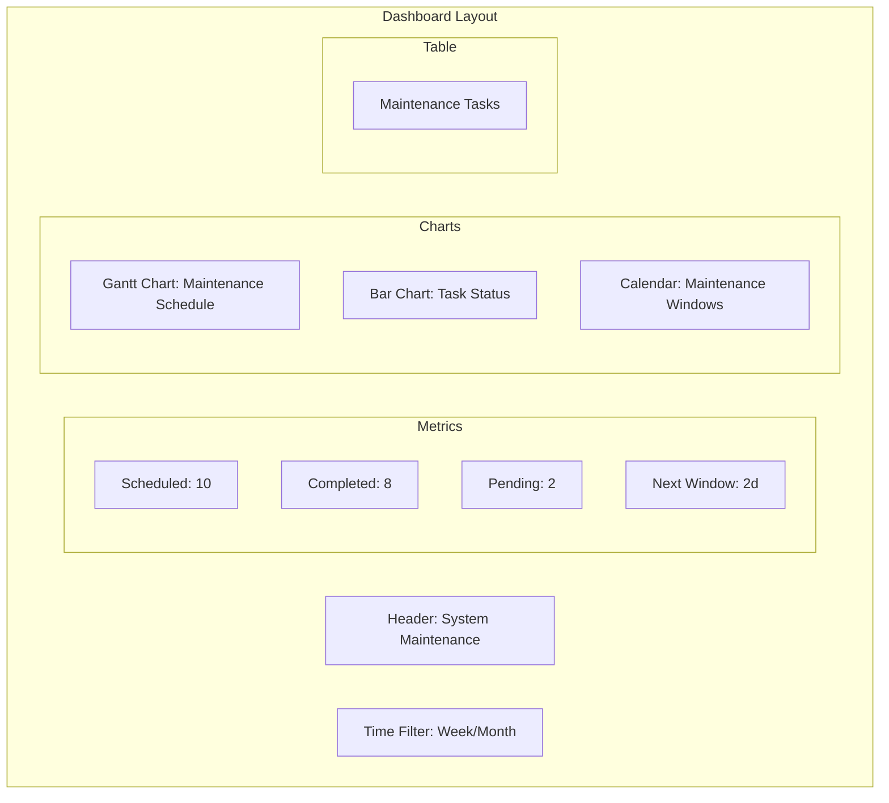

### 4.2 Backup and Recovery Dashboard

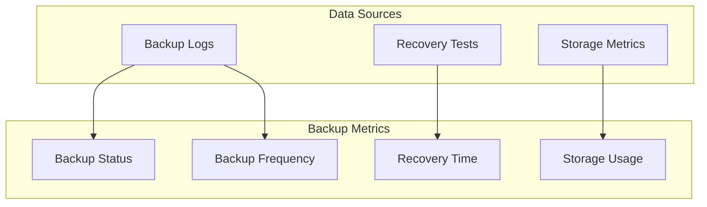

#### Wireframe: Backup Dashboard

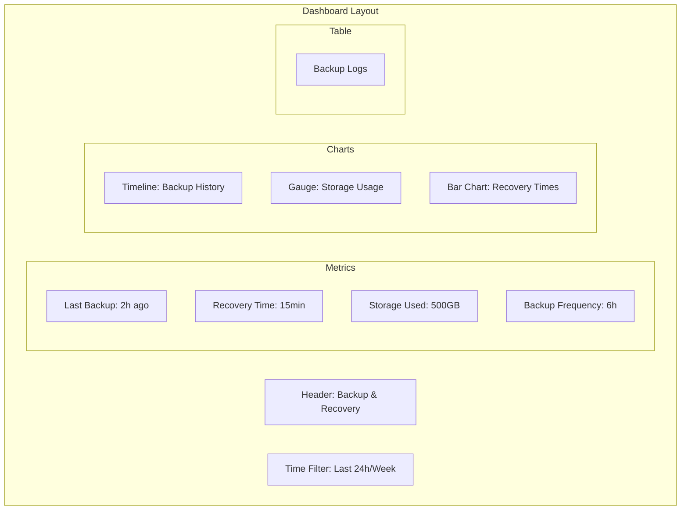

## 5. Report Generation and Distribution

### 5.1 Report Scheduling

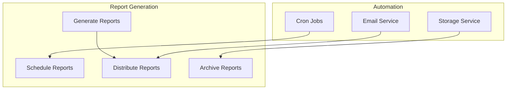

### 5.2 Report Access Control

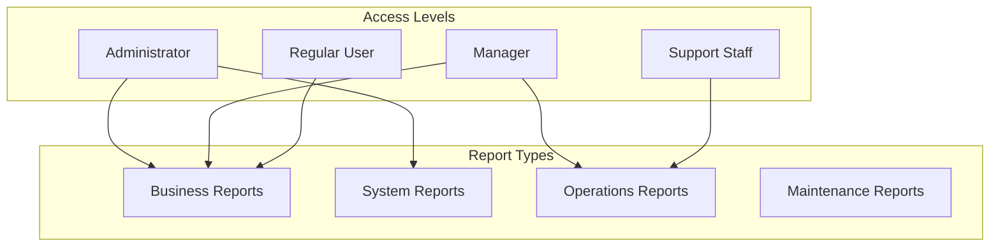

## 6. Report Customization

### 6.1 Custom Report Builder

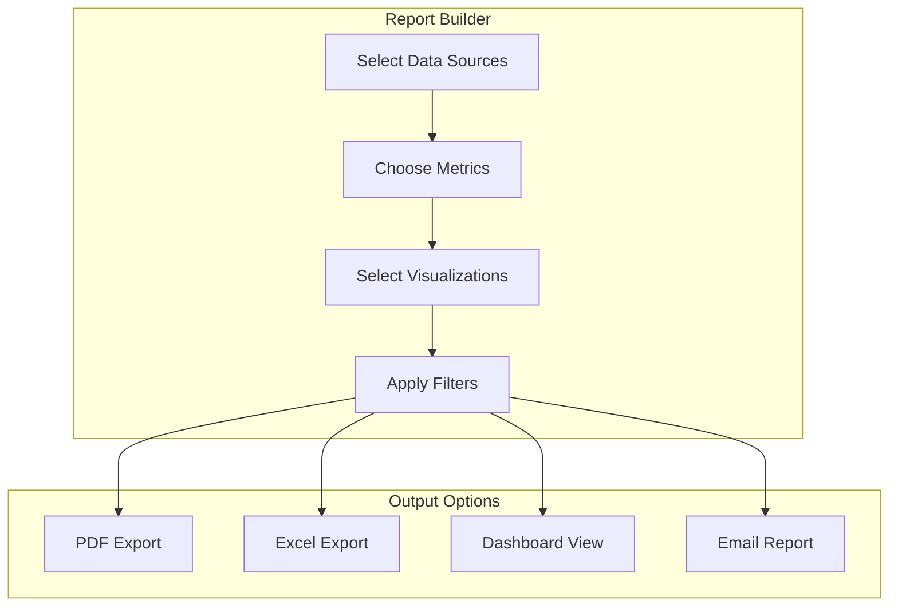

### 6.2 Report Templates

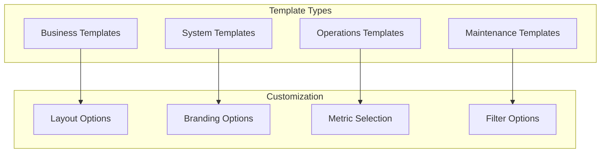

## 7. Data Sources and Integration

### 7.1 Data Integration Flow

```mermaid
graph TD
    subgraph Data Sources
        Database[Database]
        APIs[External APIs]
        Logs[System Logs]
        Metrics[Metrics]
    end

    subgraph Processing
        ETL[ETL Pipeline]
        Transform[Data Transformation]
        Aggregate[Data Aggregation]
        Cache[Data Caching]
    end

    subgraph Storage
        DataWarehouse[Data Warehouse]
        CacheStorage[Cache Storage]
        Archive[Archive Storage]
    end

    Database --> ETL
    APIs --> ETL
    Logs --> ETL
    Metrics --> ETL
    ETL --> Transform
    Transform --> Aggregate
    Aggregate --> Cache
    Cache --> DataWarehouse
    Cache --> CacheStorage
    DataWarehouse --> Archive
```

### 7.2 Real-time Data Processing

```mermaid
graph TD
    subgraph Data Stream
        Events[Event Stream]
        Metrics[Metrics Stream]
        Logs[Log Stream]
    end

    subgraph Processing
        StreamProcess[Stream Processing]
        Aggregate[Real-time Aggregation]
        Alert[Alert Generation]
    end

    subgraph Output
        Dashboard[Dashboard Updates]
        Alerts[Real-time Alerts]
        Storage[Time-series Storage]
    end

    Events --> StreamProcess
    Metrics --> StreamProcess
    Logs --> StreamProcess
    StreamProcess --> Aggregate
    Aggregate --> Alert
    Alert --> Dashboard
    Alert --> Alerts
    Aggregate --> Storage
```

## 8. Security and Compliance

### 8.1 Report Security

```mermaid
graph TD
    subgraph Security Measures
        Authentication[Authentication]
        Authorization[Authorization]
        Encryption[Encryption]
        Audit[Audit Logging]
    end

    subgraph Compliance
        GDPR[GDPR Compliance]
        HIPAA[HIPAA Compliance]
        SOC2[SOC2 Compliance]
        ISO27001[ISO27001 Compliance]
    end

    Authentication --> Authorization
    Authorization --> Encryption
    Encryption --> Audit
    Audit --> GDPR
    Audit --> HIPAA
    Audit --> SOC2
    Audit --> ISO27001
```

### 8.2 Data Privacy

```mermaid
graph TD
    subgraph Privacy Controls
        Anonymization[Data Anonymization]
        Masking[Data Masking]
        Retention[Data Retention]
        Access[Access Controls]
    end

    subgraph Compliance
        PrivacyLaws[Privacy Laws]
        DataProtection[Data Protection]
        UserConsent[User Consent]
        DataMinimization[Data Minimization]
    end

    Anonymization --> PrivacyLaws
    Masking --> DataProtection
    Retention --> UserConsent
    Access --> DataMinimization
```

## 9. Performance Optimization

### 9.1 Report Performance

```mermaid
graph TD
    subgraph Optimization
        Caching[Report Caching]
        Indexing[Data Indexing]
        QueryOpt[Query Optimization]
        Compression[Data Compression]
    end

    subgraph Monitoring
        Performance[Performance Metrics]
        Resource[Resource Usage]
        Latency[Latency Monitoring]
        Errors[Error Tracking]
    end

    Caching --> Performance
    Indexing --> Resource
    QueryOpt --> Latency
    Compression --> Errors
```

### 9.2 Scalability

```mermaid
graph TD
    subgraph Scaling
        Horizontal[Horizontal Scaling]
        Vertical[Vertical Scaling]
        LoadBalance[Load Balancing]
        Caching[Distributed Caching]
    end

    subgraph Architecture
        Microservices[Microservices]
        Serverless[Serverless]
        Containers[Containers]
        Orchestration[Orchestration]
    end

    Horizontal --> Microservices
    Vertical --> Serverless
    LoadBalance --> Containers
    Caching --> Orchestration
```

## 10. Maintenance and Updates

### 10.1 Update Process

```mermaid
graph TD
    subgraph Update Flow
        Planning[Update Planning]
        Testing[Testing]
        Deployment[Deployment]
        Monitoring[Monitoring]
    end

    subgraph Quality
        Validation[Data Validation]
        Verification[System Verification]
        Backup[Backup Process]
        Rollback[Rollback Plan]
    end

    Planning --> Testing
    Testing --> Deployment
    Deployment --> Monitoring
    Validation --> Testing
    Verification --> Deployment
    Backup --> Deployment
    Rollback --> Monitoring
```

### 10.2 Maintenance Schedule

```mermaid
graph TD
    subgraph Maintenance
        Daily[Daily Tasks]
        Weekly[Weekly Tasks]
        Monthly[Monthly Tasks]
        Quarterly[Quarterly Tasks]
    end

    subgraph Activities
        Backup[Data Backup]
        Cleanup[System Cleanup]
        Update[Software Updates]
        Audit[Security Audit]
    end

    Daily --> Backup
    Weekly --> Cleanup
    Monthly --> Update
    Quarterly --> Audit
```

This comprehensive documentation provides a detailed overview of all reporting capabilities in the LCT Learning Management System, including business, system, operations, and maintenance reports with their respective wireframes and implementation details. 