# System Architecture Diagrams and Best Practices

[🏠 Home](README.md) > [System Design Documentation](README.md) > System Architecture Diagrams

[← Back to Main Documentation](README.md)

---

## 1. System Overview

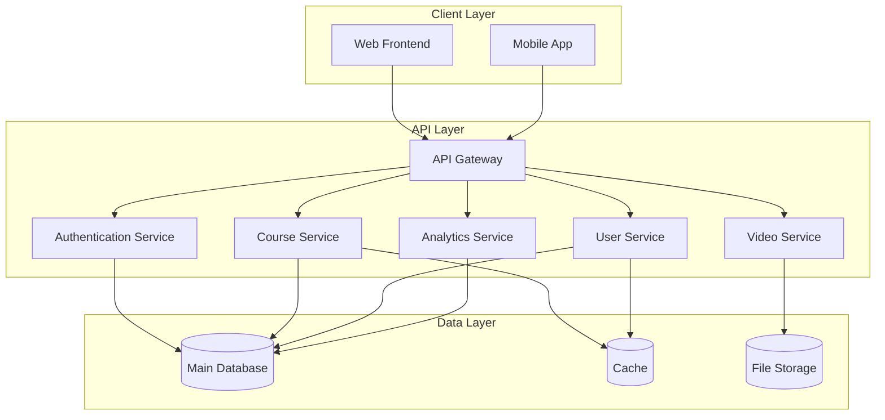
```mermaid
graph TD
    subgraph Client Layer
        Web[Web Frontend]
        Mobile[Mobile App]
    end

    subgraph API Layer
        Gateway[API Gateway]
        Auth[Authentication Service]
        Courses[Course Service]
        Users[User Service]
        Video[Video Service]
        Analytics[Analytics Service]
    end

    subgraph Data Layer
        DB[(Main Database)]
        Cache[(Cache)]
        Storage[(File Storage)]
    end

    Web --> Gateway
    Mobile --> Gateway
    Gateway --> Auth
    Gateway --> Courses
    Gateway --> Users
    Gateway --> Video
    Gateway --> Analytics
    Auth --> DB
    Courses --> DB
    Users --> DB
    Video --> Storage
    Analytics --> DB
    Courses --> Cache
    Users --> Cache
```

## 2. Frontend Architecture Flow

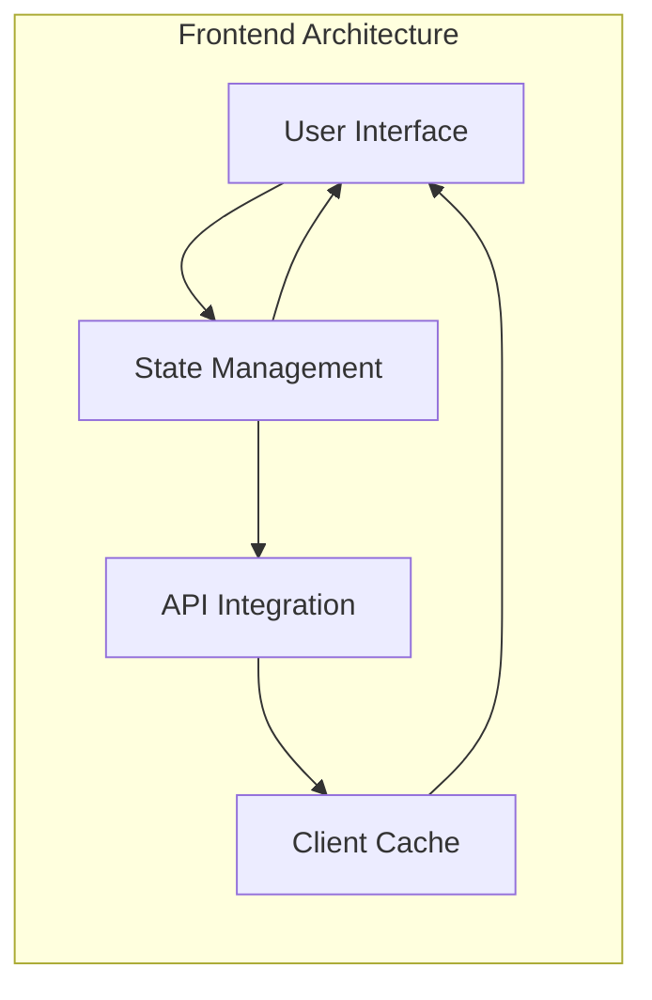
```mermaid
graph LR
    subgraph Frontend Architecture
        UI[User Interface]
        State[State Management]
        API[API Integration]
        Cache[Client Cache]
    end

    UI --> State
    State --> API
    API --> Cache
    Cache --> UI
    State --> UI
```

## 3. Mobile App Architecture Flow

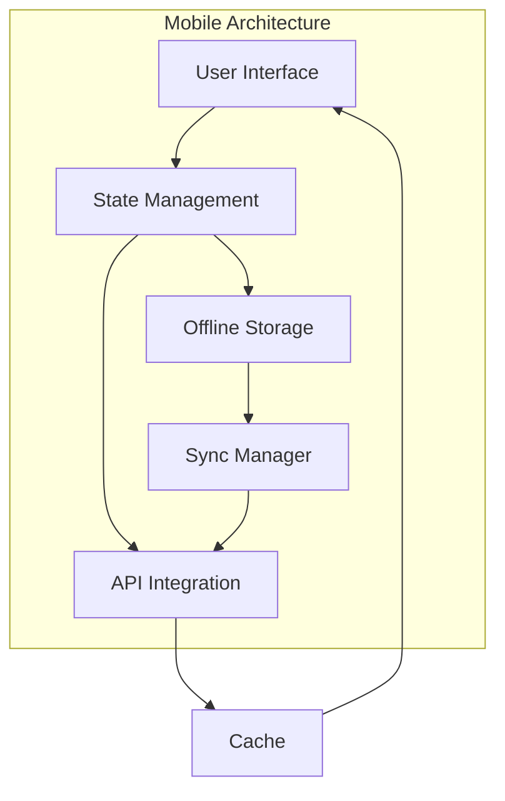
```mermaid
graph TD
    subgraph Mobile Architecture
        UI[User Interface]
        State[State Management]
        Offline[Offline Storage]
        Sync[Sync Manager]
        API[API Integration]
    end

    UI --> State
    State --> Offline
    State --> API
    Offline --> Sync
    Sync --> API
    API --> Cache
    Cache --> UI
```

## 4. Data Flow Architecture

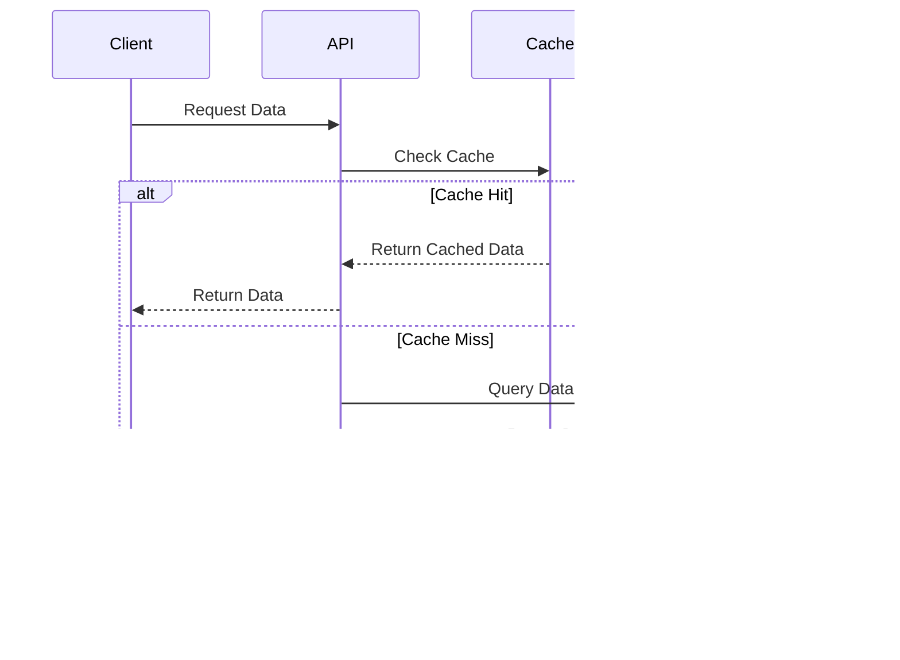
```mermaid
sequenceDiagram
    participant Client
    participant API
    participant Cache
    participant DB

    Client->>API: Request Data
    API->>Cache: Check Cache
    alt Cache Hit
        Cache-->>API: Return Cached Data
        API-->>Client: Return Data
    else Cache Miss
        API->>DB: Query Database
        DB-->>API: Return Data
        API->>Cache: Update Cache
        API-->>Client: Return Data
    end
```

## 5. Security Architecture

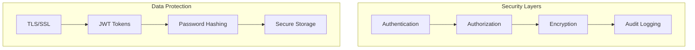
```mermaid
graph TD
    subgraph Security Layers
        Auth[Authentication]
        Authz[Authorization]
        Encrypt[Encryption]
        Audit[Audit Logging]
    end

    subgraph Data Protection
        TLS[TLS/SSL]
        Token[JWT Tokens]
        Hash[Password Hashing]
        Secure[Secure Storage]
    end

    Auth --> Authz
    Authz --> Encrypt
    Encrypt --> Audit
    TLS --> Token
    Token --> Hash
    Hash --> Secure
```

## 6. Deployment Architecture

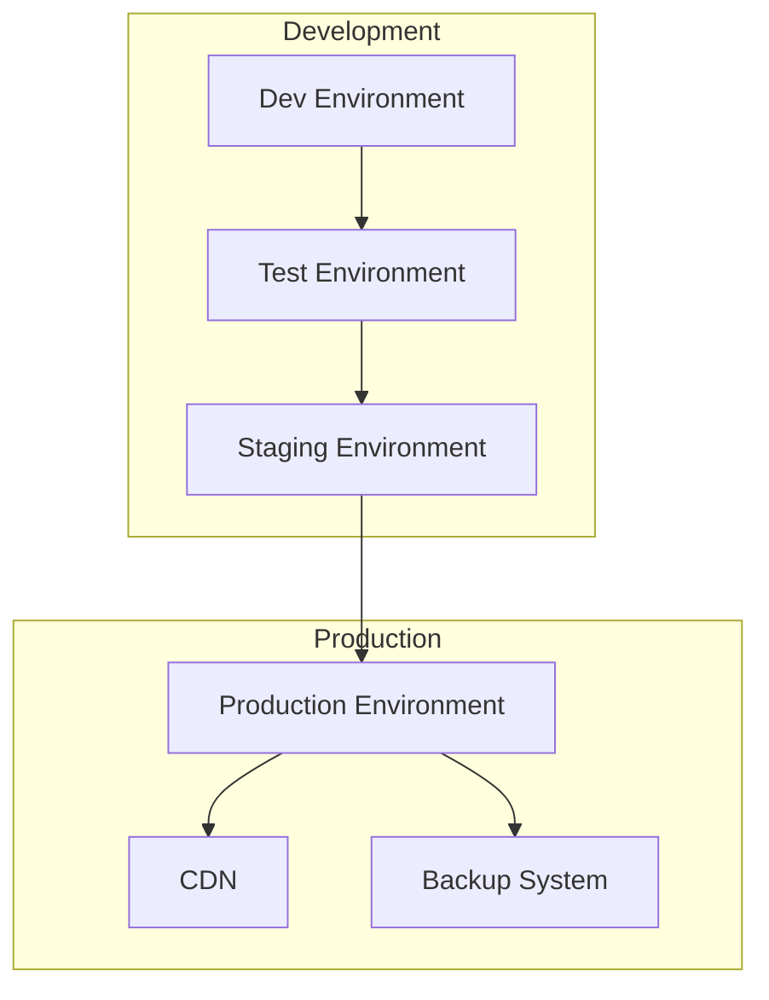
```mermaid
graph TD
    subgraph Development
        Dev[Dev Environment]
        Test[Test Environment]
        Staging[Staging Environment]
    end

    subgraph Production
        Prod[Production Environment]
        CDN[CDN]
        Backup[Backup System]
    end

    Dev --> Test
    Test --> Staging
    Staging --> Prod
    Prod --> CDN
    Prod --> Backup
```

## 7. Component Interaction Flow

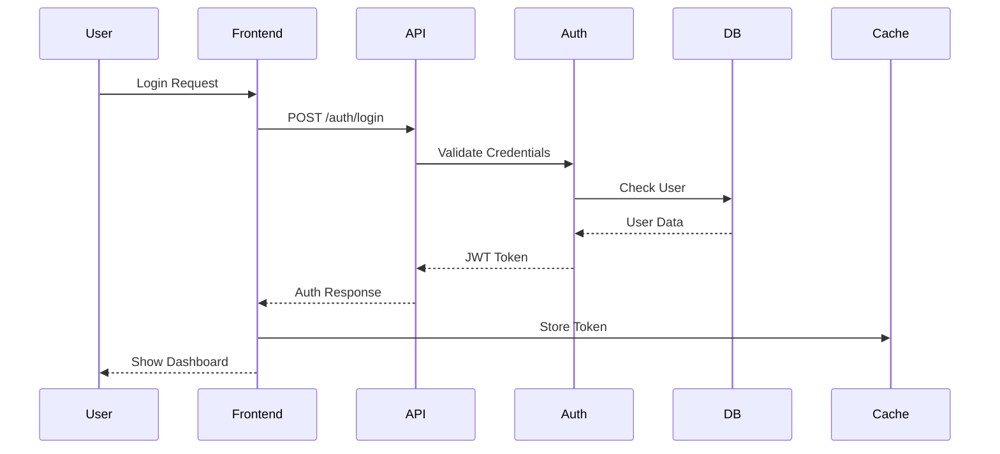
```mermaid
sequenceDiagram
    participant User
    participant Frontend
    participant API
    participant Auth
    participant DB
    participant Cache

    User->>Frontend: Login Request
    Frontend->>API: POST /auth/login
    API->>Auth: Validate Credentials
    Auth->>DB: Check User
    DB-->>Auth: User Data
    Auth-->>API: JWT Token
    API-->>Frontend: Auth Response
    Frontend->>Cache: Store Token
    Frontend-->>User: Show Dashboard
```

## 8. Course Management Flow

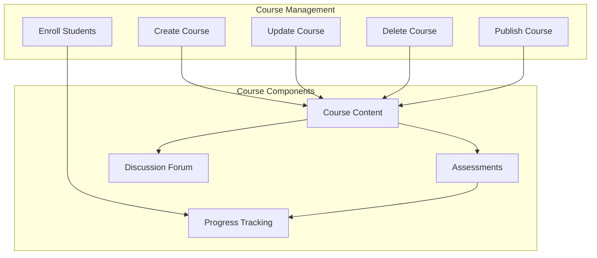
```mermaid
graph TD
    subgraph Course Management
        Create[Create Course]
        Update[Update Course]
        Delete[Delete Course]
        Publish[Publish Course]
        Enroll[Enroll Students]
    end

    subgraph Course Components
        Content[Course Content]
        Assessment[Assessments]
        Progress[Progress Tracking]
        Discussion[Discussion Forum]
    end

    Create --> Content
    Update --> Content
    Delete --> Content
    Publish --> Content
    Enroll --> Progress
    Content --> Assessment
    Content --> Discussion
    Assessment --> Progress
```

## 9. User Management Hierarchy

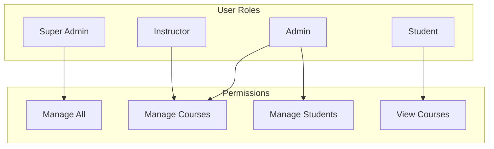
```mermaid
graph TD
    subgraph User Roles
        SuperAdmin[Super Admin]
        Admin[Admin]
        Instructor[Instructor]
        Student[Student]
    end

    subgraph Permissions
        ManageAll[Manage All]
        ManageCourses[Manage Courses]
        ManageStudents[Manage Students]
        ViewCourses[View Courses]
    end

    SuperAdmin --> ManageAll
    Admin --> ManageCourses
    Admin --> ManageStudents
    Instructor --> ManageCourses
    Student --> ViewCourses
```

## 10. Data Flow for Video Content

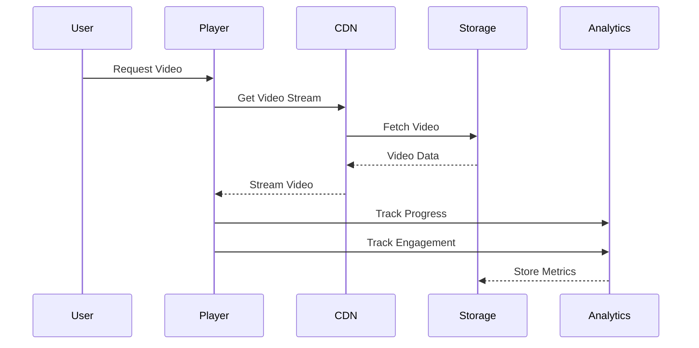
```mermaid
sequenceDiagram
    participant User
    participant Player
    participant CDN
    participant Storage
    participant Analytics

    User->>Player: Request Video
    Player->>CDN: Get Video Stream
    CDN->>Storage: Fetch Video
    Storage-->>CDN: Video Data
    CDN-->>Player: Stream Video
    Player->>Analytics: Track Progress
    Player->>Analytics: Track Engagement
    Analytics-->>Storage: Store Metrics
```

## 11. AI/ML Integration Flow

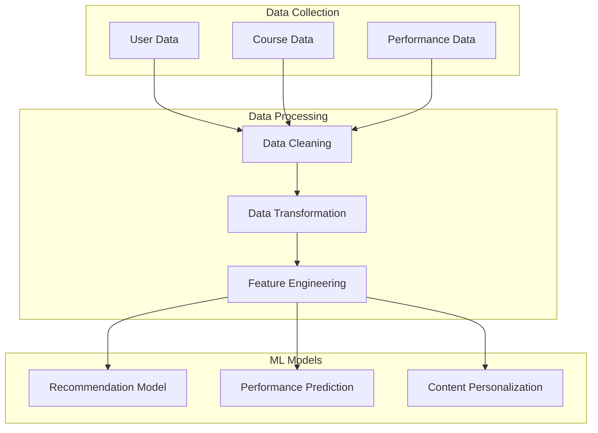
```mermaid
graph TD
    subgraph Data Collection
        UserData[User Data]
        CourseData[Course Data]
        PerformanceData[Performance Data]
    end

    subgraph Data Processing
        Clean[Data Cleaning]
        Transform[Data Transformation]
        Feature[Feature Engineering]
    end

    subgraph ML Models
        Recommend[Recommendation Model]
        Predict[Performance Prediction]
        Personalize[Content Personalization]
    end

    UserData --> Clean
    CourseData --> Clean
    PerformanceData --> Clean
    Clean --> Transform
    Transform --> Feature
    Feature --> Recommend
    Feature --> Predict
    Feature --> Personalize
```

## 12. Assessment System Flow

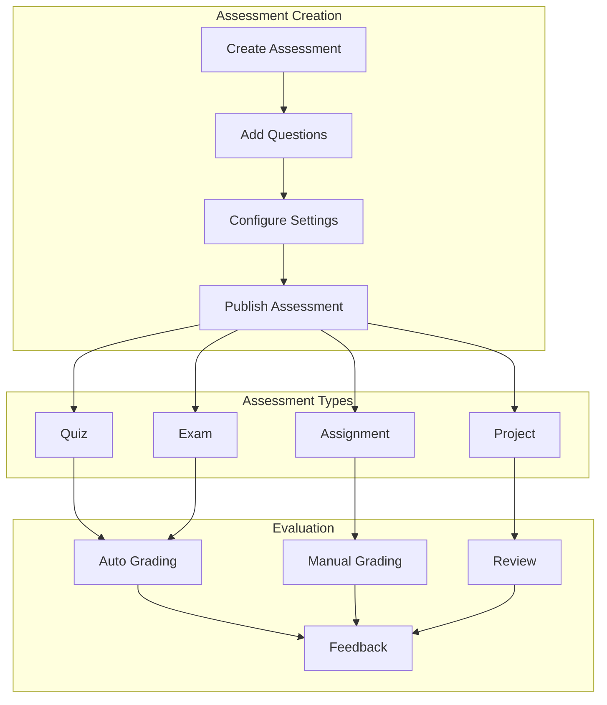
```mermaid
graph TD
    subgraph Assessment Creation
        Create[Create Assessment]
        Questions[Add Questions]
        Settings[Configure Settings]
        Publish[Publish Assessment]
    end

    subgraph Assessment Types
        Quiz[Quiz]
        Assignment[Assignment]
        Project[Project]
        Exam[Exam]
    end

    subgraph Evaluation
        AutoGrade[Auto Grading]
        ManualGrade[Manual Grading]
        Review[Review]
        Feedback[Feedback]
    end

    Create --> Questions
    Questions --> Settings
    Settings --> Publish
    Publish --> Quiz
    Publish --> Assignment
    Publish --> Project
    Publish --> Exam
    Quiz --> AutoGrade
    Assignment --> ManualGrade
    Project --> Review
    Exam --> AutoGrade
    AutoGrade --> Feedback
    ManualGrade --> Feedback
    Review --> Feedback
```

## 13. Notification System Flow

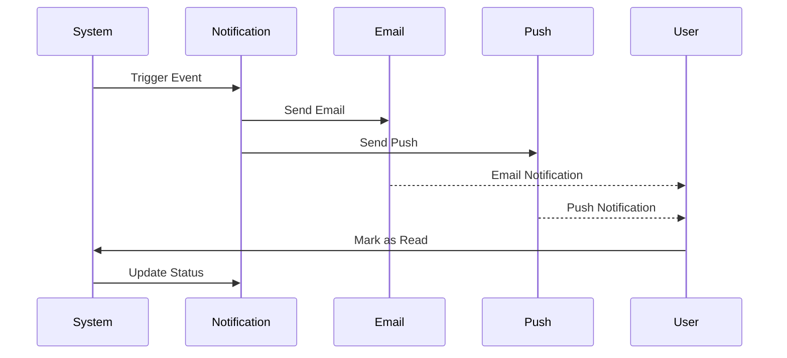
```mermaid
sequenceDiagram
    participant System
    participant Notification
    participant Email
    participant Push
    participant User

    System->>Notification: Trigger Event
    Notification->>Email: Send Email
    Notification->>Push: Send Push
    Email-->>User: Email Notification
    Push-->>User: Push Notification
    User->>System: Mark as Read
    System->>Notification: Update Status
```

## 14. Learning Path Structure

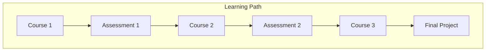
```mermaid
graph TD
    subgraph Learning Path
        Course1[Course 1]
        Course2[Course 2]
        Course3[Course 3]
        Assessment1[Assessment 1]
        Assessment2[Assessment 2]
        Project[Final Project]
    end

    Course1 --> Assessment1
    Assessment1 --> Course2
    Course2 --> Assessment2
    Assessment2 --> Course3
    Course3 --> Project
```

## 15. System Monitoring Flow

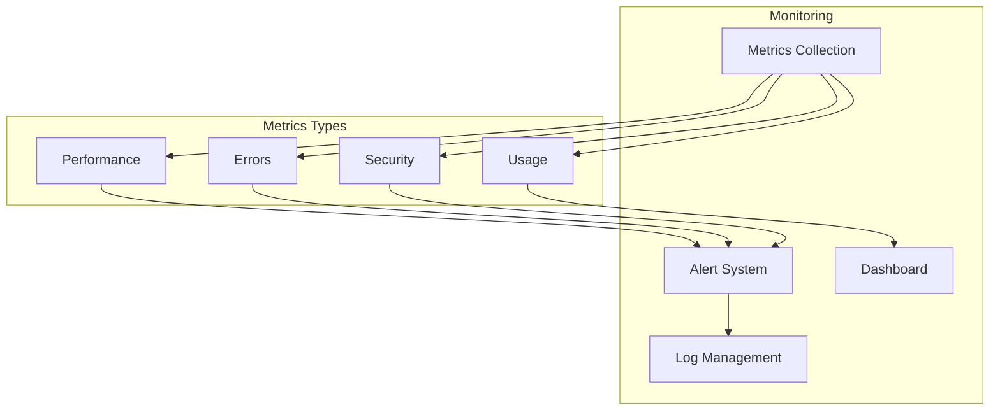
```mermaid
graph TD
    subgraph Monitoring
        Metrics[Metrics Collection]
        Alerts[Alert System]
        Logging[Log Management]
        Dashboard[Dashboard]
    end

    subgraph Metrics Types
        Performance[Performance]
        Errors[Errors]
        Usage[Usage]
        Security[Security]
    end

    Metrics --> Performance
    Metrics --> Errors
    Metrics --> Usage
    Metrics --> Security
    Performance --> Alerts
    Errors --> Alerts
    Usage --> Dashboard
    Security --> Alerts
    Alerts --> Logging
```

## 16. Backup and Recovery Flow

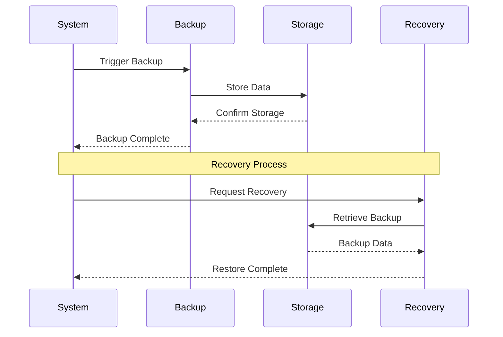
```mermaid
sequenceDiagram
    participant System
    participant Backup
    participant Storage
    participant Recovery

    System->>Backup: Trigger Backup
    Backup->>Storage: Store Data
    Storage-->>Backup: Confirm Storage
    Backup-->>System: Backup Complete
    
    Note over System,Recovery: Recovery Process
    System->>Recovery: Request Recovery
    Recovery->>Storage: Retrieve Backup
    Storage-->>Recovery: Backup Data
    Recovery-->>System: Restore Complete
```

## 17. Content Management System Flow

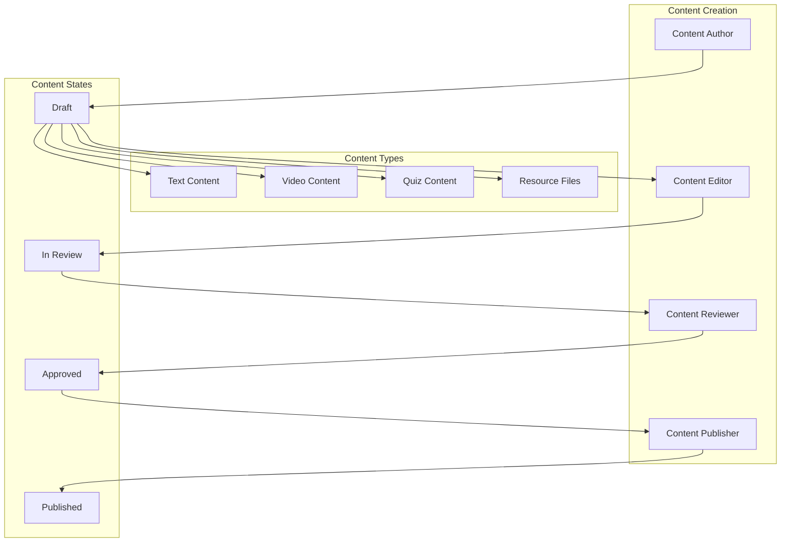
```mermaid
graph TD
    subgraph Content Creation
        Author[Content Author]
        Editor[Content Editor]
        Reviewer[Content Reviewer]
        Publisher[Content Publisher]
    end

    subgraph Content Types
        Text[Text Content]
        Video[Video Content]
        Quiz[Quiz Content]
        Resource[Resource Files]
    end

    subgraph Content States
        Draft[Draft]
        Review[In Review]
        Approved[Approved]
        Published[Published]
    end

    Author --> Draft
    Draft --> Editor
    Editor --> Review
    Review --> Reviewer
    Reviewer --> Approved
    Approved --> Publisher
    Publisher --> Published
    Draft --> Text
    Draft --> Video
    Draft --> Quiz
    Draft --> Resource
```

## 18. Discussion Forum Flow

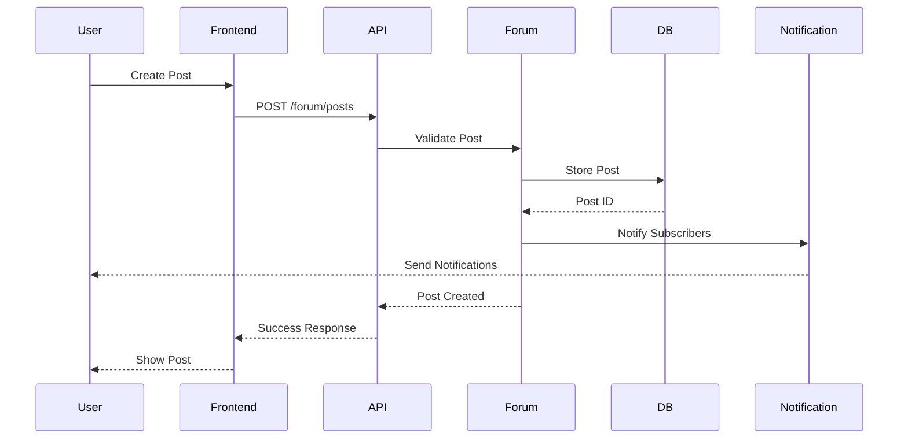
```mermaid
sequenceDiagram
    participant User
    participant Frontend
    participant API
    participant Forum
    participant DB
    participant Notification

    User->>Frontend: Create Post
    Frontend->>API: POST /forum/posts
    API->>Forum: Validate Post
    Forum->>DB: Store Post
    DB-->>Forum: Post ID
    Forum->>Notification: Notify Subscribers
    Notification-->>User: Send Notifications
    Forum-->>API: Post Created
    API-->>Frontend: Success Response
    Frontend-->>User: Show Post
```

## 19. Progress Tracking System

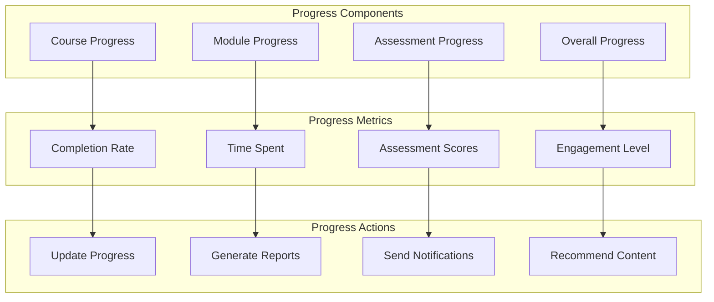
```mermaid
graph TD
    subgraph Progress Components
        CourseProgress[Course Progress]
        ModuleProgress[Module Progress]
        AssessmentProgress[Assessment Progress]
        OverallProgress[Overall Progress]
    end

    subgraph Progress Metrics
        Completion[Completion Rate]
        TimeSpent[Time Spent]
        Scores[Assessment Scores]
        Engagement[Engagement Level]
    end

    subgraph Progress Actions
        Update[Update Progress]
        Report[Generate Reports]
        Notify[Send Notifications]
        Recommend[Recommend Content]
    end

    CourseProgress --> Completion
    ModuleProgress --> TimeSpent
    AssessmentProgress --> Scores
    OverallProgress --> Engagement
    Completion --> Update
    TimeSpent --> Report
    Scores --> Notify
    Engagement --> Recommend
```

## 20. Payment Processing Flow

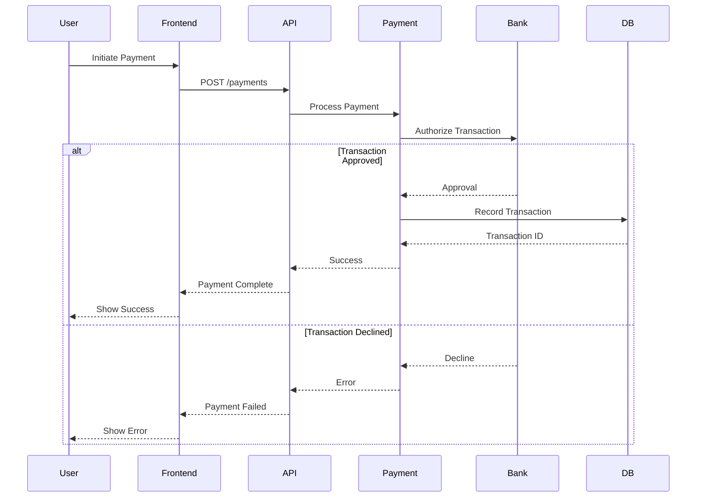
```mermaid
sequenceDiagram
    participant User
    participant Frontend
    participant API
    participant Payment
    participant Bank
    participant DB

    User->>Frontend: Initiate Payment
    Frontend->>API: POST /payments
    API->>Payment: Process Payment
    Payment->>Bank: Authorize Transaction
    alt Transaction Approved
        Bank-->>Payment: Approval
        Payment->>DB: Record Transaction
        DB-->>Payment: Transaction ID
        Payment-->>API: Success
        API-->>Frontend: Payment Complete
        Frontend-->>User: Show Success
    else Transaction Declined
        Bank-->>Payment: Decline
        Payment-->>API: Error
        API-->>Frontend: Payment Failed
        Frontend-->>User: Show Error
    end
```

## 21. Content Delivery Network (CDN) Flow

```mermaid
graph TD
    subgraph CDN Architecture
        Origin[Origin Server]
        Edge[Edge Servers]
        Cache[Cache Layer]
        LoadBalancer[Load Balancer]
    end

    subgraph Content Types
        Static[Static Content]
        Dynamic[Dynamic Content]
        Media[Media Files]
        API[API Responses]
    end

    subgraph Optimization
        Compression[Compression]
        Minification[Minification]
        Caching[Caching Strategy]
        Routing[Smart Routing]
    end

    Origin --> Edge
    Edge --> Cache
    Cache --> LoadBalancer
    Static --> Compression
    Dynamic --> Minification
    Media --> Caching
    API --> Routing
```

## 22. User Onboarding Flow

```mermaid
sequenceDiagram
    participant User
    participant Frontend
    participant API
    participant Auth
    participant Profile
    participant DB
    participant Email

    User->>Frontend: Register
    Frontend->>API: POST /users
    API->>Auth: Create Account
    Auth->>DB: Store User
    DB-->>Auth: User ID
    Auth->>Email: Send Verification
    Email-->>User: Verification Email
    User->>Frontend: Verify Email
    Frontend->>API: POST /verify
    API->>Auth: Verify Token
    Auth->>Profile: Create Profile
    Profile->>DB: Store Profile
    DB-->>Profile: Profile ID
    Profile-->>API: Profile Created
    API-->>Frontend: Onboarding Complete
    Frontend-->>User: Show Dashboard
```

## 23. Search and Discovery Flow

```mermaid
graph TD
    subgraph Search Components
        Query[Search Query]
        Index[Search Index]
        Results[Search Results]
        Filters[Search Filters]
    end

    subgraph Search Types
        CourseSearch[Course Search]
        ContentSearch[Content Search]
        UserSearch[User Search]
        ResourceSearch[Resource Search]
    end

    subgraph Search Features
        AutoComplete[Auto Complete]
        Suggestions[Suggestions]
        Related[Related Content]
        History[Search History]
    end

    Query --> Index
    Index --> Results
    Results --> Filters
    CourseSearch --> AutoComplete
    ContentSearch --> Suggestions
    UserSearch --> Related
    ResourceSearch --> History
```

## 24. Analytics Data Collection Flow

```mermaid
sequenceDiagram
    participant User
    participant Frontend
    participant API
    participant Analytics
    participant Processing
    participant Storage
    participant Dashboard

    User->>Frontend: Interact with System
    Frontend->>API: Track Event
    API->>Analytics: Process Event
    Analytics->>Processing: Transform Data
    Processing->>Storage: Store Metrics
    Storage-->>Processing: Confirm Storage
    Processing->>Dashboard: Update Visualizations
    Dashboard-->>User: Show Analytics
```

## 25. Multi-Tenant Architecture Flow

```mermaid
graph TD
    subgraph Tenant Management
        Tenant[Tenant]
        Config[Tenant Config]
        Resources[Tenant Resources]
        Isolation[Data Isolation]
    end

    subgraph Tenant Types
        Organization[Organization]
        Department[Department]
        Team[Team]
        Individual[Individual]
    end

    subgraph Tenant Features
        Customization[Customization]
        Branding[Branding]
        Settings[Settings]
        Access[Access Control]
    end

    Tenant --> Config
    Config --> Resources
    Resources --> Isolation
    Organization --> Customization
    Department --> Branding
    Team --> Settings
    Individual --> Access
```

## 26. Integration Flow with External Systems

```mermaid
sequenceDiagram
    participant LMS
    participant API
    participant Auth
    participant External
    participant Sync
    participant DB

    LMS->>API: Request Integration
    API->>Auth: Validate Request
    Auth->>External: Authenticate
    External-->>Auth: Auth Token
    Auth->>Sync: Start Sync
    Sync->>External: Fetch Data
    External-->>Sync: Return Data
    Sync->>DB: Store Data
    DB-->>Sync: Confirm Storage
    Sync-->>API: Sync Complete
    API-->>LMS: Integration Ready
```

## Best Practices

### 1. Code Organization
- Follow feature-based folder structure
- Implement clear separation of concerns
- Use consistent naming conventions
- Maintain proper documentation
- Implement proper error handling

### 2. Performance Optimization
- Implement proper caching strategies
- Use lazy loading for components
- Optimize images and assets
- Minimize API calls
- Implement proper state management

### 3. Security Measures
- Implement proper authentication
- Use secure storage for sensitive data
- Implement proper authorization
- Use HTTPS for all communications
- Regular security audits

### 4. Testing Strategy
- Unit testing for components
- Integration testing for features
- E2E testing for critical paths
- Performance testing
- Security testing

### 5. Monitoring and Logging
- Implement proper error tracking
- Use analytics for user behavior
- Monitor performance metrics
- Implement proper logging
- Set up alerts for critical issues

### 6. Deployment Process
- Use CI/CD pipelines
- Implement proper versioning
- Use feature flags
- Implement proper rollback strategies
- Monitor deployment health

### 7. Documentation Standards
- Maintain up-to-date documentation
- Use clear and concise language
- Include code examples
- Document API endpoints
- Maintain changelog

### 8. Accessibility Standards
- Follow WCAG guidelines
- Implement proper ARIA labels
- Ensure keyboard navigation
- Test with screen readers
- Maintain color contrast ratios

### 9. Internationalization
- Support multiple languages
- Handle RTL layouts
- Use proper date/time formats
- Support multiple currencies
- Handle text expansion/contraction

### 10. Mobile Considerations
- Handle offline capabilities
- Optimize for different screen sizes
- Implement proper touch interactions
- Handle network conditions
- Optimize battery usage 