# LCT Learning Management System - Tech Stack Documentation

[🏠 Home](README.md) > [System Design Documentation](README.md) > Tech Stack

[← Back to Main Documentation](README.md)

## Related Documentation
- [System Architecture Diagrams](System_Architecture_Diagrams.md)
- [Frontend Architecture](Frontend_Architecture.md)
- [Mobile App Architecture](Mobile_App_Architecture.md)
- [Database Schema](Database_Schema.md)
- [API Specification](API_Specification.md)
- [Security Compliance](Security_Compliance.md)
- [Project Budget](Project_Budget.md)
- [BCDR Plan](BCDR_Plan.md)
- [Development Rollout Plan](Development_Rollout_Plan.md)

---

## Overview

This document outlines the technology stack for the LCT Learning Management System, including detailed comparisons of available options and the rationale for MVP selection, with a focus on Microsoft technologies.

## 1. Frontend Technologies

### 1.1 Web Framework Options

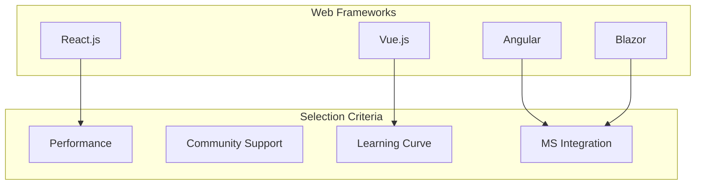

| Framework | Pros | Cons | Community Size | Learning Curve | MS Integration | MVP Selection |
|-----------|------|------|----------------|----------------|----------------|---------------|
| **Blazor** | - .NET ecosystem - C# codebase - Strong MS integration - WebAssembly | - New technology - Smaller community - Limited tooling | 500K+ developers | Medium | Very High | ✅ Selected |
| **React.js** | - Large ecosystem - Virtual DOM - Reusable components | - JSX learning curve - Frequent updates | 16M+ developers | Medium | Medium | ❌ Not Selected |
| **Angular** | - Full framework - TypeScript support - Strong typing | - Steep learning curve - Verbose syntax | 2M+ developers | High | High | ❌ Not Selected |
| **Vue.js** | - Easy to learn - Flexible - Good documentation | - Smaller ecosystem - Less enterprise adoption | 1.5M+ developers | Low | Low | ❌ Not Selected |

**MVP Selection Rationale**: Blazor was selected for its:
- Strong Microsoft ecosystem integration
- C# codebase consistency
- WebAssembly performance
- Growing enterprise adoption
- Simplified full-stack development

### 1.2 State Management Options

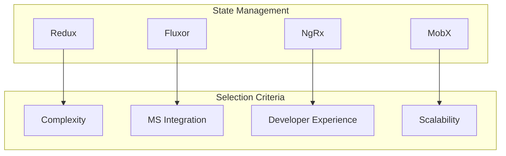

| Solution | Pros | Cons | Learning Curve | MS Integration | MVP Selection |
|----------|------|------|----------------|----------------|---------------|
| **Fluxor** | - C# based - Simple syntax - Strong typing - Blazor integration | - Smaller community - Limited resources | Medium | Very High | ✅ Selected |
| **Redux** | - Predictable state - Time travel debugging - Middleware support | - Boilerplate code - Complex setup | High | Medium | ❌ Not Selected |
| **NgRx** | - Angular integration - Strong typing - Good documentation | - Steep learning curve - Verbose | High | High | ❌ Not Selected |
| **MobX** | - Simple syntax - Automatic updates - Less boilerplate | - Less predictable - Magic behind scenes | Medium | Low | ❌ Not Selected |

**MVP Selection Rationale**: Fluxor was selected for its:
- Native C# implementation
- Strong Blazor integration
- Simple and intuitive API
- Type-safe state management
- Growing .NET community support

## 2. Backend Technologies

### 2.1 Server Framework Options

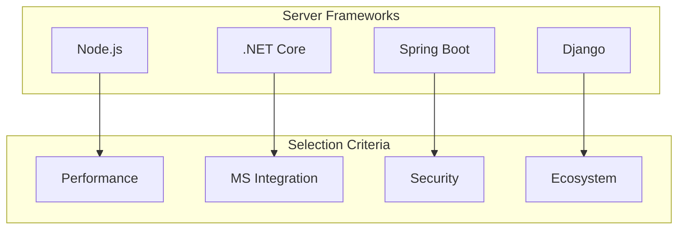

| Framework | Pros | Cons | Performance | MS Integration | MVP Selection |
|-----------|------|------|-------------|----------------|---------------|
| **.NET Core** | - Enterprise-grade - Strong typing - Excellent performance - MS ecosystem | - Windows-centric - Learning curve | Very High | Very High | ✅ Selected |
| **Node.js** | - Fast execution - Non-blocking I/O - JavaScript ecosystem | - Callback hell - Single-threaded | High | Medium | ❌ Not Selected |
| **Spring Boot** | - Enterprise-grade - Strong typing - Microservices ready | - Steep learning curve - Verbose | High | Low | ❌ Not Selected |
| **Django** | - Batteries included - Strong security - ORM included | - Monolithic - Less flexible | Medium | Low | ❌ Not Selected |

**MVP Selection Rationale**: .NET Core was selected for its:
- Strong Microsoft ecosystem integration
- Enterprise-grade features
- Excellent performance
- Comprehensive tooling
- Strong security features

### 2.2 Database Options

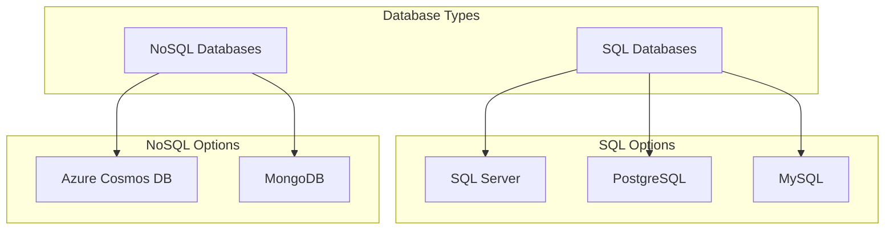

| Database | Type | Pros | Cons | MS Integration | MVP Selection |
|----------|------|------|------|----------------|---------------|
| **SQL Server** | SQL | - Enterprise features - Strong security - MS integration - AI capabilities | - Licensing cost - Windows-centric | Very High | ✅ Selected |
| **Azure Cosmos DB** | NoSQL | - Global distribution - Multi-model - Auto-scaling - MS integration | - Expensive - Complex pricing | Very High | ✅ Selected |
| **PostgreSQL** | SQL | - ACID compliant - Strong typing - JSON support | - Complex setup - Resource intensive | Medium | ❌ Not Selected |
| **MongoDB** | NoSQL | - Flexible schema - Easy scaling - Good performance | - No joins - Less ACID compliance | Low | ❌ Not Selected |

**MVP Selection Rationale**: SQL Server and Cosmos DB were selected for their:
- Strong Microsoft ecosystem integration
- Enterprise-grade features
- Comprehensive security
- Excellent scalability
- Advanced AI capabilities

## 3. Mobile Technologies

### 3.1 Mobile Framework Options

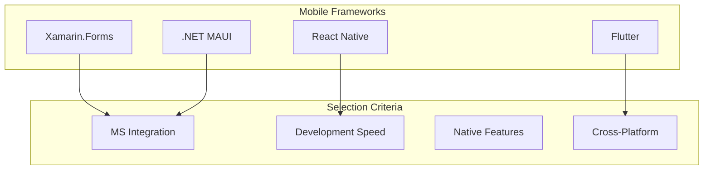

| Framework | Pros | Cons | Development Speed | MS Integration | MVP Selection |
|-----------|------|------|-------------------|----------------|---------------|
| **.NET MAUI** | - C# codebase - Native performance - MS ecosystem - Hot reload | - New technology - Limited resources | High | Very High | ✅ Selected |
| **Xamarin.Forms** | - C# ecosystem - Native performance - MS support | - Larger app size - Limited community | Medium | Very High | ❌ Not Selected |
| **React Native** | - Code reuse - Large ecosystem - Hot reloading | - Native modules needed - Performance overhead | High | Medium | ❌ Not Selected |
| **Flutter** | - High performance - Beautiful UI - Single codebase | - Larger app size - New ecosystem | High | Low | ❌ Not Selected |

**MVP Selection Rationale**: .NET MAUI was selected for its:
- Strong Microsoft ecosystem integration
- C# codebase consistency
- Native performance
- Modern development experience
- Growing community support

## 4. Cloud Infrastructure

### 4.1 Cloud Provider Options

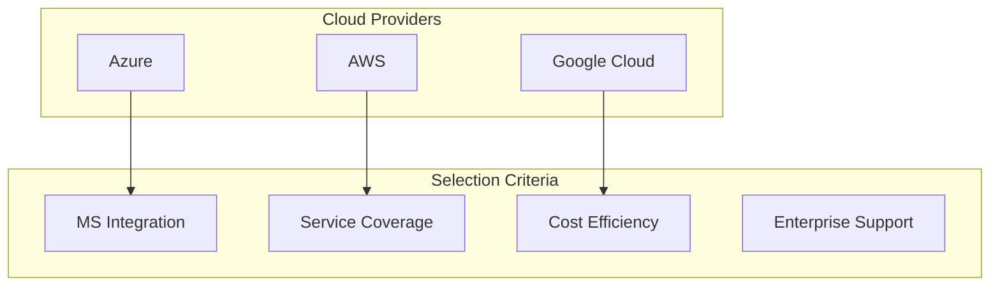

| Provider | Pros | Cons | MS Integration | Service Coverage | MVP Selection |
|----------|------|------|----------------|------------------|---------------|
| **Azure** | - MS ecosystem - Enterprise focus - Hybrid support - Strong security | - Complex pricing - Learning curve | Very High | Very High | ✅ Selected |
| **AWS** | - Largest ecosystem - Global presence - Extensive services | - Complex management - Cost management | Medium | Very High | ❌ Not Selected |
| **GCP** | - Simple pricing - Strong AI/ML - Good performance | - Smaller ecosystem - Less enterprise focus | Low | High | ❌ Not Selected |

**MVP Selection Rationale**: Azure was selected for its:
- Strong Microsoft ecosystem integration
- Enterprise-grade features
- Comprehensive service offering
- Excellent security features
- Hybrid cloud capabilities

## 5. DevOps Tools

### 5.1 CI/CD Options

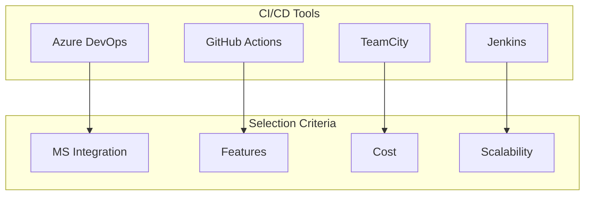

| Tool | Pros | Cons | MS Integration | Features | MVP Selection |
|------|------|------|----------------|----------|---------------|
| **Azure DevOps** | - MS ecosystem - All-in-one solution - Strong integration - Good reporting | - Complex setup - Learning curve | Very High | Very High | ✅ Selected |
| **GitHub Actions** | - Simple setup - Good integration - Free tier | - Limited features - Less enterprise focus | High | High | ❌ Not Selected |
| **Jenkins** | - Highly customizable - Extensive plugins - Open source | - Complex setup - Maintenance overhead | Low | High | ❌ Not Selected |
| **TeamCity** | - Good performance - Strong typing - Good UI | - Expensive - Limited integration | Medium | High | ❌ Not Selected |

**MVP Selection Rationale**: Azure DevOps was selected for its:
- Strong Microsoft ecosystem integration
- Comprehensive feature set
- Enterprise-grade capabilities
- Good reporting and analytics
- Scalable architecture

## 6. Monitoring and Logging

### 6.1 Monitoring Solutions

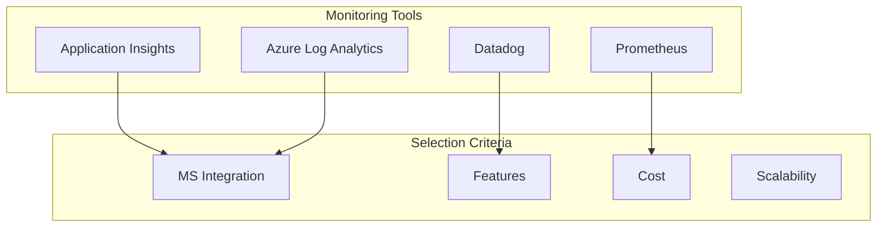

| Solution | Pros | Cons | MS Integration | Features | MVP Selection |
|----------|------|------|----------------|----------|---------------|
| **Application Insights** | - MS ecosystem - Comprehensive features - Good integration | - Azure lock-in - Limited customization | Very High | Very High | ✅ Selected |
| **Azure Log Analytics** | - MS ecosystem - Strong integration - Good features | - Azure lock-in - Complex setup | Very High | High | ✅ Selected |
| **Prometheus** | - Open source - Highly customizable - Good performance | - Complex setup - Maintenance required | Low | Medium | ❌ Not Selected |
| **Datadog** | - Comprehensive features - Good UI - Wide integration | - Expensive - Complex pricing | Low | Very High | ❌ Not Selected |

**MVP Selection Rationale**: Application Insights and Log Analytics were selected for their:
- Strong Microsoft ecosystem integration
- Comprehensive feature set
- Seamless Azure integration
- Good scalability
- Strong enterprise support

## 7. Security Tools

### 7.1 Security Solutions

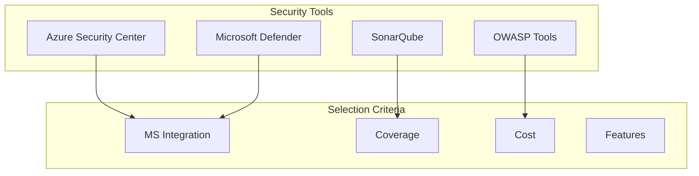

| Solution | Pros | Cons | MS Integration | Coverage | MVP Selection |
|----------|------|------|----------------|----------|---------------|
| **Azure Security Center** | - MS ecosystem - Comprehensive - Strong integration | - Azure lock-in - Complex setup | Very High | Very High | ✅ Selected |
| **Microsoft Defender** | - MS ecosystem - Strong integration - Good features | - Windows-centric - Limited cross-platform | Very High | High | ✅ Selected |
| **OWASP Tools** | - Open source - Community support - Free | - Limited features - Manual setup | Low | Medium | ❌ Not Selected |
| **SonarQube** | - Code quality - Security scanning - Good reporting | - Complex setup - Resource intensive | Medium | High | ❌ Not Selected |

**MVP Selection Rationale**: Azure Security Center and Microsoft Defender were selected for their:
- Strong Microsoft ecosystem integration
- Comprehensive security coverage
- Enterprise-grade features
- Good reporting capabilities
- Automated security management

## 8. AI/ML Integration

### 8.1 AI/ML Framework Options

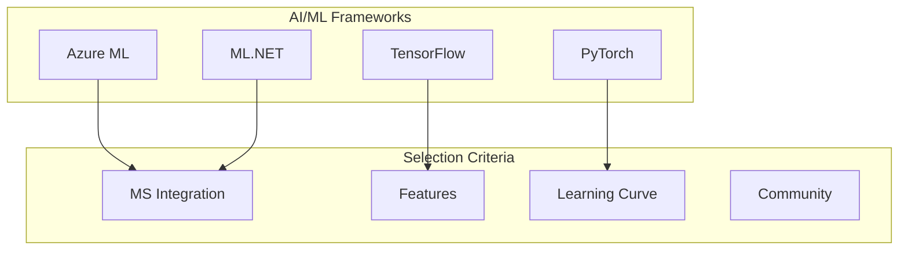

| Framework | Pros | Cons | MS Integration | Features | MVP Selection |
|-----------|------|------|----------------|----------|---------------|
| **Azure ML** | - MS ecosystem - Managed service - Comprehensive features | - Azure lock-in - Cost at scale | Very High | Very High | ✅ Selected |
| **ML.NET** | - C# based - .NET integration - Easy to use | - Limited features - Smaller community | Very High | Medium | ✅ Selected |
| **TensorFlow** | - Comprehensive - Good performance - Large community | - Steep learning curve - Complex setup | Low | Very High | ❌ Not Selected |
| **PyTorch** | - Easy to learn - Good flexibility - Growing community | - Less production-ready - Limited tools | Low | High | ❌ Not Selected |

**MVP Selection Rationale**: Azure ML and ML.NET were selected for their:
- Strong Microsoft ecosystem integration
- C# and .NET compatibility
- Comprehensive feature set
- Enterprise-grade capabilities
- Strong security features

## 9. RPA Integration

### 9.1 RPA Platform Options

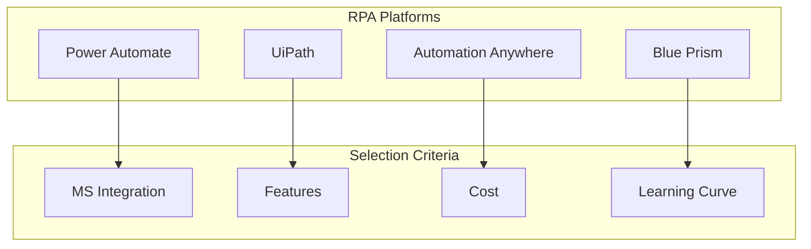

| Platform | Pros | Cons | MS Integration | Features | MVP Selection |
|----------|------|------|----------------|----------|---------------|
| **Power Automate** | - MS ecosystem - Strong integration - Easy to use | - Limited complexity - Microsoft ecosystem | Very High | High | ✅ Selected |
| **UiPath** | - Comprehensive features - Good community - Strong support | - Expensive - Complex setup | Medium | Very High | ❌ Not Selected |
| **Automation Anywhere** | - Good features - Cloud-native - Strong security | - Expensive - Limited integration | Low | High | ❌ Not Selected |
| **Blue Prism** | - Enterprise-grade - Strong security - Good scalability | - Very expensive - Steep learning curve | Low | High | ❌ Not Selected |

**MVP Selection Rationale**: Power Automate was selected for its:
- Strong Microsoft ecosystem integration
- Ease of use
- Cost-effectiveness
- Good feature set
- Cloud-native architecture

## 10. Microsoft-Focused MVP Tech Stack Summary

### 10.1 Selected Technologies

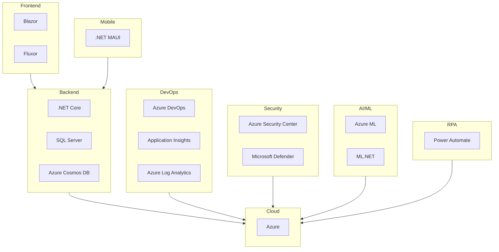

### 10.2 Selection Rationale

1. **Microsoft Ecosystem Integration**
   - All selected technologies are part of the Microsoft ecosystem
   - Consistent development experience
   - Unified management and monitoring
   - Simplified security implementation

2. **Development Efficiency**
   - C# codebase consistency across all layers
   - Shared tooling and processes
   - Reduced learning curve
   - Faster time to market

3. **Enterprise Readiness**
   - Proven Microsoft technologies
   - Strong security features
   - Enterprise-grade support
   - Compliance capabilities

4. **Cost Optimization**
   - Optimized licensing through Microsoft agreements
   - Reduced operational overhead
   - Scalable pricing models
   - Efficient resource utilization

5. **Scalability and Performance**
   - Cloud-native architecture
   - Microservices-ready
   - Auto-scaling capabilities
   - Global distribution

6. **Security and Compliance**
   - Integrated security solutions
   - Automated compliance checks
   - Enterprise-grade protection
   - Regular security updates

7. **Innovation and Future-Proofing**
   - Access to latest Microsoft innovations
   - Regular updates and improvements
   - Strong roadmap alignment
   - Growing ecosystem support

## 11. Low-Cost MVP Stack

### 11.1 Cost-Optimized Technology Options

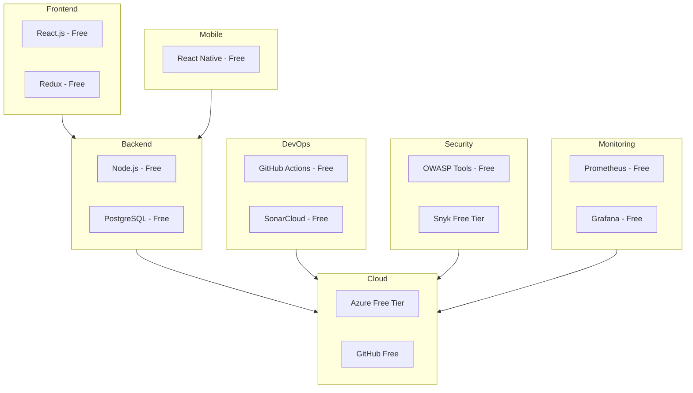

### 11.2 Cost-Optimized Technology Stack

| Category | Technology | Cost | Security Features | Optimization Strategy |
|----------|------------|------|-------------------|-----------------------|
| **Frontend** | React.js | Free | - Built-in XSS protection - CSP support - Secure by default | - Code splitting - Lazy loading - Tree shaking |
| **State Management** | Redux | Free | - Immutable state - Predictable updates - Time-travel debugging | - Selective updates - Memoization - Normalized state |
| **Backend** | Node.js | Free | - Regular security updates - NPM audit - Helmet.js integration | - Cluster mode - Worker threads - Caching |
| **Database** | PostgreSQL | Free | - Row-level security - SSL encryption - Role-based access | - Connection pooling - Query optimization - Indexing |
| **Mobile** | React Native | Free | - Secure storage - Biometric auth - SSL pinning | - Hermes engine - Code optimization - Image caching |
| **Cloud** | Azure Free Tier | Free | - DDoS protection - Network security - Firewall | - Auto-scaling - Resource optimization - CDN usage |
| **CI/CD** | GitHub Actions | Free | - Secret management - Environment protection - Audit logs | - Caching - Matrix builds - Parallel jobs |
| **Security** | OWASP Tools | Free | - Dependency scanning - SAST - DAST | - Automated scanning - Regular updates - Custom rules |
| **Monitoring** | Prometheus + Grafana | Free | - Alert management - Log encryption - Access control | - Efficient metrics - Data retention - Query optimization |

### 11.3 Cost Optimization Strategies

1. **Infrastructure Optimization**
   - Use serverless where possible
   - Implement auto-scaling
   - Leverage CDN for static content
   - Optimize resource allocation
   - Use spot instances for non-critical workloads

2. **Development Optimization**
   - Code splitting and lazy loading
   - Efficient bundling
   - Tree shaking
   - Caching strategies
   - Database query optimization

3. **Operational Optimization**
   - Automated scaling
   - Resource scheduling
   - Cost monitoring
   - Usage analytics
   - Regular cleanup

4. **Security Optimization**
   - Automated security scanning
   - Regular dependency updates
   - Security headers
   - Rate limiting
   - Input validation

### 11.4 Free Tier Limitations and Workarounds

| Service | Free Tier Limit | Workaround |
|---------|-----------------|------------|
| **Azure App Service** | 1 GB RAM, 1 CPU | - Optimize application - Use containerization - Implement caching |
| **Azure SQL Database** | 250 GB storage | - Implement data archiving - Use table partitioning - Optimize indexes |
| **Azure Storage** | 5 GB storage | - Implement cleanup policies - Use compression - Optimize file sizes |
| **GitHub Actions** | 2000 minutes/month | - Optimize workflows - Use self-hosted runners - Cache dependencies |
| **Azure Functions** | 1 million executions | - Implement batching - Use queue triggers - Optimize execution time |

### 11.5 Security Considerations

1. **Application Security**
   - Implement OWASP Top 10 protections
   - Use security headers
   - Regular dependency updates
   - Input validation
   - Output encoding

2. **Data Security**
   - Encryption at rest
   - Encryption in transit
   - Regular backups
   - Access controls
   - Audit logging

3. **Infrastructure Security**
   - Network segmentation
   - Firewall rules
   - DDoS protection
   - Regular patching
   - Security monitoring

### 11.6 Performance Optimization

1. **Frontend Optimization**
   - Code splitting
   - Lazy loading
   - Image optimization
   - Caching strategies
   - Bundle optimization

2. **Backend Optimization**
   - Connection pooling
   - Query optimization
   - Caching
   - Load balancing
   - Resource optimization

3. **Database Optimization**
   - Index optimization
   - Query tuning
   - Partitioning
   - Connection management
   - Regular maintenance

### 11.7 Monitoring and Maintenance

1. **Free Monitoring Tools**
   - Prometheus for metrics
   - Grafana for visualization
   - ELK Stack for logging
   - Uptime monitoring
   - Performance monitoring

2. **Maintenance Tasks**
   - Regular updates
   - Security patches
   - Performance tuning
   - Backup verification
   - Log rotation

### 11.8 Scaling Strategy

1. **Horizontal Scaling**
   - Use containerization
   - Implement load balancing
   - Auto-scaling groups
   - Stateless design
   - Session management

2. **Vertical Scaling**
   - Resource optimization
   - Memory management
   - CPU optimization
   - Storage optimization
   - Network optimization

### 11.9 Cost Monitoring and Control

1. **Cost Tracking**
   - Azure Cost Management
   - Budget alerts
   - Resource tagging
   - Usage analytics
   - Cost allocation

2. **Cost Control**
   - Resource scheduling
   - Auto-shutdown
   - Size optimization
   - Reserved instances
   - Spot instances

This low-cost MVP stack provides a secure, scalable, and cost-effective solution while maintaining enterprise-grade features and security. The stack leverages free and open-source technologies where possible, with strategic use of cloud services' free tiers and optimization techniques to minimize costs.

## 12. Tools and Vendor Links

### 12.1 Frontend Technologies
- **Blazor**: [Microsoft Blazor Documentation](https://learn.microsoft.com/en-us/aspnet/core/blazor/)
- **Fluxor**: [Fluxor GitHub Repository](https://github.com/mrpmorris/fluxor)
- **React.js**: [React Official Documentation](https://reactjs.org/)
- **Angular**: [Angular Official Documentation](https://angular.io/)
- **Vue.js**: [Vue.js Official Documentation](https://vuejs.org/)

### 12.2 Backend Technologies
- **.NET Core**: [.NET Documentation](https://learn.microsoft.com/en-us/dotnet/)
- **SQL Server**: [Microsoft SQL Server](https://www.microsoft.com/en-us/sql-server)
- **Azure Cosmos DB**: [Azure Cosmos DB Documentation](https://learn.microsoft.com/en-us/azure/cosmos-db/)
- **PostgreSQL**: [PostgreSQL Official Documentation](https://www.postgresql.org/docs/)
- **MongoDB**: [MongoDB Documentation](https://www.mongodb.com/docs/)

### 12.3 Mobile Technologies
- **.NET MAUI**: [.NET MAUI Documentation](https://learn.microsoft.com/en-us/dotnet/maui/)
- **Xamarin.Forms**: [Xamarin Documentation](https://learn.microsoft.com/en-us/xamarin/)
- **React Native**: [React Native Documentation](https://reactnative.dev/)
- **Flutter**: [Flutter Documentation](https://flutter.dev/docs)

### 12.4 Cloud Infrastructure
- **Azure**: [Microsoft Azure](https://azure.microsoft.com/)
- **AWS**: [Amazon Web Services](https://aws.amazon.com/)
- **Google Cloud**: [Google Cloud Platform](https://cloud.google.com/)

### 12.5 DevOps Tools
- **Azure DevOps**: [Azure DevOps Documentation](https://learn.microsoft.com/en-us/azure/devops/)
- **GitHub Actions**: [GitHub Actions Documentation](https://docs.github.com/en/actions)
- **Jenkins**: [Jenkins Documentation](https://www.jenkins.io/doc/)
- **TeamCity**: [TeamCity Documentation](https://www.jetbrains.com/teamcity/documentation/)

### 12.6 Monitoring and Logging
- **Application Insights**: [Azure Application Insights](https://learn.microsoft.com/en-us/azure/azure-monitor/app/app-insights-overview)
- **Azure Log Analytics**: [Azure Log Analytics](https://learn.microsoft.com/en-us/azure/azure-monitor/logs/log-analytics-overview)
- **Prometheus**: [Prometheus Documentation](https://prometheus.io/docs/)
- **Grafana**: [Grafana Documentation](https://grafana.com/docs/)
- **Datadog**: [Datadog Documentation](https://docs.datadoghq.com/)

### 12.7 Security Tools
- **Azure Security Center**: [Azure Security Center Documentation](https://learn.microsoft.com/en-us/azure/security-center/)
- **Microsoft Defender**: [Microsoft Defender Documentation](https://learn.microsoft.com/en-us/microsoft-365/security/defender/)
- **OWASP Tools**: [OWASP Tools](https://owasp.org/www-project-tools/)
- **SonarQube**: [SonarQube Documentation](https://docs.sonarqube.org/latest/)

### 12.8 AI/ML Integration
- **Azure ML**: [Azure Machine Learning](https://learn.microsoft.com/en-us/azure/machine-learning/)
- **ML.NET**: [ML.NET Documentation](https://learn.microsoft.com/en-us/dotnet/machine-learning/)
- **TensorFlow**: [TensorFlow Documentation](https://www.tensorflow.org/guide)
- **PyTorch**: [PyTorch Documentation](https://pytorch.org/docs/stable/index.html)

### 12.9 RPA Integration
- **Power Automate**: [Power Automate Documentation](https://learn.microsoft.com/en-us/power-automate/)
- **UiPath**: [UiPath Documentation](https://docs.uipath.com/)
- **Automation Anywhere**: [Automation Anywhere Documentation](https://docs.automationanywhere.com/)
- **Blue Prism**: [Blue Prism Documentation](https://portal.blueprism.com/)

### 12.10 Free and Open Source Tools
- **React.js**: [React.js GitHub](https://github.com/facebook/react)
- **Node.js**: [Node.js Documentation](https://nodejs.org/en/docs/)
- **PostgreSQL**: [PostgreSQL Downloads](https://www.postgresql.org/download/)
- **Prometheus**: [Prometheus GitHub](https://github.com/prometheus/prometheus)
- **Grafana**: [Grafana GitHub](https://github.com/grafana/grafana)
- **OWASP Tools**: [OWASP GitHub](https://github.com/OWASP)

### 12.11 Cloud Free Tiers
- **Azure Free Tier**: [Azure Free Account](https://azure.microsoft.com/en-us/free/)
- **AWS Free Tier**: [AWS Free Tier](https://aws.amazon.com/free/)
- **Google Cloud Free Tier**: [Google Cloud Free Tier](https://cloud.google.com/free)
- **GitHub Free**: [GitHub Free](https://github.com/pricing)

### 12.12 Development Tools
- **Visual Studio**: [Visual Studio Downloads](https://visualstudio.microsoft.com/downloads/)
- **Visual Studio Code**: [VS Code Documentation](https://code.visualstudio.com/docs)
- **Azure Data Studio**: [Azure Data Studio](https://learn.microsoft.com/en-us/sql/azure-data-studio/)
- **Postman**: [Postman Documentation](https://learning.postman.com/docs/)

### 12.13 Database Tools
- **Azure Data Studio**: [Azure Data Studio Documentation](https://learn.microsoft.com/en-us/sql/azure-data-studio/)
- **SQL Server Management Studio**: [SSMS Documentation](https://learn.microsoft.com/en-us/sql/ssms/sql-server-management-studio-ssms)
- **MongoDB Compass**: [MongoDB Compass](https://www.mongodb.com/products/compass)
- **pgAdmin**: [pgAdmin Documentation](https://www.pgadmin.org/docs/)

### 12.14 Testing Tools
- **Azure Test Plans**: [Azure Test Plans](https://learn.microsoft.com/en-us/azure/devops/test/overview)
- **Selenium**: [Selenium Documentation](https://www.selenium.dev/documentation/)
- **Postman**: [Postman Testing](https://learning.postman.com/docs/writing-scripts/test-scripts/)
- **SonarQube**: [SonarQube Quality Gates](https://docs.sonarqube.org/latest/user-guide/quality-gates/)

### 12.15 Documentation Tools
- **Azure DevOps Wiki**: [Azure DevOps Wiki](https://learn.microsoft.com/en-us/azure/devops/project/wiki/)
- **GitHub Wiki**: [GitHub Wiki](https://docs.github.com/en/communities/documenting-your-project-with-wikis)
- **Markdown**: [Markdown Guide](https://www.markdownguide.org/)
- **Mermaid**: [Mermaid Documentation](https://mermaid-js.github.io/mermaid/)

This section provides direct links to all tools and vendors mentioned in the documentation, making it easier for developers to access the resources they need. 