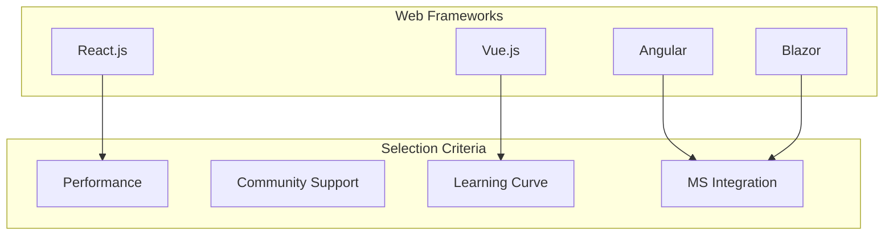

# LCT Learning Management System - Tech Stack Documentation

  

[🏠 Home](../README.md) > [System Design Documentation](README.md) > Tech Stack Documentation

[← Back to Main Documentation](../README.md)

## Company Information
- **Company**: [Lear Cyber Tech](https://www.linkedin.com/company/leartech/)
- **Author**: [Dr. Libin Pallikunnel Kurian](https://www.linkedin.com/in/dr-libin-pallikunnel-kurian-88741530/)
- **GitHub**: [leomultimedia](https://github.com/leomultimedia)
- **Position**: Principal Consultant - ICT & Cyber Security
- **Expertise**: Cloud Digital Leader | Ethical Hacker | OT | IoT | ICS/SCADA | IT Audit | RPA | AI | ML | Analytics

## Company Vision & Mission
- **Vision**: To be a global leader in cybersecurity and technology solutions, empowering organizations with innovative and secure digital transformation.
- **Mission**: To provide cutting-edge cybersecurity solutions and technology services that protect and enhance our clients' digital assets while fostering a culture of continuous learning and innovation.

## Core Values
1. **Integrity**: Upholding the highest standards of ethical conduct and transparency
2. **Customer Focus**: Delivering exceptional value and service to our clients
3. **Innovation**: Driving technological advancement and creative solutions
4. **Teamwork**: Fostering collaboration and mutual respect
5. **Excellence**: Striving for the highest quality in all our endeavors

---

## Overview

This document outlines the technology stack for the LCT Learning Management System, including detailed comparisons of available options and the rationale for MVP selection, with a focus on Microsoft technologies.

## 1. Frontend Technologies

### 1.1 Web Framework Options

| Framework | Pros | Cons | Community Size | Learning Curve | MS Integration | MVP Selection |
|